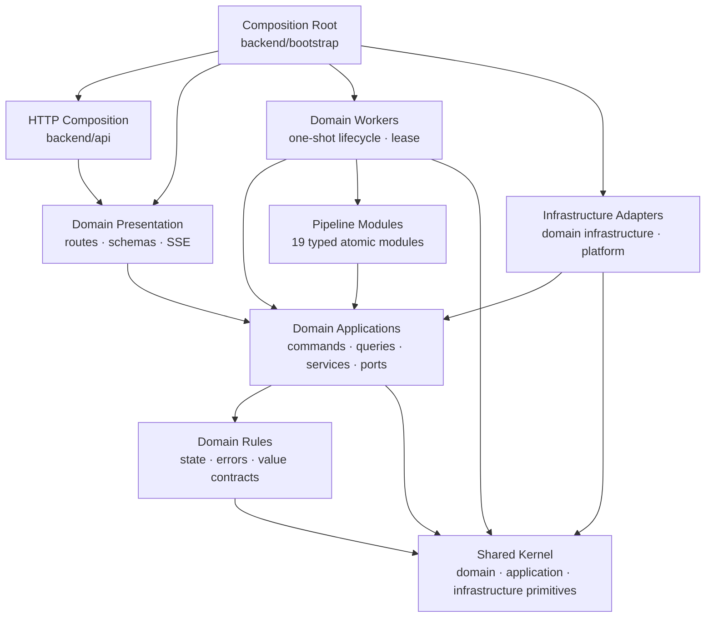

# [BP-102] 백엔드 modular monolith와 의존성 규칙
> **Document Code:** `BP-102` | **Category:** System Architecture Blueprint | **Status:** Partially Implemented · Migration In Progress
> **Source Roots:** [`backend/api/`](file:///c:/Repos/bist-mini-final/backend/api/), [`backend/domains/`](file:///c:/Repos/bist-mini-final/backend/domains/), [`backend/bootstrap/`](file:///c:/Repos/bist-mini-final/backend/bootstrap/), [`backend/engine/`](file:///c:/Repos/bist-mini-final/backend/engine/), [`backend/platform/`](file:///c:/Repos/bist-mini-final/backend/platform/), [`backend/shared/`](file:///c:/Repos/bist-mini-final/backend/shared/), [`modules/`](file:///c:/Repos/bist-mini-final/modules/)

---

## 1. 구조 원칙

백엔드의 목표는 기술별 수평 계층을 늘리는 구조가 아니라, 제품 도메인을 먼저 분리하고 각 도메인 안에서 `domain → application port ← infrastructure adapter` 의존성 역전을 지키는 modular monolith입니다. HTTP, worker, DB, 외부 provider는 도메인 유스케이스의 바깥에 위치해야 합니다.



화살표는 목표 compile-time 의존 방향입니다. Bootstrap은 유일한 예외로 구체 구현 전체를 알고 객체 그래프를 조립합니다.

---

## 2. 목표 디렉터리 구조

```text
backend/
├── bootstrap/                   # 객체 조립과 프로세스 생명주기
│   ├── application.py
│   ├── http.py
│   └── workers.py
│
├── shared/                      # 도메인 비종속 공통 계약
│   ├── domain/
│   │   ├── errors.py
│   │   ├── identifiers.py
│   │   └── clock.py
│   ├── application/
│   │   ├── pagination.py
│   │   └── results.py
│   └── infrastructure/
│       ├── database/
│       │   ├── sync_session.py
│       │   ├── async_session.py
│       │   └── transaction.py
│       ├── telemetry/
│       └── files/
│
├── domains/
│   ├── workflow/
│   │   ├── domain/
│   │   │   ├── models.py
│   │   │   ├── states.py
│   │   │   └── policies.py
│   │   ├── application/
│   │   │   ├── ports.py
│   │   │   ├── commands.py
│   │   │   ├── queries.py
│   │   │   └── services/
│   │   ├── infrastructure/
│   │   │   ├── postgres/
│   │   │   ├── filesystem/
│   │   │   └── kubernetes/
│   │   ├── presentation/
│   │   │   ├── routes.py
│   │   │   ├── schemas.py
│   │   │   └── sse.py
│   │   └── workers/
│   ├── data_sources/
│   ├── bi/
│   ├── company_comparison/
│   ├── chatbot/
│   └── benchmark/
│
├── platform/                    # 외부 시스템 어댑터
│   ├── postgres/
│   ├── pgvector/
│   ├── openai/
│   ├── kubernetes/
│   └── redis/
│
└── api/
    ├── router.py                # 도메인 router 결합만 수행
    ├── middleware.py
    ├── exception_handlers.py
    └── versioning.py

modules/                         # 원자적 DAG 모듈
jobs/                            # 선언형 표준 Job 정의
```

각 제품 도메인은 같은 하위 계층 이름을 사용하되 필요하지 않은 계층을 억지로 만들지 않습니다. `api`는 도메인 router를 결합하는 조립 계층이며 도메인별 HTTP DTO와 route는 각 도메인의 `presentation`에 둡니다. `platform`은 여러 도메인이 공유하는 외부 시스템 client와 기반 adapter만 소유하고, 도메인 고유 repository 구현은 해당 도메인의 `infrastructure`에 둡니다.

### 2.1 현재 구현과의 차이

2026-08-31 기준 현재 트리는 목표 구조로 이동 중인 과도기입니다. `domains`, `bootstrap`, `shared`, `platform`, `modules`, `jobs` 경계는 생성됐지만 다음 호환 패키지와 수평 계층이 남아 있습니다.

| 영역 | 현재 상태 | 목표 대비 차이 |
| :--- | :--- | :--- |
| `backend/bootstrap` | `container.py`, `lifecycle.py`, `bi.py`, `company_comparison.py` | HTTP·worker·application composition root가 목표 파일 단위로 분리되지 않음 |
| `backend/shared` | 공통 error, repository base, observability만 존재 | identifiers, clock, application result/pagination, session/transaction, telemetry/files 경계가 미구성 |
| `backend/domains` | workflow·BI 중심으로 domain/application 도입, chatbot 일부 infrastructure 도입 | 모든 도메인이 infrastructure/presentation/workers까지 일관된 vertical slice를 갖추지 않았고 application 일부가 `features`·`engine` 구체 구현을 직접 import함 |
| `backend/api` | 27개 Python 파일에서 도메인 route/controller/DTO를 직접 보유 | 최종 router 결합 전용 계층보다 책임이 넓음 |
| `backend/platform` | pgvector와 data-source adapter만 존재 | PostgreSQL/OpenAI/Kubernetes/Redis adapter가 `storage`, `providers`, `engine`, `core`에 분산됨 |
| 호환 수평 패키지 | `features` 59개, `storage` 42개, `providers` 9개, `engine` 23개, `cli` 7개, `core` 5개, `contracts` 4개 Python 파일 | 도메인·platform·shared·process adapter 경계로 이전되지 않은 구현이 다수 존재 |
| 프로세스 진입점 | `backend/main.py`와 `backend/cli`가 별도 진입점 역할 | application/http/worker bootstrap과 CLI adapter의 최종 위치 결정이 필요 |
| `modules`, `jobs` | 원자 모듈과 선언형 Job 경계를 별도 루트로 유지 | 목표와 일치 |

정적 import 조사에서는 `backend/domains`에서 호환 수평 패키지(`features`, `engine`, `contracts` 등)로 향하는 직접 import 문장이 26개, `backend/api`에서 domain 또는 수평 구현 패키지로 향하는 import 문장이 68개 확인됩니다. 모든 import가 같은 위험도를 갖는 것은 아니지만, domain application의 port 전환과 API 축소가 아직 끝나지 않았음을 보여주는 migration 지표로 사용합니다.

따라서 이 문서의 `Status`는 디렉터리 생성이나 일부 의존성 역전만을 근거로 완료 처리하지 않습니다. `features/storage/providers/core/contracts/engine`의 책임 이전, 도메인 presentation/infrastructure/workers 정착, 호환 import 제거가 끝나고 구조 계약 테스트가 목표 트리를 검증할 때 완료로 전환합니다.

### 2.2 잔여 전환 순서

1. 현재 허용 중인 `domains → features/engine/contracts` 직접 의존을 목록화하고 application port 또는 shared domain contract로 대체합니다.
2. DB session/transaction, clock, identifier, result/pagination 계약을 `shared` 목표 위치에 만들고 기존 facade가 이를 위임하도록 전환합니다.
3. OpenAI, Kubernetes, Redis, PostgreSQL 기반 client를 `platform`으로 모으고 도메인 고유 adapter는 각 domain `infrastructure`로 이동합니다.
4. workflow부터 presentation/infrastructure/workers vertical slice를 완성한 뒤 data sources, BI, company comparison, chatbot, benchmark 순서로 반복합니다.
5. 도메인 route가 이동한 뒤 `backend/api`를 router 결합과 공통 HTTP 정책만 남도록 축소합니다.
6. 호환 import 사용량을 0으로 만든 패키지부터 제거하고 목표 트리를 검사하는 구조 계약 테스트를 활성화합니다.

---

## 3. 현재 구현에서 확보된 책임 경계

| 경계 | 책임 | 대표 구현 |
| :--- | :--- | :--- |
| Presentation | `/api/v1`, Pydantic 입력, status code, SSE, 표준 오류 envelope | `backend/api/*_routes.py`, `workflow_controller.py`, `data_source_controller.py`, `data_source_ingestion_controller.py`, `exception_handlers.py` |
| Domain | 프레임워크와 저장소에 독립적인 상태·오류·값 규칙 | `workflow/domain/state.py`, `workflow/domain/errors.py` |
| Application | 유스케이스 orchestration과 요구 port | `GraphValidator`, `WorkflowInputAssembler`, `DataSourceFileService`, `BiApplicationService`, `CompanyComparisonService`, `ChatConversationService`, `BenchmarkApplicationService` |
| Engine | DAG 실행, durable queue, worker lease와 retry/timeout policy | `WorkflowExecutor`, `WorkflowBatchRunner`, `WorkflowNodeRunner`, `KubernetesQueueDispatcher`, `LeasedWorker` |
| Modules | 입력·출력·config pin 계약을 가진 재사용 실행 단위 | `BaseModule`, `BaseModuleRegistry`, 19개 module type |
| Infrastructure | PostgreSQL, pgvector, OpenAI, artifact, snapshot 구현 | shared repository bases, pgvector capability repositories, provider adapters |
| Bootstrap | 프로세스 수명주기와 concrete object graph | `ApplicationContainer`, `RuntimeContainer`, `ExecutionContainer`, `DomainServicesContainer` |

---

## 4. 저장소와 pgvector 경계

- `SyncPostgresRepository`와 `AsyncPostgresRepository`가 connection/transaction 수명주기를 공개 메서드로 제공합니다. feature repository가 `DatabaseManager._raw_connection()`에 접근하지 않습니다.
- `PgVectorCatalogRepository`, `PgVectorIngestionRepository`, `PgVectorRetrievalRepository`는 서로 다른 외부 capability를 노출합니다. 내부 facade도 `PgVectorCatalogMixin`, `PgVectorWriteMixin`, `PgVectorRetrievalMixin`으로 같은 책임 경계를 유지합니다.
- pipeline module은 `backend.storage.pgvector_store`를 import하지 않고 module port에만 의존합니다.
- `DatabaseManager`는 `SourceFileRepositoryMixin`과 `WorkflowRunRepositoryMixin`을 조합합니다. workflow facade는 다시 queue, state, history capability를 조합합니다. `PgVectorStore`는 catalog, write, retrieval mixin을 조합하는 하위 호환 facade입니다. 외부 호출 경로는 유지하되 저장 책임별 파일 경계를 갖습니다.
- 동적 SQL 식별자는 driver의 SQL composition API를 사용하고 값은 parameter binding을 사용합니다.

---

## 5. Worker 상속과 관측성

동일한 one-shot 수명주기를 가진 ingestion embedding, ingestion vector COPY, BI materialization worker는 `LeasedWorker[Claim, Output]`를 상속합니다.

1. `claim()`으로 한 작업을 확보합니다.
2. `WorkerLeaseSpec`으로 job/worker ID와 heartbeat 갱신 함수를 제공합니다.
3. base template이 heartbeat 시작·소유권 확인·실행 시간·terminal update·종료를 소유합니다.
4. subclass는 `execute`, `complete`, `fail`의 도메인별 동작만 구현합니다.

Benchmark처럼 pause/cancel FSM이 추가된 worker를 이 상속에 강제로 넣지 않습니다. 해당 worker는 공통 `LeaseHeartbeat`와 `default_worker_id` primitive를 재사용합니다.

HTTP와 worker는 `ObservabilityContext`를 통해 `request_id`, `run_id`, `job_id`, `worker_id`를 전달합니다. OpenTelemetry node span은 현재 correlation identifier를 attribute로 기록합니다.

---

## 6. DI와 비동기 규칙

- `RuntimeContainer.create()`가 OpenAI clients, embedding adapter, `WorkflowRuntimeServices`, paths, pgvector probe를 구성합니다.
- `ExecutionContainer.create(runtime)`가 durable workflow dispatcher와 execution service를 구성합니다.
- `DomainServicesContainer.create(runtime)`가 BI, company comparison, chat suggestion, jobs monitor application service를 구성합니다.
- FastAPI hot path는 native async DB/provider method를 우선합니다.
- 동기 `RunStore`, 파일 해시·이동, openpyxl 파싱은 worker thread 또는 one-shot worker로 격리합니다.
- DAG의 동일 위상 batch는 `TaskGroup`으로 병렬 실행하되 timeout/상태 병합 계약을 지킵니다.
- PostgreSQL 상태를 먼저 확정하고 Redis는 변경 알림으로만 사용합니다.
- `OpenAIResponsesClient`는 sync/async transport, 응답 파싱과 연결 종료를 소유하고 `BaseLLMModule`은 structured/text/agentic 호출의 usage·latency·tool round lifecycle을 공유합니다.

---

## 7. 실행 가능한 의존성 불변식

- `backend/domains`에서 `backend.api`, `backend.platform`, `backend.providers`, `backend.storage` import 금지.
- `backend/features`에서 `backend.api` import 금지.
- `modules`에서 DB/provider concrete client 생성 금지.
- `modules`에서 `backend.storage.pgvector_store` import 금지.
- feature repository에서 private DB connection 접근 금지.
- 동일 수명주기의 one-shot worker는 `LeasedWorker` 상속.
- BI와 Company Comparison 계산을 공통 base service로 합치지 않음. 공유 대상은 versioned snapshot 저장 수명주기와 infrastructure primitive뿐임.
- 공개 API·DB schema·저장 데이터는 구조 리팩토링만으로 변경하지 않음.
- 함수별 cyclomatic complexity는 10 이하를 기본으로 하며 현재 legacy C901 예외는 없음.

현재 규칙은 [`tests/modules/test_architecture_contracts.py`](file:///c:/Repos/bist-mini-final/tests/modules/test_architecture_contracts.py)와 Ruff/Pyright로 검증하며 현재 15개 계약 테스트는 통과합니다. 다만 이 테스트는 domain의 일부 outer-layer import 금지, module의 concrete client 생성 금지, 일부 facade·worker 상속관계만 확인하며 목표 디렉터리의 완성 여부는 아직 검증하지 않습니다. 최종 전환 단계에서는 허용된 최상위 패키지, 도메인별 계층 위치, `api`의 결합 전용 책임과 호환 import 제거를 별도 구조 계약으로 추가해야 합니다.

### 7.1 아직 활성화하지 않은 목표 구조 게이트

- `domains/*/domain`은 같은 domain과 `shared/domain` 외 패키지를 import하지 않습니다.
- `domains/*/application`은 domain 및 application port만 의존하며 `features`, `storage`, `providers`, `engine`의 concrete 구현을 import하지 않습니다.
- `domains/*/presentation`은 application use case만 호출하고 infrastructure adapter를 직접 생성하지 않습니다.
- `backend/api`에는 도메인 고유 route/controller/schema가 남지 않습니다.
- `backend/features`, `backend/storage`, `backend/providers`, `backend/engine`, `backend/core`, `backend/contracts`의 호환 import 수가 0이어야 합니다.

이 게이트는 현재 코드에 즉시 적용하면 다수의 알려진 위반으로 실패하므로, 각 migration 단계에서 해당 위반을 제거한 뒤 순차적으로 테스트를 켭니다.
