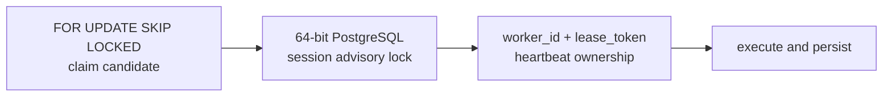
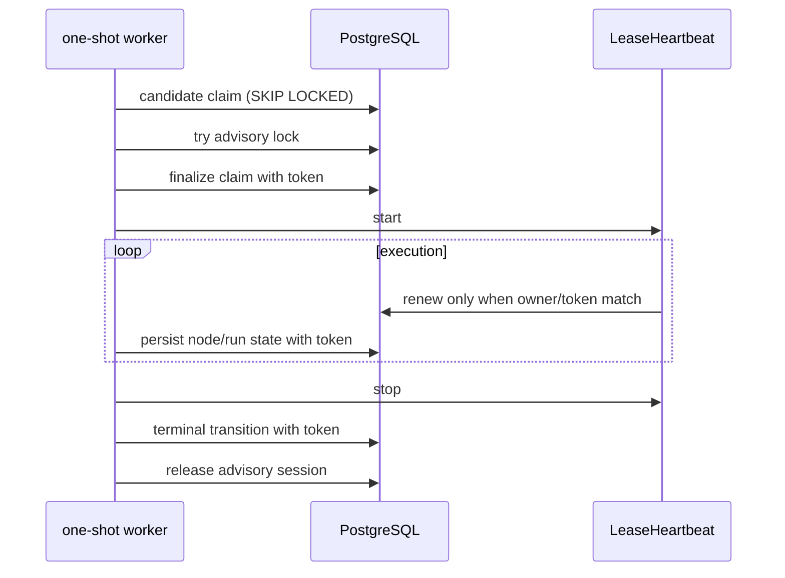

# [BP-103] Durable queue, lease와 동시성 제어
> **Document Code:** `BP-103` | **Contract State:** Target Architecture | **Capability State:** Operational | **Structure State:** Partial Migration
> **Target Ownership:** `backend/shared/application`, `backend/platform/postgres`, `backend/domains/*/application`, `backend/domains/*/infrastructure/postgres`, `backend/domains/*/workers`
> **Current References:** [`backend/engine/worker/lease.py`](file:///c:/Repos/bist-mini-final/backend/engine/worker/lease.py), [`backend/engine/worker/main.py`](file:///c:/Repos/bist-mini-final/backend/engine/worker/main.py), [`backend/storage/db_manager.py`](file:///c:/Repos/bist-mini-final/backend/storage/db_manager.py), [`backend/storage/data_sources/ingestion_shards.py`](file:///c:/Repos/bist-mini-final/backend/storage/data_sources/ingestion_shards.py)

---

## 1. 세 단계 소유권

1. row lock은 여러 worker가 같은 queue row를 동시에 candidate로 선택하지 못하게 합니다.
2. session advisory lock은 transaction commit 이후 실행 전체에 대한 상호 배제를 제공합니다. DB session이 종료되면 lock도 해제됩니다.
3. `worker_id`와 UUID `lease_token`은 모든 heartbeat·terminal update에서 현재 세대를 검증합니다. 이전 worker의 늦은 update는 row count 불일치로 거부됩니다.

workflow advisory key는 `hashtextextended(..., 0)`의 64-bit 값을 사용합니다.

---

## 2. Worker lifecycle

workflow worker의 기본 heartbeat는 15초, stale window는 180초입니다. benchmark와 BI worker는 각 worker entrypoint 설정을 따르며 현재 30초 heartbeat를 사용합니다. 이 값은 배포 resource/timeouts와 함께 변경해야 합니다.

---

## 3. Lease 상실

`LeaseHeartbeat`는 heartbeat가 `False`를 반환하거나 DB 예외가 나면 `LeaseLostError`를 기록합니다. 정상 terminal update와 마지막 heartbeat가 경합할 수 있어 기본 2초 grace를 두며, owner가 heartbeat를 정지하지 못하면 exit code 75로 process를 fail-closed 종료합니다.

협력 가능한 worker code는 결과 publish 전에 `raise_if_lost()`를 호출합니다. stale worker가 source snapshot, BI answer, benchmark result를 새 owner 뒤에 덮어쓰는 것을 허용하지 않습니다.

---

## 4. Stale recovery

- queue claim은 queued row뿐 아니라 heartbeat가 stale한 running row를 회수할 수 있습니다.
- 새 claim은 새 lease token을 발급해 이전 세대를 무효화합니다.
- API startup의 recovery와 다음 worker claim은 미완료 durable 상태를 재평가합니다.
- `cancel_requested`는 cooperative cancellation이며 `/jobs` 관제 API가 직접 Pod/lease를 삭제하지 않습니다.
- PostgreSQL이 상태 원본이고 Redis Pub/Sub는 lease나 lock으로 사용하지 않습니다.

---

## 5. 운영 규칙

- heartbeat interval은 stale window보다 충분히 작아야 합니다.
- provider timeout, worker active deadline, KEDA polling, stale window를 독립적으로 바꾸지 않습니다.
- OOM/eviction 후에는 `/api/v1/jobs`에서 Pod 상태와 queue heartbeat age를 함께 확인합니다.
- 수동 DB update로 token이나 status를 바꾸지 않습니다.
- 새 durable job 도메인은 claim, heartbeat, token-guarded terminal update, stale recovery 테스트를 모두 가져야 합니다.

---

## 6. Excel ingestion child shard 소유권

`ingestion_shards`는 `embedding`, `vector_copy` 두 phase를 `(operation_id, phase, shard_index)`로 식별합니다. 각 KEDA one-shot Job은 `FOR UPDATE SKIP LOCKED`로 한 행을 claim하고 30초 heartbeat와 lease token으로 terminal update를 보호합니다.

workflow run과 달리 shard 실행 전체를 session advisory lock으로 직렬화하지 않습니다. 서로 다른 shard가 병렬 실행되어야 하기 때문입니다. 대신 다음 멱등 계약을 사용합니다.

- embedding part artifact는 shard index별 고정 경로에 원자적으로 replace합니다.
- vector row ID는 staging collection UUID와 전역 문서 index의 UUIDv5입니다.
- COPY retry는 동일 ID 범위를 delete+COPY하는 단일 트랜잭션입니다.
- 부모 finalizer는 모든 현재 shard가 succeeded이고 staging row count가 예상 문서 수와 같을 때만 HNSW를 생성하고 publish합니다.
- 최종 실패 shard는 부모 모듈을 실패시키며 workflow retry가 failed shard의 attempt budget을 새로 시작합니다.

---

## 7. 책임 분리와 구조 완료 조건

- lease token, heartbeat clock과 transaction primitive는 `shared`에 두되 queue 상태 전이 정책은 각 domain application이 소유합니다.
- `FOR UPDATE`, advisory lock, token-guarded update SQL은 domain infrastructure의 PostgreSQL adapter가 구현합니다.
- worker는 claim 결과를 application command로 전달하며 repository SQL이나 Kubernetes client를 직접 조립하지 않습니다.
- Redis를 lock·lease·queue의 진실 공급원으로 승격하지 않습니다.
- workflow와 ingestion의 현재 lease 구현이 각 vertical slice로 이동하고 공통 lifecycle primitive만 shared에 남을 때 구조 migration을 완료합니다.
