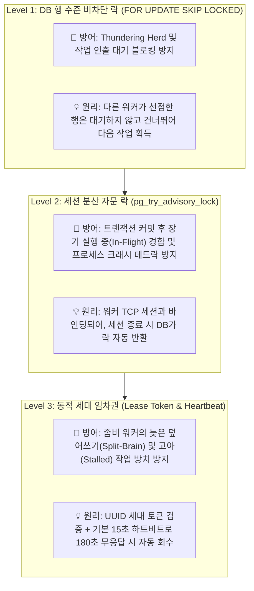
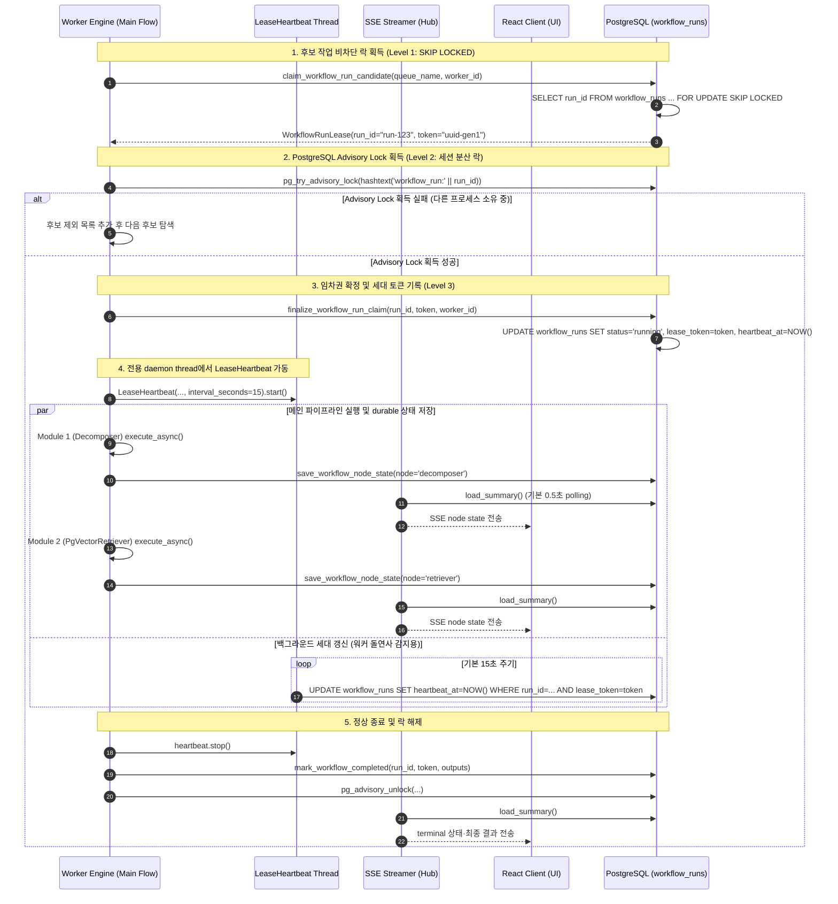
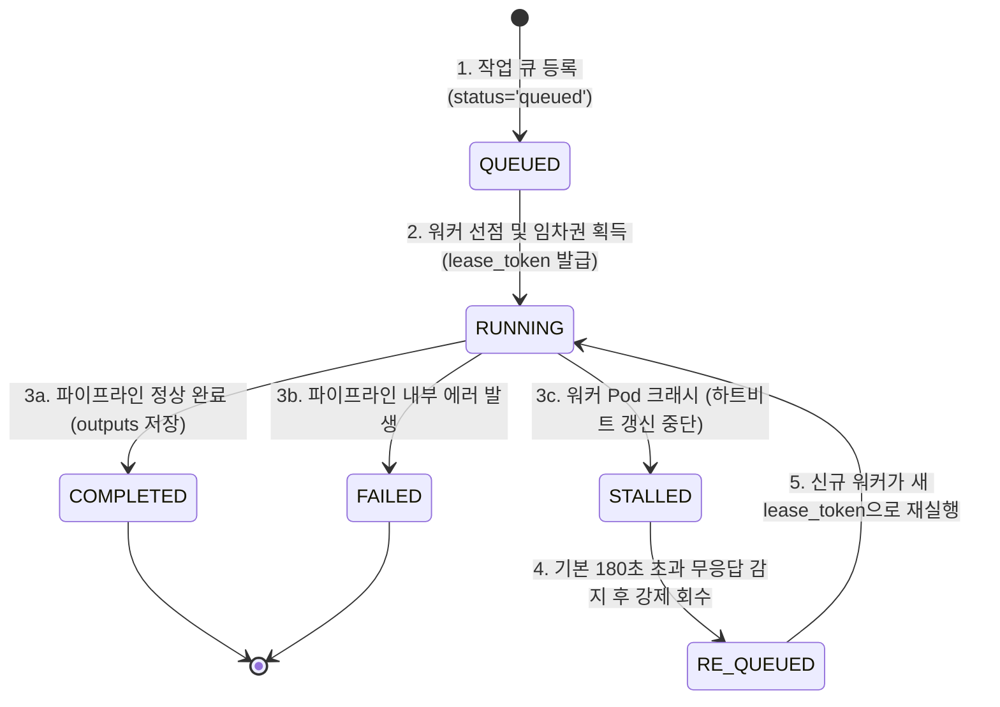

# [BP-103] 분산 락, 임차권(Lease) & 경합 회복 시퀀스
> **Document Code:** `BP-103` | **Category:** Concurrency & Distributed Systems Blueprint | **Status:** Approved Baseline  
> **Source Files:** [`backend/engine/worker/lease.py`](file:///c:/Repos/bist-mini-final/backend/engine/worker/lease.py), [`backend/engine/worker/main.py`](file:///c:/Repos/bist-mini-final/backend/engine/worker/main.py), [`backend/storage/db_manager.py`](file:///c:/Repos/bist-mini-final/backend/storage/db_manager.py)

---

## 1. 분산 동시성 제어 개요 (Concurrency Architecture)

Kubernetes 환경에서 수십 개의 Worker Pod가 단일 PostgreSQL `workflow_runs` 작업 대기열을 병렬로 소비할 때 발생할 수 있는 **4대 치명적 동시성 문제(Thundering Herd, 중복 실행, 좀비 덮어쓰기, 고아 작업)**를 원천 차단하기 위해 **3중 동시성 안전 분산 락킹 프로토콜(Triple Safety Locking)**을 구현합니다.



---

### 1.1 3중 동시성 안전 계층별 해결 문제 및 방어 매트릭스 (Problem-Solution Matrix)

| 안전 계층 (Level) | 핵심 기술 및 프로토콜 | 🛑 해결하는 핵심 문제점 (Problem) | 💡 동작 원리 및 아키텍처 보장 (Guarantee) |
| :--- | :--- | :--- | :--- |
| **Level 1: 인출 경합 방지**<br>(Row-Level Non-Blocking) | `SELECT ... FOR UPDATE SKIP LOCKED` | • **Thundering Herd 병목**<br>• **워커 프로세스 전체 블로킹**<br>• **동일 작업 중복 인출(Double Claim)** | 여러 워커가 동시에 큐를 폴링해도 다른 워커가 잠근 행을 기다리지 않고 건너뛰어 다음 claim 후보를 찾습니다. 실제 지연시간은 PostgreSQL 부하와 네트워크에 따라 달라집니다. |
| **Level 2: 실행 중 상호 배제**<br>(Session-Level Advisory Lock) | `pg_try_advisory_lock(hashtext(...))` | • **트랜잭션 종료 후 실행 중 경합**<br>• **Redis 분산락 만료/TTL 데드락**<br>• **워커 OOM 크래시 시 락 잔존** | Level 1의 행 락은 `COMMIT` 시 풀리지만 Advisory Lock은 파이프라인 실행 동안 세션 수준에서 유지됩니다. 워커 세션이 종료되면 PostgreSQL이 락을 자동 해제합니다. |
| **Level 3: 스플릿 브레인 방어**<br>(Generation Token & Heartbeat) | `WorkflowRunLease` (UUID) & `LeaseHeartbeat` (기본 15초 주기) | • **지연된 좀비 워커의 결과 덮어쓰기**<br>• **네트워크 파티션 Split-Brain**<br>• **무한 대기 고아(Orphaned) 작업** | 작업 인출 시 고유한 UUID 세대 토큰을 발급합니다. 지연된 구형 워커가 결과를 쓰려 해도 `WHERE run_id = :id AND lease_token = :token` 불일치로 DB가 덮어쓰기를 거부합니다. 기본 180초 무응답 시 다른 워커가 안전하게 회수합니다. |

---

## 2. 작업 임차(Claim) 및 실행 라이프사이클 시퀀스 (Claim & Lease Sequence)



---

### 2.1 SSE 상태 관찰과 백그라운드 Lease 하트비트의 역할 분담

1. **모듈 진행 상태 관찰 (SSE + Redis 알림 + polling fallback)**:
   - 각 파이프라인 모듈은 진행·완료 상태를 먼저 PostgreSQL에 영속화합니다. API의 `SharedStateStream`은 기본 0.5초 간격으로 변경을 읽고 SSE 구독자에게 fan-out합니다.
   - 한 API Pod가 변경을 감지하면 Redis Pub/Sub로 다른 API Pod의 동일 구독을 깨워 다시 읽게 합니다. Redis 장애 시에도 0.5초 polling fallback을 유지하며, 문서에서 0ms 지연을 보장하지 않습니다.
2. **백그라운드 임차권 하트비트 (Lease Liveness ➡️ 워커 돌연사 방어)**:
   - 모듈 실행 흐름과 분리된 `LeaseHeartbeat` daemon thread가 기본 **15초마다** DB의 `heartbeat_at`을 갱신합니다. 갱신 거부·DB 예외가 발생하면 lease 상실로 기록하고 2초 grace 후 one-shot worker를 fail-closed 종료합니다.
   - 워커 Pod가 OOM이나 노드 장애로 사망하면 다른 워커가 기본 **180초 무응답**을 감지하여 고아 작업을 안전하게 회수합니다.

---

## 3. 고아 작업 자동 회복 및 스톨 감지 FSM (Stale Recovery State Machine)

워커 프로세스가 OOM(Out of Memory)이나 Node Eviction으로 즉시 종료되어 정상적인 에러 기록을 남기지 못한 경우, 다음 워커가 스톨된 작업을 감지하여 안전하게 복구합니다.



---

### 3.1 상태 전이(State Transition) 및 복구 트리거 매트릭스

| 전이 (Transition) | 출발 상태 | 도착 상태 | 트리거 조건 (Trigger Condition) | DB 반영 및 처리 동작 |
| :--- | :---: | :---: | :--- | :--- |
| **① 작업 인출** | `QUEUED` | `RUNNING` | 워커가 `FOR UPDATE SKIP LOCKED` 선점 | `lease_token=UUID`, `heartbeat_at=NOW()` 기록 |
| **② 정상 완료** | `RUNNING` | `COMPLETED` | 파이프라인 DAG 모든 노드 성공 | `status='completed'`, `outputs` JSON 영속화, 락 해제 |
| **③ 실행 에러** | `RUNNING` | `FAILED` | 모듈 예외 발생 (ProviderApiError 등) | `status='failed'`, `error` JSON 및 스택트레이스 기록 |
| **④ 스톨 감지** | `RUNNING` | `STALLED` | 워커 Pod 비정상 종료 (OOM/SIGKILL) | `heartbeat_at`이 기본 180초 이상 갱신되지 않고 멈춤 |
| **⑤ 고아 회수** | `STALLED` | `RE_QUEUED` | 후속 워커가 스톨 작업 탐색 쿼리 실행 | 기존 토큰 무효화, `status='queued'`, 재시도 횟수 +1 |
| **⑥ 작업 재개** | `RE_QUEUED` | `RUNNING` | 신규 정상 워커가 재임차 획득 | 신규 `lease_token` 재발급 후 1번 노드부터 안전 재실행 |

---

## 4. 핵심 데이터 구조 및 DDL 명세

### `WorkflowRunLease` 구조체
```python
@dataclass(frozen=True)
class WorkflowRunLease:
    run_id: str
    token: str  # 임차권 세대 식별자 (UUID v4)
```

### `workflow_runs` 락킹 관련 핵심 컬럼
| 컬럼명 | 타입 | 제약 조건 및 역할 |
| :--- | :--- | :--- |
| `run_id` | `VARCHAR(64)` | PK, 고유 실행 식별자 |
| `queue_name` | `VARCHAR(64)` | 인덱스 대상 (`workflow-core`, `excel-ingestion`, `bi-materialize`) |
| `worker_id` | `VARCHAR(128)` | 현재 소유 워커 Pod 식별자 (예: `worker-pod-7df89-a1b2`) |
| `lease_token` | `VARCHAR(64)` | 세대 토큰. 이전 세대 토큰의 무단 DB 업데이트 방지 (`WorkflowLeaseLost`) |
| `heartbeat_at` | `TIMESTAMPTZ` | 마지막 생존 신호 타임스탬프 (인덱스: `(queue_name, status, heartbeat_at)`) |
| `cancel_requested`| `BOOLEAN` | 강제 취소 플래그 (True일 경우 하트비트 스레드가 실행 즉각 중단) |

---

## 5. 분산 인프라 운영 런북 및 장애 복구 절차 (Ops & Disaster Recovery Runbook)

| 장애 시나리오 (Scenario) | 감지 메커니즘 (Detection) | 자동 복구 절차 (Automated Recovery Sequence) | 운영자 수동 개입 지침 (Runbook Action) |
| :--- | :--- | :--- | :--- |
| **워커 Pod OOM / 노드 장애** | 기본 15초 주기 하트비트 중단 ➡️ `heartbeat_at`이 기본 180초 stale 임계값 초과 | 1. PostgreSQL이 종료된 워커 세션의 `pg_advisory_lock`을 자동 해제.<br>2. 180초 경과 시 타 워커가 stale lease를 감지.<br>3. `reap_stalled_leases()`가 기존 토큰을 무효화하고 `status='queued'`로 전환. | k8s 워커 Pod의 메모리 리밋 증설 (`deploy/kubernetes/`) 및 `/jobs` 포털에서 큐 재유입 확인. |
| **PostgreSQL 일시적 연결 단절** | `psycopg2.OperationalError` 발생 | 1. 워커는 DB 업데이트 실패 시 `lease_token`을 상실한 것으로 간주하여 즉시 실행 중단.<br>2. 커넥션 풀이 지수 백오프(1s, 2s, 4s)로 재연결 시도. | DB 서버 리소스(CPU/메모리) 점유율 확인 및 `pg_stat_activity`에서 잔여 락 세션 점검. |
| **OpenAI Responses API 429 (Rate-Limit)** | ProviderApiError (HTTP 429) 반환 | 1. `BaseLLMModule`이 `Retry-After` 헤더를 파싱하여 최대 5회 지수 백오프 자동 재시도.<br>2. 재시도 초과 시 에러 엔벨로프 포장 후 큐에 재등록. | OpenAI 티어 할당량(TPM/RPM) 모니터링 및 KEDA 동시 워커 수 상한(`maxReplicaCount`) 조정. |
| **장기 실행 좀비 워커 발생** | 실행 시간이 `timeout_seconds` 초과 | 1. 워커 내부 비동기 타임아웃 트리거.<br>2. `cancel_requested=true` 플래그 감지 시 프로세스 안전 종료 및 롤백. | 워크플로 실행은 `POST /api/v1/runs/{run_id}/cancel`로 취소 요청합니다. `/jobs`는 현재 읽기 전용 관제 화면이며 취소 명령을 발행하지 않습니다. |

---

## 6. 리팩토링 타깃 및 주의사항 (Refactoring Targets)

1. **구현됨 — Advisory Lock Key 해시 충돌 범위 축소**:
   - workflow run lock은 `hashtextextended(..., 0)`의 64비트 키를 사용하고 전용 세션 종료로 lock 해제를 보장합니다. 컬렉션 publish의 트랜잭션 lock도 후속 정합성 개선 시 같은 64비트 방식으로 통일할 수 있습니다.
2. **구현됨 — 하트비트 상실 fail-closed 회로**:
   - `LeaseHeartbeat`는 갱신 거부 또는 DB 예외를 lease 상실로 기록합니다. 정상 terminal 갱신과의 race를 위한 2초 grace 안에 owner가 heartbeat를 정지하지 않으면 one-shot worker 프로세스를 종료하여 Split-Brain 실행을 차단합니다.
   - workflow, benchmark, BI materialization, BI question worker가 동일한 중단 회로를 사용하며, 협력적 실행 경계에서는 `raise_if_lost()`로 결과 저장 전 소유권을 재검증합니다.
