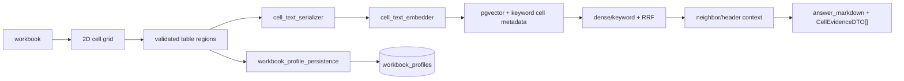

# [BP-201] Spreadsheet 2D 좌표 정규화와 직렬화
> **Document Code:** `BP-201` | **Contract State:** Target Architecture | **Capability State:** Operational | **Structure State:** Complete
> **Target Ownership:** `backend/domains/data_sources/domain`, `backend/domains/data_sources/application`, `backend/domains/data_sources/infrastructure/filesystem`, `modules/structure`
> **Current References:** [`backend/domains/data_sources/infrastructure/spreadsheets/`](../../../backend/domains/data_sources/infrastructure/spreadsheets), [`modules/structure/`](../../../modules/structure)

---

## 1. 목적

재무 workbook의 값은 cell 하나만으로 의미가 완성되지 않습니다. 행 계정명, 열 기간, unit, 병합 header, sheet와 company scope를 보존해 검색 text와 source evidence를 함께 만들어야 합니다.

---

## 2. 정규화 규칙

1. workbook과 sheet의 원래 순서·이름을 보존합니다.
2. merged range의 anchor 값을 해당 header 문맥을 해석할 때 공유하되 원본 좌표는 바꾸지 않습니다.
3. cell은 row/column index와 Excel coordinate를 모두 가집니다.
4. formula cell은 값과 formula/source 표현을 혼동하지 않도록 명시적으로 처리합니다.
5. blank/hidden 영역의 포함 여부는 parser config와 source metadata로 남깁니다.
6. 셀 로컬 의미와 workbook 전역 의미를 분리합니다. 셀 `cmetadata`는 좌표·행/열 header·실제 값·variant·lineage를 보존하고, 반복되는 currency·scale·period·sheet role은 `WorkbookProfile`로 한 번만 저장합니다. 특정 셀에만 적용되는 기간/단위가 명시된 경우에만 로컬 override를 허용합니다.
7. `cell_id`에는 `A1`, `L42` 같은 원본 Excel 좌표만 저장합니다. 저장·검색·RRF 중복 판정은 `index_id/workbook_hash + 정확한 company_name + 정확한 sheet_name + cell_id` 복합 키를 사용합니다. 회사명은 변경 가능한 표시·routing 속성이므로 영속 범위의 기준은 `index_id` 또는 `workbook_hash`이며, 시트명은 축약·공백 제거·underscore 제거 없이 원본 이름을 보존합니다.

구현 책임은 `cell_semantics.py`의 좌표·값 record 수집, `grid_structure.py`의 occupied grid·병합 영역·header tree, `table_geometry.py`의 pixel/cell 경계 변환, `sheet_renderer.py`의 원본 시트 rasterization으로 분리합니다. renderer 내부에서도 값 포맷, fill, border, text alignment를 독립 단계로 유지해 날짜·회계 형식 수정이 좌표 기하학에 영향을 주지 않게 합니다.

---

## 3. `header_with_value` 검색 표현

```text
Company: {company} | Sheet: {sheet} | Row Header: {row_header_path} | Column Header: {column_header_path} | Cell Value: {display_value}
```

직렬화 text는 dense embedding과 keyword index가 같은 cell 의미를 공유하도록 합니다. `Company`는 `Row Header`에 섞지 않는 독립 필드이며, table `title` 영역의 회사명·출처·단위·기간 설명도 행 계정명 계층에 포함하지 않습니다. raw workbook 값, `cell_coord`, row/column index와 source lineage는 셀 metadata에 남겨 reader가 evidence로 참조합니다. workbook 전체에 반복 적용되는 통화·배율·기간 목록·시트 역할은 원본 파일에서 결정적으로 추출한 `WorkbookProfile`을 data sources 도메인이 소유하고 BI·기업 비교·챗봇이 adapter를 통해 공유합니다.

`header_only` 변형의 `Cell Value: ?`는 검색 recall 보조용이며 사용자 답변의 근거가 될 수 없습니다. Context Expander는 같은 좌표의 `header_with_value`/실제 metadata 값을 우선 복원하고, Reader는 값이 없는 셀을 인용 후보에서 제외합니다.

---

## 4. 후속 검색 흐름



구조 감지 실패 시 임의의 header heuristic으로 계속 적재하지 않습니다. 구조 감지와 좌표 정규화는 분리돼 있어 외부 vision 결과도 실제 workbook bounds와 대조합니다.

---

## 5. 무결성·성능 검증

- 병합 header, 다층 header, 음수·괄호 숫자, 단위 행, 여러 FY 열에 대한 fixture test를 유지합니다.
- serialized record에서 workbook/sheet/cell 좌표를 역추적할 수 있어야 합니다.
- batch size와 artifact 사용량은 데이터셋 benchmark로 조정하며 근거 없는 고정 절감률을 문서화하지 않습니다.
- large workbook parsing은 API 이벤트 루프가 아니라 worker thread/one-shot worker에서 실행합니다.
- formula workbook과 cached-value workbook을 함께 읽으며 cached 값이 없는 formula도 formula record로 보존합니다. 일반 빈 셀만 컨텍스트에서 제외합니다.
- profile 추출은 고정 sheet 이름이나 고정 좌표를 사용하지 않습니다. 명시적 통화·배율 표기, 기간 축의 반복 날짜, `Actual/LTM/Estimate` 의미와 재무 계정명 증거를 조합하며 서로 충돌하거나 근거가 없으면 `partial`과 diagnostics를 기록합니다.
- 미래 estimate/forecast 열과 template valuation date 같은 제어 행은 기간 축에서 제외합니다. BI는 profile의 전체 실제 FY/LTM 중 실행 시점 기준 최근 FY 5개와 최신 LTM을 선택합니다.

---

## 6. 책임 분리와 구조 완료 조건

- 좌표, 셀 의미, header path와 evidence identity는 `data_sources/domain`의 provider·파일 형식 비종속 계약입니다.
- workbook 읽기, openpyxl 변환, raster 좌표 변환은 `data_sources/infrastructure/filesystem` adapter가 담당합니다.
- serialization use case와 parser port는 `data_sources/application`, DAG adapter는 `modules/structure`에 둡니다.
- renderer나 parser가 pgvector 저장소, HTTP DTO 또는 외부 vision client를 직접 import하지 않습니다.
- 이전 `backend/storage/spreadsheets` 구현은 data sources infrastructure로 이동했고 수평 storage package는 제거됐습니다.
- workbook catalog와 renderer는 bootstrap에서 생성해 module에 주입합니다. module은 경로·provider·DB client를 자체 생성하지 않으며 저장 capability는 좁은 port로 받습니다.
- `structured-cell-v7-exact-sheet-identity`, 좌표 전용 `cell_id`, `header_only`/`header_with_value`, header hierarchy 조합 생성과 unresolved-value 필터가 현재 직렬화 계약입니다.
- `WorkbookProfile`은 `data_sources/domain/workbook_profiles.py`, 원본 추출은 `workbook_profile_extractor.py`, 저장은 `workbook_profiles`가 소유합니다. 이미 인덱싱된 파일은 동일 원본 hash를 확인한 뒤 on-demand resolver로 재임베딩 없이 프로필을 보완할 수 있습니다. BI 신규 materialization은 resolver의 강제 재생성 모드로 저장 프로필을 건너뛰고 원본에서 다시 계산한 결과를 교체 저장합니다.
- variant, serialization version, unresolved marker 또는 좌표 metadata를 바꾸면 기존 collection 호환성·재적재 전략·BP-303 Reader 경계를 함께 검토합니다.
