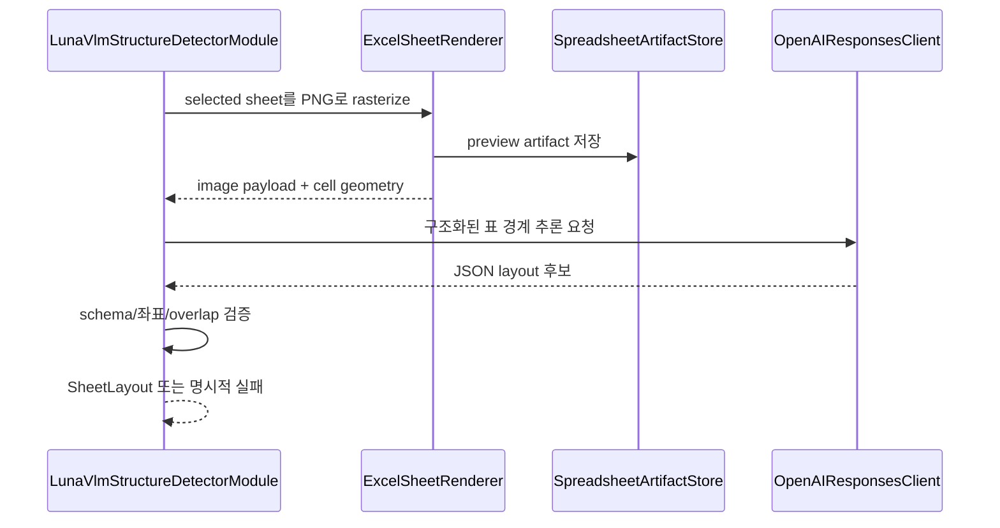

# [BP-202] 외부 Vision 기반 시트 구조 감지
> **Document Code:** `BP-202` | **Category:** Data Engine Blueprint | **Status:** Implemented with External Provider
> **Source Files:** [`modules/structure/luna_vlm_structure_detector.py`](file:///c:/Repos/bist-mini-final/modules/structure/luna_vlm_structure_detector.py), [`backend/storage/spreadsheets/sheet_renderer.py`](file:///c:/Repos/bist-mini-final/backend/storage/spreadsheets/sheet_renderer.py), [`backend/storage/spreadsheets/cell_type_overlay.py`](file:///c:/Repos/bist-mini-final/backend/storage/spreadsheets/cell_type_overlay.py)

---

## 1. 범위 결정

`structure.luna_vlm_structure_detector`라는 module type과 클래스 이름은 유지되지만 현재 추론은 `OpenAIResponsesClient`를 통해 외부 OpenAI vision model에 위임합니다. 실제 model ID는 런타임 설정으로 결정되며 문서에서 특정 Codex/ChatGPT 모델 이름으로 고정하지 않습니다.

로컬·온디바이스 VLM, ONNX/vLLM 추론 서버, 에어갭 모델 배포는 구현하지 않습니다. 이 결정은 현재 제품 범위이며 로드맵 항목도 아닙니다.

---

## 2. 처리 흐름

출력은 sheet 크기와 한 개 이상의 table region을 포함하는 구조화 계약입니다. 각 region은 table bounding box와 header/data 영역 좌표를 가지며 후속 `cell_text_serializer`가 실제 셀 좌표와 결합합니다.

---

## 3. 무결성 규칙

- provider 응답은 Pydantic schema와 sheet bounds를 모두 통과해야 합니다.
- 범위를 벗어난 행·열, 뒤집힌 좌표, 허용되지 않은 overlap은 실패 처리합니다.
- vision 실패 시 임의로 첫 행/첫 열을 header로 간주하는 silent fallback을 만들지 않습니다.
- provider 오류와 schema 오류는 도메인 예외로 변환되어 해당 ingestion run에 기록됩니다.
- 원본 workbook과 raster artifact를 통해 구조 감지 결과를 역추적할 수 있어야 합니다.

---

## 4. 현재 UI와의 관계

Data Sources는 서버가 만든 spreadsheet preview와 감지 region을 조회할 수 있지만 수동 bounding-box 편집·승인 workflow는 현재 공개 계약이 아닙니다. 편집 기능을 추가하려면 사용자 수정 좌표, 원본 추론 좌표, 승인자, 버전, 재색인 트리거를 함께 저장하는 별도 감사 모델이 먼저 필요합니다.
