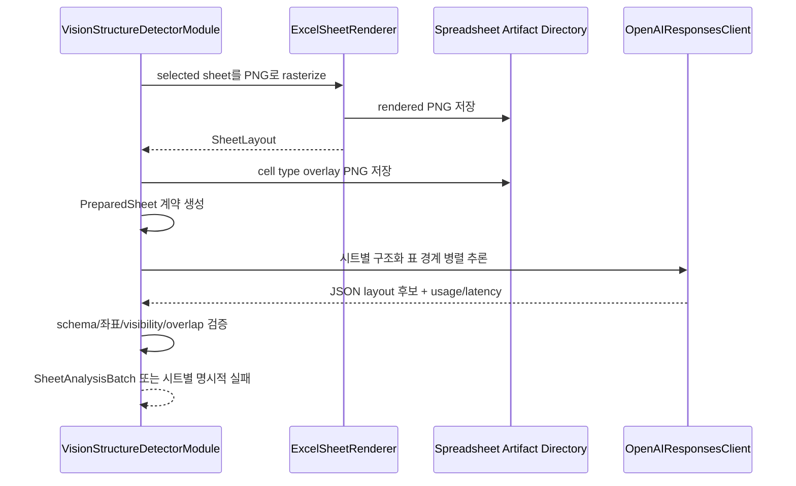

# [BP-202] 외부 Vision 기반 시트 구조 감지
> **Document Code:** `BP-202` | **Contract State:** Target Architecture | **Capability State:** Operational via External Provider | **Structure State:** Partial Migration
> **Target Ownership:** `backend/domains/data_sources/application`, `backend/domains/data_sources/infrastructure/vision`, `backend/platform/openai`, `modules/structure`
> **Current References:** [`modules/structure/luna_vlm_structure_detector.py`](file:///c:/Repos/bist-mini-final/modules/structure/luna_vlm_structure_detector.py), [`backend/domains/data_sources/infrastructure/spreadsheets/sheet_renderer.py`](file:///c:/Repos/bist-mini-final/backend/domains/data_sources/infrastructure/spreadsheets/sheet_renderer.py), [`backend/domains/data_sources/infrastructure/spreadsheets/cell_type_overlay.py`](file:///c:/Repos/bist-mini-final/backend/domains/data_sources/infrastructure/spreadsheets/cell_type_overlay.py)

---

## 1. Provider 계약

목표 module 계약은 provider 중립적인 `vision_structure_detector`입니다. application port는 prepared sheet와 구조화 결과만 알고, 실제 추론은 외부 OpenAI vision adapter에 위임합니다. model ID와 transport는 런타임 설정으로 결정되며 module contract에 provider 제품명을 고정하지 않습니다. 현재 공개된 compatibility module type은 저장된 workflow migration이 끝날 때까지 alias로만 유지할 수 있습니다.

---

## 2. 처리 흐름

출력은 sheet 크기와 한 개 이상의 table region을 포함하는 구조화 계약입니다. 각 region은 table bounding box와 header/data 영역 좌표를 가지며 후속 `cell_text_serializer`가 실제 셀 좌표와 결합합니다.

---

## 3. 무결성 규칙

- provider 응답은 Pydantic schema와 sheet bounds를 모두 통과해야 합니다.
- 범위를 벗어난 행·열, 뒤집힌 좌표, 허용되지 않은 overlap은 실패 처리합니다.
- vision 실패 시 임의로 첫 행/첫 열을 header로 간주하는 silent fallback을 만들지 않습니다.
- provider 오류와 schema 오류는 도메인 예외로 변환되어 해당 ingestion run에 기록됩니다.
- 원본 workbook과 raster artifact를 통해 구조 감지 결과를 역추적할 수 있어야 합니다.
- `title`, `column_header`, `row_header`, `data`가 겹치면 sheet bounds 검증 후 결정적 정규화 규칙으로 서로 분리합니다. 최종 data 영역을 기준으로 row header의 행 범위와 column header의 열 범위를 다시 맞춥니다.
- openpyxl은 thread-safe하지 않으므로 workbook 읽기·렌더링·셀 의미 추출은 주 스레드에서 수행합니다. 완성된 `PreparedSheet`만 provider 병렬 호출에 전달합니다.
- 병렬 결과는 `SheetAnalysisBatch`에서 성공 표, 실패 시트, token usage, latency를 한 번에 집계합니다. 한 시트 실패가 다른 시트의 성공 결과를 폐기하지 않지만 모든 시트 실패 시 모듈은 실패합니다.

---

## 4. UI와의 계약

Data Sources는 서버가 만든 spreadsheet preview와 감지 region을 조회할 수 있지만 수동 bounding-box 편집·승인 workflow는 현재 공개 계약이 아닙니다. 편집 기능을 추가하려면 사용자 수정 좌표, 원본 추론 좌표, 승인자, 버전, 재색인 트리거를 함께 저장하는 별도 감사 모델이 먼저 필요합니다.

---

## 5. 책임 분리와 구조 완료 조건

- `data_sources/application`은 `VisionStructureDetector` port와 batch orchestration을 소유합니다.
- `data_sources/infrastructure/vision`은 provider 응답을 도메인 구조 계약으로 변환합니다.
- `platform/openai`는 인증, timeout, retry, transport와 provider 응답 파싱 primitive만 제공합니다.
- `modules/structure`는 application port를 호출하는 DAG adapter이며 OpenAI client를 생성하지 않습니다.
- provider 중립 port가 정착하고 compatibility module type 외에 provider 이름이 domain/application에 남지 않을 때 구조 migration을 완료합니다.
