# [BP-203] 대용량 Binary COPY와 pgvector 인덱싱
> **Document Code:** `BP-203` | **Category:** Data Engine Blueprint | **Status:** Implemented & Operational
> **Source Files:** [`backend/storage/pgvector_binary_copy.py`](file:///c:/Repos/bist-mini-final/backend/storage/pgvector_binary_copy.py), [`backend/storage/pgvector_store.py`](file:///c:/Repos/bist-mini-final/backend/storage/pgvector_store.py), [`backend/storage/embedding_artifacts.py`](file:///c:/Repos/bist-mini-final/backend/storage/embedding_artifacts.py), [`backend/storage/data_sources/shard_coordinator.py`](file:///c:/Repos/bist-mini-final/backend/storage/data_sources/shard_coordinator.py)

---

## 1. 벡터 인제스천 아키텍처

수십만 개의 스프레드시트 셀 임베딩을 PostgreSQL `INSERT` 문이나 ORM 객체 매핑으로 주입하면 Python 인터프리터의 float 객체 생성 오버헤드와 네트워크 직렬화 병목으로 인해 막대한 지연이 발생합니다.

`bist-mini-final`은 **PostgreSQL 네이티브 Binary COPY 프로토콜**을 직접 바이트 스트림 수준에서 구현합니다. 처리량은 DB 디스크·네트워크·벡터 생성 여부에 따라 달라지므로 고정 수치로 보장하지 않고 벤치마크로 측정합니다.

```mermaid
flowchart LR
    SERIALIZED["직렬화 문서"] --> EQ["ingestion_shards: embedding"]
    EQ --> EJ["KEDA embedding Jobs\n최대 4"]
    EJ --> PARTS["ordered .f32 part artifacts"]
    PARTS --> EMB["canonical float32 artifact"]
    EMB --> VQ["ingestion_shards: vector_copy"]
    VQ --> VJ["KEDA COPY Jobs\n최대 2"]
    VJ --> STREAM["PgVectorBinaryCopyStream"]
    STREAM --> STAGE["private staging collection"]
    STAGE --> BARRIER["count barrier"]
    BARRIER --> HNSW["collection-local HNSW 1회 생성"]
    HNSW --> PUBLISH["atomic collection publish"]
```



기본 임베딩 배치 크기 2,048은 각각 독립적인 `ingestion-embedding` Job으로 claim됩니다. COPY는 기본 4,096문서 shard를 `ingestion-vector` Job으로 보내며, 전체 shard가 성공하기 전에는 staging collection을 검색에 공개하지 않습니다. KEDA 동시성은 임베딩 4, COPY 2로 제한해 API rate limit과 PostgreSQL WAL·인덱스 write amplification을 제어합니다.

---

## 2. PostgreSQL Binary COPY 프로토콜 프레이밍 구조

`PgVectorBinaryCopyStream`이 생성하는 바이너리 프레임 레이아웃:

```text
+-----------------------------------------------------------------------+
| PGCOPY File Header: "PGCOPY\n\xff\r\n\x00" + Flags(4B) + HeaderExt(4B)|
+-----------------------------------------------------------------------+
| Tuple 1: FieldCount(2B) = 5                                           |
|   - Field 0 (id): Len(4B) + UUID/VARCHAR bytes                        |
|   - Field 1 (collection_id): Len(4B) + UUID bytes (16B)               |
|   - Field 2 (embedding): Len(4B) + Dim(2B) + Flags(2B) + Float32[3072]|
|   - Field 3 (document): Len(4B) + UTF-8 Text bytes                    |
|   - Field 4 (cmetadata): Len(4B) + JSONB bytes                        |
+-----------------------------------------------------------------------+
| ... (Tuple 2 ~ N)                                                     |
+-----------------------------------------------------------------------+
| File Trailer: -1 (2B) = 0xFFFF                                        |
+-----------------------------------------------------------------------+
```

---

## 3. HNSW 인덱스 물리 파라미터 및 검색 튜닝 (HNSW Vector Index)

PostgreSQL `vector` 확장의 HNSW를 사용하되, 3072차원 float32 전체를 인덱스에 중복 저장하지 않습니다. 컬렉션별 **binary quantization HNSW**에서 후보를 찾고 원본 float32 벡터의 코사인 거리로 재정렬합니다.

```sql
-- 실제 이름은 컬렉션 UUID와 차원을 포함해 충돌 없이 생성한다.
CREATE INDEX CONCURRENTLY idx_lc_hnsw_bq_c_{collection_uuid}_{dimension}
ON langchain_pg_embedding
USING hnsw (
    (binary_quantize(embedding)::bit({dimension})) bit_hamming_ops
)
WHERE collection_id = '{collection_uuid}'::uuid
  AND vector_dims(embedding) = {dimension};
```

### 런타임 검색 쿼리 튜닝
- **후보 단계**: Hamming 거리로 `max(k × 20, 100)`, 최대 1,000개 후보를 조회합니다.
- **정확 재정렬**: 후보의 원본 `vector`에 코사인 거리(`<=>`)를 적용해 최종 `k`개를 반환합니다.
- **연결 단위 튜닝**: `hnsw.iterative_scan=strict_order`, `hnsw.max_scan_tuples=20000`, `hnsw.ef_search=40`을 동기·비동기 풀 모두에 적용합니다. Recall/지연 목표치는 [BP-701]의 실제 데이터셋으로 별도 측정합니다.

---

## 4. 메모리 격리 및 SSE 실시간 진행률 스트리밍 (Memory Isolation & SSE Telemetry)

- **`memoryview` 세그먼트 스트리밍**: 수만 행의 대형 워크북이라도 DB 전송 프레임 전체를 한 번에 만들지 않습니다. 분산 COPY Job은 artifact range view를 사용해 Python float 목록을 만들지 않고 little-endian raw bytes를 직접 읽으며, 로컬 fallback은 기존 `batch_size=1000` 스트림을 유지합니다.
- **재시도 멱등성**: `(staging collection UUID, global embedding index)`의 UUIDv5를 row ID로 사용합니다. 같은 shard를 재실행하면 해당 결정적 ID 범위를 한 트랜잭션에서 삭제한 뒤 COPY하므로 중복 row가 생기지 않습니다.
- **실시간 SSE 프로그레스 이벤트 (`Server-Sent Events`)**:
  - `progress_callback({"completed_batches", "total_batches", "completed_items", "total_items"})`가 실행 상태에 저장되고 SSE 상태 갱신에 반영됩니다.
  - **React 프론트엔드 UI ([BP-402], [BP-601])**: 워크플로 실행은 `EventSource` (`GET /api/v1/runs/{id}/stream`)로 상태를 수신합니다. 인제스천 화면은 ingestion job 조회를 기준으로 상태를 표시하며, 지연 시간은 네트워크·저장소 상태에 따라 달라집니다.
  - **내장 관제 대시보드 ([BP-104 Section 4])**: 관리자 화면(`GET /jobs`)은 워커 Pod와 durable queue/lease의 heartbeat·TTL을 상관 표시합니다. 배치별 인제스천 처리량 그래프는 아직 제공하지 않습니다.

---

## 5. 리팩토링 타깃 (Refactoring Targets)

1. **구현됨 — Binary COPY 단일 스트리밍 경로 (Zero Legacy Code Policy)**:
   - `PgVectorBinaryCopyStream`이 float32 artifact와 일반 벡터 시퀀스를 모두 동일한 PostgreSQL Binary COPY row framing으로 변환합니다.
   - `PgVectorStore.put_documents()`의 embedding row 쓰기에서 `execute_values`/multi-row INSERT 경로를 제거했습니다. 동적 임베딩도 bounded batch로 생성한 뒤 동일한 COPY 연결에 스트리밍합니다.
2. **구현됨 — Halfvec 대신 binary quantization + exact rerank 채택**:
   - 원본은 정확 재정렬을 위해 float32 `vector`로 유지합니다. HNSW 인덱스만 1-bit 표현을 사용하므로 fp16 `halfvec` 인덱스보다 작고, 최종 순위는 원본 코사인 거리로 보정됩니다.
   - `halfvec` 인덱스를 함께 만들면 동일 검색 목적의 인덱스가 중복되고 메모리·빌드 시간이 증가하므로 현재 운영 전략에서는 추가하지 않습니다. `GET /api/v1/data-sources/db-status`가 `binary_quantized_hnsw_exact_rerank` 전략과 실제 인덱스 수를 반환합니다.
3. **결정 완료 — 물리 파티션 대신 컬렉션 로컬 파티션 전략 유지**:
   - 모든 벡터는 immutable `collection_id`로 범위를 제한하고, 컬렉션 UUID별 partial HNSW를 생성합니다. PostgreSQL 실행계획에서 해당 인덱스가 직접 선택됩니다.
   - `company_name`은 수정 가능한 JSON 메타데이터이고 현재 인덱싱 계약에는 `fiscal_year`가 필수가 아닙니다. 이를 물리 파티션 키로 쓰면 기업명 변경 시 대량 row 이동이 발생하고 연도 없는 행을 안정적으로 분배할 수 없습니다.
   - 따라서 기존 대형 테이블을 자동 재작성하는 마이그레이션은 넣지 않습니다. 향후 회계연도 메타데이터 계약이 필수화되고 컬렉션 수·쿼리 계획 벤치마크가 물리 분할의 이득을 입증할 때 온라인 마이그레이션으로 별도 도입합니다.
4. **구현됨 — Kubernetes shard fan-out/fan-in**:
   - `ingestion_shards`가 embedding과 vector COPY work item의 queue, lease, heartbeat, retry 상태를 저장합니다.
   - 부모 workflow Job은 child shard barrier를 기다리면서 진행률과 실행/대기 Job 수를 SSE 상태에 기록합니다.
   - embedding part는 순서대로 하나의 content-addressed artifact로 결합하고, COPY 완료 후 document count를 검증한 뒤 HNSW와 collection publish를 한 번만 수행합니다.
   - publish 후 operation advisory lock 안에서 part vector와 shard manifest를 제거해 canonical artifact와 PostgreSQL collection만 남깁니다.
