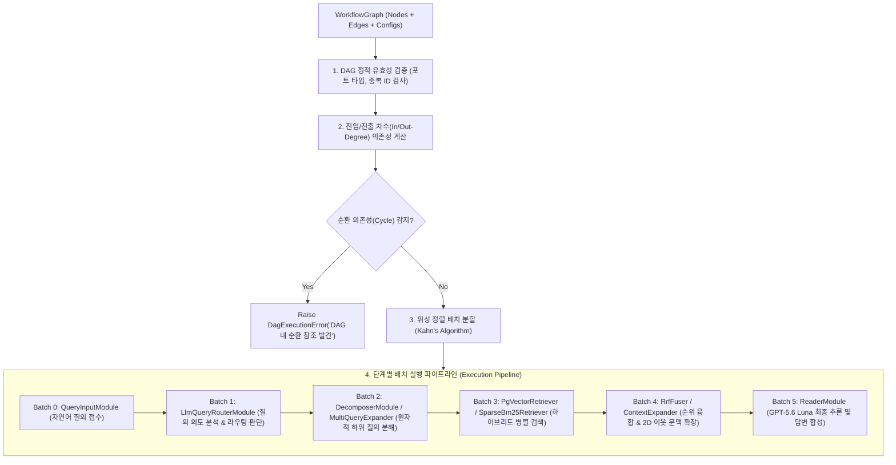
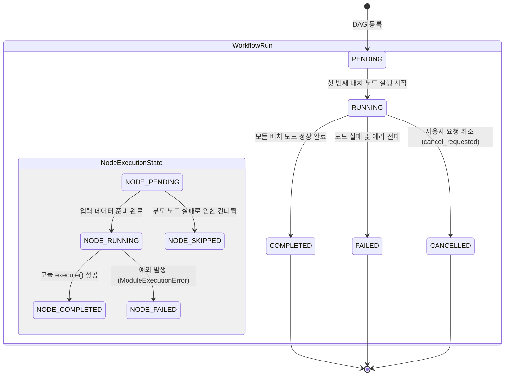

# [BP-301] DAG 토폴로지 실행기 & 상태머신(FSM)
> **Document Code:** `BP-301` | **Category:** Pipeline & Execution Blueprint | **Status:** Approved Baseline  
> **Source Files:** [`backend/engine/workflows/executor.py`](file:///c:/Repos/bist-mini-final/backend/engine/workflows/executor.py), [`backend/engine/workflows/models.py`](file:///c:/Repos/bist-mini-final/backend/engine/workflows/models.py), [`backend/engine/workflows/store.py`](file:///c:/Repos/bist-mini-final/backend/engine/workflows/store.py)

---

## 1. DAG 토폴로지 분석 및 위상 정렬 (DAG Validation & Topological Batches)

`WorkflowExecutor`는 사용자가 구성한 파이프라인 그래프의 유효성을 검증하고, 순환 의존성(Cycle) 유무를 검사한 후 **Kahn 알고리즘 기반의 병렬 실행 가능한 위상 배치(Topological Batches)**로 분할하여 실행합니다.



---

### 1.1 `LlmQueryRouter`의 동적 의도 분류 및 분기 제어 (Dynamic Routing Control)

사용자 질의가 유입되면 `QueryInputModule` 바로 다음에 **`LlmQueryRouterModule`이 개입하여 질의의 복잡도와 의도를 사전 분석**합니다:

1. **복합 재무 분석 질의 (Complex Analytical Query)**:
   - 예: *"삼성전자 2023년 영업이익률과 전년 대비 증감액을 비교해줘"*
   - ➡️ `LlmQueryRouter`가 `decompose_rag` 경로를 선택하여 **`DecomposerModule`로 질의를 전달**하고, 하위 서브쿼리 분해 및 RRF 융합 파이프라인을 가동합니다.
2. **단순 사실/정의 조회 질의 (Simple Fact / Direct Retrieval)**:
   - 예: *"2023년 당기순이익 얼마야?"*
   - ➡️ 분해(Decomposition) 단계를 생략하고 `PgVectorRetriever`로 직결 라우팅하여 지연 시간을 50% 단축합니다.
3. **정형 재무 공식 계산 질의 (Pre-calculated BI Metric)**:
   - 예: *"부채비율 공식 및 현재 수치"*
   - ➡️ 비정형 RAG 대신 `FinancialCalculator` BI 엔진으로 직결 연결합니다.

---

## 2. 노드 및 워크플로우 FSM 상태 전이표 (FSM State Transitions)



### 상태 전이 이벤트 및 데이터 버스 명세
| 상태 (State) | 트리거 이벤트 | 데이터 버스 동작 및 I/O |
| :--- | :--- | :--- |
| `PENDING` | API 요청 수신 | `RunStore`에 `WorkflowRun` 레코드 생성 (상태: `pending`) |
| `RUNNING` | `execute_batch()` 호출 | 소스 노드의 출력(`node_outputs`)을 타깃 노드의 입력 포트로 결선 |
| `NODE_COMPLETED`| 모듈 반환값 수신 | 결과 캐시(`ResultCache`) 저장 및 SSE 이벤트 발송 (`node_completed`) |
| `NODE_FAILED` | 모듈 예외 발생 | 스택 트레이스 압축 및 에러 엔벨로프 기록, 후속 노드 즉시 중단 |
| `CANCELLED` | `cancel_run()` 수신 | 진행 중인 스레드 중단 시그널 전파 및 리소스 해제 |

---

## 3. 노드 간 데이터 결선 및 핀 매핑 (Data Bus Wiring)

엣지(`WorkflowEdge`)는 소스 노드의 특정 출력 필드와 타깃 노드의 입력 필드를 1:1로 매핑합니다.

```json
[
  {
    "id": "edge_input_to_router",
    "source": "node_query_input",
    "source_handle": "query",
    "target": "node_query_router",
    "target_handle": "query"
  },
  {
    "id": "edge_router_to_decomposer",
    "source": "node_query_router",
    "source_handle": "analytical_query",
    "target": "node_decomposer",
    "target_handle": "query"
  }
]
```

- **타입 호환성 검증**: 타깃 모듈의 입력 DTO 스키마(Pydantic)와 소스 출력의 필드 타입을 실행 전 정적 검증합니다.

---

## 4. 리팩토링 타깃 (Refactoring Targets)

1. **구현됨 — 비동기 asyncio 실행 엔진 및 핵심 질의 체인**:
   - 동일 위상 배치의 노드는 `asyncio.TaskGroup`으로 병렬 실행합니다. 각 노드는 깊은 복사 상태를 사용하고 완료 후 공유 상태에 잠금 병합하여 lost update를 방지합니다.
   - 실행기는 `BaseModuleRegistry.execute_async()`를 직접 await합니다. Decomposer, LLM Router, Query Embedder, data scope, dense/keyword Retriever, context expansion, Reader와 Reader 셀 조회 도구는 네이티브 provider/DB await 경로를 사용하고, 동기 모듈은 `asyncio.to_thread()` 호환 경계를 사용합니다.
   - 하드 타임아웃이 설정된 배치는 Unix signal 기반 강제 제한을 보존하기 위해 순차 실행합니다. Windows에서는 signal hard-timeout을 사용할 수 없어 동일 순차 경로에서 협력적 취소 계약을 적용합니다.
   - 특정 배수의 성능 향상은 문서상 가정으로 두지 않고, 실제 워크로드 벤치마크 결과로 검증합니다.
2. **구현됨 — 조건부 분기(Conditional Branching / Switch Node)**:
   - `WorkflowEdge.source_branch`, 모듈의 `branch_outputs`, 실행 결과 `outcome` 계약으로 활성 edge를 선택합니다. 비활성 브랜치의 downstream 노드는 입력 준비 판정에서 제외되며 Playground도 branch handle과 실행 상태를 표시합니다.
