# [BP-301] DAG 검증과 durable 실행
> **Document Code:** `BP-301` | **Contract State:** Target Architecture | **Capability State:** Operational | **Structure State:** Partial Migration
> **Target Ownership:** `backend/domains/workflow/domain`, `backend/domains/workflow/application`, `backend/domains/workflow/infrastructure`, `backend/domains/workflow/presentation`, `backend/domains/workflow/workers`
> **Current References:** [`backend/engine/workflows/executor.py`](file:///c:/Repos/bist-mini-final/backend/engine/workflows/executor.py), [`backend/engine/workflows/batch_runner.py`](file:///c:/Repos/bist-mini-final/backend/engine/workflows/batch_runner.py), [`backend/engine/workflows/node_runner.py`](file:///c:/Repos/bist-mini-final/backend/engine/workflows/node_runner.py), [`backend/engine/workflows/models.py`](file:///c:/Repos/bist-mini-final/backend/engine/workflows/models.py), [`backend/engine/workflows/store.py`](file:///c:/Repos/bist-mini-final/backend/engine/workflows/store.py), [`backend/engine/workflows/service.py`](file:///c:/Repos/bist-mini-final/backend/engine/workflows/service.py)

---

## 1. 정의와 실행 분리

workflow 문서는 node, edge, config를 저장합니다. 실행 요청은 저장된 revision과 runtime input을 복제해 `workflow_runs`의 durable row를 만들며 실제 실행은 KEDA one-shot worker가 담당합니다.

```mermaid
flowchart LR
    DOC["WorkflowDocument"] --> VALIDATE["node/pin/edge/cycle validation"]
    VALIDATE --> SAVE["WorkflowStore"]
    SAVE --> SUBMIT["WorkflowExecutionService"]
    SUBMIT --> QUEUE["workflow_runs: queued"]
    QUEUE --> WORKER["KEDA worker claim + lease"]
    WORKER --> EXECUTOR["WorkflowExecutor"]
    EXECUTOR --> NODELOG["node_execution_logs"]
    NODELOG --> RESTSSE["REST + SSE"]
```

---

## 2. DAG 검증

1. node ID와 edge ID는 workflow 안에서 unique여야 합니다.
2. 모든 edge의 source/target node와 pin이 존재해야 합니다.
3. source output과 target input schema가 호환돼야 합니다.
4. Kahn topological sort 결과가 모든 node를 포함하지 않으면 cycle로 거부합니다.
5. 조건부 edge는 `source_branch`, module `branch_outputs`, 실행 `outcome`으로 활성 여부를 판정합니다.
6. 비활성 branch의 downstream node는 입력 준비에서 제외하거나 skipped 상태로 기록합니다.

실제 batch 구성은 사용자가 저장한 DAG에 따라 달라집니다. 문서가 고정된 “6단계 RAG batch”를 실행 계약으로 강제하지 않습니다.

---

## 3. 실행 상태

Workflow run의 영속 상태는 queued, running, completed, failed, paused를 사용합니다. cancel API는 `cancel_requested`를 설정하고 worker가 안전한 경계에서 paused terminal 상태로 전환합니다. resume은 기존 실행을 무단으로 덮어쓰지 않고 재등록 계약을 따릅니다.

Node는 pending, running, succeeded, skipped, failed 상태와 input/config/output/error, progress, elapsed time, cache hit, usage를 기록합니다.

---

## 4. Async batch 실행

- 동일 topological batch의 node는 `asyncio.TaskGroup`으로 병렬 실행합니다.
- 각 node는 격리된 실행 state를 사용하고 완료 후 공유 상태에 병합합니다.
- `BaseModuleRegistry.execute_async()`가 native async module을 직접 await합니다.
- 동기 module, RunStore I/O, CPU/file 작업은 `asyncio.to_thread()` 또는 one-shot process 경계로 격리합니다.
- signal hard timeout이 필요한 node는 플랫폼 제약에 따라 순차 경로를 사용할 수 있습니다.
- node 전후와 결과 publish 전에 cancel/lease ownership을 다시 확인합니다.

`WorkflowExecutor`는 실행 수명주기와 공개 facade만 소유합니다. resume 계획은 `WorkflowResumePlanner`, 위상 batch 진행은 `WorkflowBatchRunner`, 단일 node 준비·실행·결과 기록은 `WorkflowNodeRunner`가 담당합니다.

Excel ingestion의 `cell_text_embedder`와 `pgvector_index_writer`는 하나의 DAG node 상태를 유지하면서 내부 work item을 `ingestion_shards`에 fan-out합니다. child KEDA Job은 별도 DAG node가 아니며, 부모 node는 durable barrier를 기다리는 동안 `running` 상태와 shard 진행률을 저장합니다. 따라서 사용자 워크플로 pin 계약은 바뀌지 않고 실행 구현만 batch-level 병렬화됩니다.

---

## 5. 데이터 버스

`WorkflowEdge`는 source node의 output pin을 target input pin으로 매핑합니다. runtime은 edge를 따라 값을 모으고 target Pydantic input model로 최종 검증한 뒤 module을 실행합니다. module 출력 역시 output model을 통과한 값만 다음 node에 전달합니다.

중간 대형 payload를 매 polling마다 반환하지 않도록 run summary projection은 필요한 module output과 progress만 읽습니다. 전체 상세는 단일 run/trace 경계에서 필요할 때 조회합니다.

---

## 6. Cache와 재현성

- cache key는 module type/version, validated input/config와 관련 source identity를 포함해야 합니다.
- `use_cache=false`는 읽기/쓰기를 우회하는 실행 정책입니다.
- source workbook/index/workflow revision이 바뀌면 이전 결과를 현재 결과로 재사용하지 않습니다.
- cache 정리는 `DELETE /api/v1/cache`에서 명시적으로 수행합니다.
- 품질과 latency 비교는 같은 workflow/dataset/provider 설정으로 benchmark합니다.

---

## 7. 책임 분리와 구조 완료 조건

- graph, pin, run/node state와 전이 policy는 `workflow/domain`에 둡니다.
- validate, save, submit, cancel, resume, execute command/query와 required ports는 `workflow/application`이 소유합니다.
- PostgreSQL store, Kubernetes dispatcher와 cache adapter는 `workflow/infrastructure`, REST/SSE는 `workflow/presentation`, lease process는 `workflow/workers`에 둡니다.
- executor는 presentation DTO, provider client, concrete store를 import하지 않고 application port와 module registry 계약만 사용합니다.
- 현재 `backend/engine/workflows`와 `backend/engine/worker` 호출자가 0이고 workflow vertical slice가 동일한 회귀 테스트를 통과할 때 구조 migration을 완료합니다.
