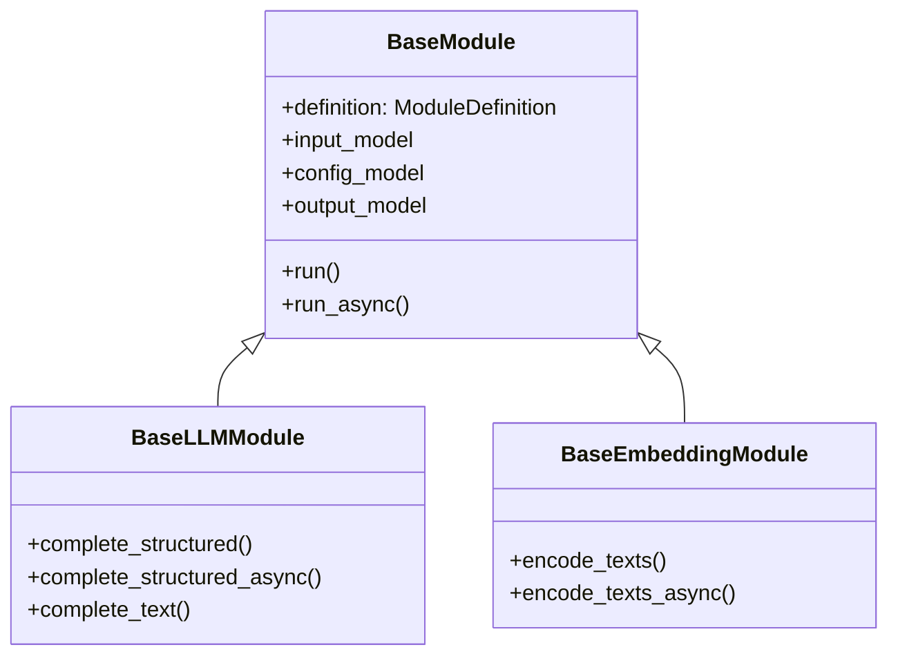

# [BP-302] 17개 파이프라인 모듈 핀아웃 카탈로그

> **Document Code:** `BP-302` | **Contract State:** Target Architecture | **Capability State:** Operational | **Structure State:** Complete
> **Target Ownership:** `modules`, `backend/domains/workflow/application`, `backend/bootstrap`
> **Current References:** [`backend/bootstrap/module_registry.py`](../../../backend/bootstrap/module_registry.py), [`backend/bootstrap/runtime.py`](../../../backend/bootstrap/runtime.py), [`modules/registry.py`](../../../modules/registry.py), [`modules/`](../../../modules)

---

## 1. 카탈로그 경계

`ModuleRegistry`가 등록하는 실행 가능한 DAG 노드는 17개입니다. 이 수는 코드의 factory 등록 목록을 기준으로 하며 문서상 후보 모듈을 포함하지 않습니다. BI, 챗봇, 벤치마크, Company Comparison은 사용자 유스케이스를 조율하는 제품 도메인 서비스이므로 모듈 수에 포함하지 않습니다.

- `BaseModule`은 Pydantic 입출력·설정 검증, 공통 오류 분류와 실행 telemetry를 담당합니다.
- `BaseLLMModule`은 OpenAI Responses 구조화·텍스트 호출을 공유합니다.
- `BaseEmbeddingModule`은 임베딩 차원 검증과 동기·비동기 인코딩을 공유합니다.
- 네이티브 async 구현이 없는 동기 모듈은 실행기가 worker thread에 격리합니다.

## 2. 공개 등록 목록

| 번호 | module type | 구현 클래스·파일 | 상속 | 역할 |
| :---: | :--- | :--- | :--- | :--- |
| 1 | `query_input` | `QueryInputModule` · `modules/query/query_input.py` | `BaseModule` | 사용자 질의를 표준 입력 DTO로 변환 |
| 2 | `decomposer` | `DecomposerModule` · `modules/query/decomposer.py` | `BaseLLMModule` | 질문과 collection catalog를 함께 받아 실제 기업·시트에 고정된 원자 `RetrievalPlanDTO` 생성 |
| 3 | `embedder` | `EmbedderModule` · `modules/embedding/query_embedder.py` | `BaseEmbeddingModule` | 검색 질의 임베딩 생성 |
| 4 | `pgvector_data_scope` | `PgVectorDataScopeModule` · `modules/storage/pgvector_data_scope.py` | `BaseModule` | collection·기업·ticker·정확한 시트·임베딩 계약 제공 |
| 5 | `pgvector_retriever` | `PgVectorRetrieverModule` · `modules/retrieval/pgvector_retriever.py` | `BaseModule` | pgvector Dense 검색 |
| 6 | `postgres_native_keyword_retriever` | `PostgresNativeKeywordRetrieverModule` · `modules/retrieval/postgres_native_keyword_retriever.py` | `BaseModule` | PostgreSQL Full-Text keyword 검색 |
| 7 | `rrf_fusion` | `RrfFusionModule` · `modules/retrieval/rrf_fusion.py` | `BaseModule` | Dense·keyword 결과 RRF 융합 |
| 8 | `pg_context_expander` | `PgContextExpanderModule` · `modules/retrieval/context_expander.py` | `BaseModule` | 원본 셀 주변 2D 문맥 확장 |
| 9 | `cell_text_embedder` | `CellTextEmbedderModule` · `modules/embedding/cell_text_embedder.py` | `BaseEmbeddingModule` | 직렬화된 셀 배치 임베딩 |
| 10 | `pgvector_index_writer` | `PgVectorIndexWriterModule` · `modules/storage/pgvector_index_writer.py` | `BaseModule` | 임베딩 아티팩트 Binary COPY 색인 |
| 11 | `processed_file_selector` | `ProcessedFileSelectorModule` · `modules/storage/processed_file_selector.py` | `BaseModule` | 처리할 워크북 선택·해시 확인 |
| 12 | `luna_vlm_structure_detector` | `LunaVlmStructureDetectorModule` · `modules/structure/luna_vlm_structure_detector.py` | `BaseModule` | 외부 vision client로 시트 구조 감지 |
| 13 | `cell_text_serializer` | `CellTextSerializerModule` · `modules/structure/cell_text_serializer.py` | `BaseModule` | 셀 좌표와 헤더를 검색 텍스트로 직렬화 |
| 14 | `company_entity_extractor` | `CompanyEntityExtractorModule` · `modules/storage/company_entity_extractor.py` | `BaseLLMModule` | 워크북 기업 식별 정보 추출 |
| 15 | `sheet_metadata_persistence` | `SheetMetadataPersistenceModule` · `modules/storage/sheet_metadata_persistence.py` | `BaseModule` | 시트·구조 메타데이터 저장 |
| 16 | `workbook_profile_persistence` | `WorkbookProfilePersistenceModule` · `modules/storage/workbook_profile_persistence.py` | `BaseModule` | 원본 workbook의 통화·배율·기간·시트 역할 공통 프로필 저장 |
| 17 | `reader` | `ReaderModule` · `modules/reader/reader.py` | `BaseLLMModule` | strict `answer_markdown + evidence_ids` 출력을 검증해 `CellEvidenceDTO[]`와 분리된 답변 생성 |

정확한 Input·Config·Output JSON Schema는 실행 중인 API의 `GET /api/v1/modules`, `GET /api/v1/modules/{module_type}`, `GET /api/v1/modules/schemas`를 단일 계약으로 사용합니다. 문서에 DTO 필드를 중복 복사하지 않아 코드 변경과의 드리프트를 방지합니다.

복잡한 module은 `execute()` 안에서 저장소·파일·provider 단계를 섞지 않습니다. 현재 구조 감지는 `PreparedSheet` 전처리 계약과 `SheetAnalysisBatch` 병렬 결과 계약으로 분리되고, 시트 메타데이터 저장은 대상 시트 결정 → workbook 차원 측정 → persistence record 조립 → 저장 순서를 독립 메서드로 유지합니다. 공통 상속은 `BaseModule`, `BaseLLMModule`, `BaseEmbeddingModule`처럼 실제 lifecycle과 불변식을 공유할 때만 사용합니다.

표준 질의 DAG에서 `decomposer`는 `query_context`와 `scope_catalog` 두 입력을 필수로 받습니다. 별도 LLM Router는 두 번의 LLM 호출과 중간 계약 드리프트를 만들기 때문에 사용하지 않습니다. Decomposer는 catalog에 존재하는 `index_id`만 선택하고 회사명·시트명을 실제 catalog 표기로 정규화한 뒤 `RetrievalPlanDTO`를 Dense와 keyword 경로에 동시에 전달합니다. 검색 대상에 없는 기업은 유사 기업으로 치환하지 않고 명시적인 실행 오류로 반환합니다. 정확한 canonical 기업에 한정된 전부-미등록 ID는 서버 scope로 교정할 수 있지만 알려진/미등록 ID 혼합, 기업 불일치, 구성원이 명시되지 않은 집합 표현은 fail-closed 처리합니다. 추정·전망은 `Key_Stats` 우선, 계산·비교는 모든 피연산 item과 최소 필요 시트라는 공통 분해 규칙을 따릅니다. 원 질문의 `총매출/매출`, `총부채/총차입금` 구분은 LLM 출력보다 우선하는 의미 계약이며, 단일 atomic query에서 현금흐름표·손익계산서·재무상태표·Key Stats를 명시하면 해당 source sheet를 hard constraint로 적용합니다. 여러 피연산자 route에는 문장 전체의 sheet 표현을 일괄 덮어쓰지 않습니다.

## 3. 제품 도메인 서비스와의 관계

| 도메인 | 주요 서비스 | 모듈과의 관계 |
| :--- | :--- | :--- |
| BI | `DocumentProfiler`, `QuestionPipeline`, `FinancialCalculator`, `PostgresBiStore` | 필요 시 등록 모듈을 포트로 조합하지만 BI DTO·스냅샷 수명주기는 독립 |
| Chat | 세션 repository, suggestion service, durable RAG run | 워크플로 run을 등록하고 완료 결과를 메시지로 동기화 |
| Benchmark | benchmark job service·worker | 평가셋을 대상으로 워크플로를 반복 실행 |
| Company Comparison | `CompanyComparisonSnapshotBuilder`, `CompanyComparisonService` | BI current snapshot을 읽고 별도 비교 버전을 발행; DAG 모듈 아님 |

## 4. 변경 규칙

1. 모듈 추가·삭제 시 `ModuleRegistry`, Playground 목록, API contract test와 이 문서를 같은 변경에서 갱신합니다.
2. 신규 제품 도메인 서비스를 모듈 개수에 포함하지 않습니다.
3. 외부 vision 모듈과 Dense + keyword + RRF 경로를 현재 실행 기준선으로 유지합니다.
4. 자동 스캔보다 명시적 factory 등록을 유지하여 provider·storage 의존성 주입과 등록 순서를 코드 리뷰 가능하게 보존합니다.
5. `modules/documentation.py`가 Pydantic schema에서 예시와 Markdown을 생성하므로 생성 문서를 직접 수정하지 않습니다.

---

## 5. 소유권과 구조 완료 조건

- module class, input/config/output schema와 version은 `modules/`가 소유합니다.
- registry protocol과 execution use case는 `workflow/application`, concrete factory 등록은 `bootstrap`이 소유합니다.
- module 자동 검색과 import side effect를 사용하지 않으며 factory가 요구하는 capability는 명시적인 port로 전달합니다.
- 저장된 workflow가 참조하는 module type rename은 alias·migration·deprecation 기간 없이 수행하지 않습니다.
- registry composition과 runtime 조립은 `backend/bootstrap`, registry lifecycle은 `modules/registry.py`로 이동했고 module concrete client 생성 금지 gate가 통과합니다. 이전 `backend/engine/runtime` shim도 제거됐습니다.
- 현재 factory 등록과 이 표는 모두 17개 type이며 BI·chatbot·benchmark·company comparison 서비스는 DAG module 수에 포함하지 않습니다.
- 공개 type, version, pin 또는 DTO schema를 바꾸면 저장 workflow 호환성, OpenAPI component, Playground adapter와 module contract test를 함께 갱신합니다.
