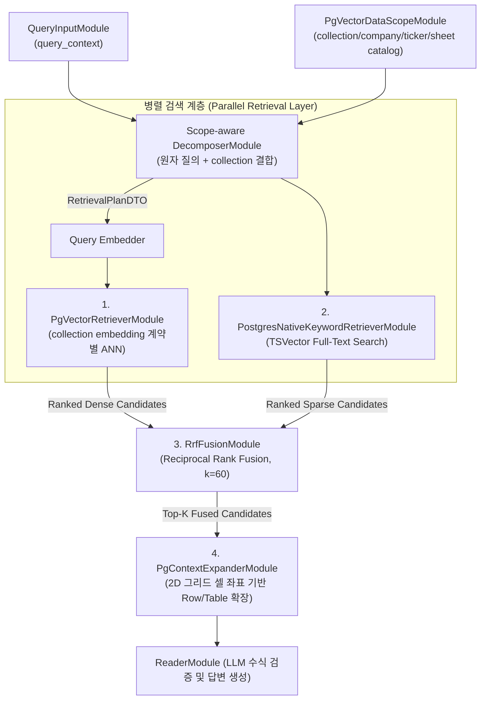
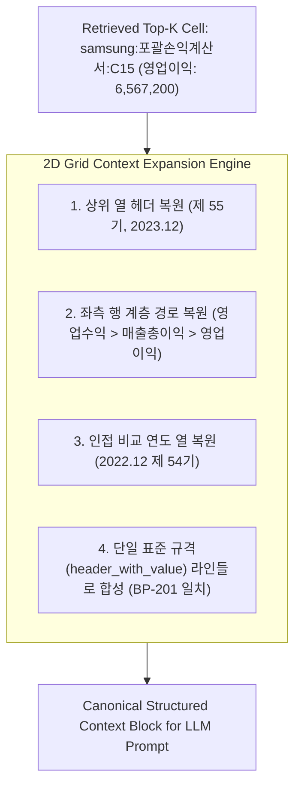

# [BP-303] Dense + Sparse + RRF 융합 & 셀 확장 회로
> **Document Code:** `BP-303` | **Contract State:** Target Architecture | **Capability State:** Operational | **Structure State:** Complete
> **Target Ownership:** `modules/retrieval`, `backend/domains/data_sources/application`, `backend/domains/data_sources/infrastructure/postgres`, `backend/platform/pgvector`
> **Current References:** [`modules/retrieval/pgvector_retriever.py`](../../../modules/retrieval/pgvector_retriever.py), [`modules/retrieval/postgres_native_keyword_retriever.py`](../../../modules/retrieval/postgres_native_keyword_retriever.py), [`modules/retrieval/rrf_fusion.py`](../../../modules/retrieval/rrf_fusion.py), [`modules/retrieval/context_expander.py`](../../../modules/retrieval/context_expander.py), [`modules/reader/reader.py`](../../../modules/reader/reader.py), [`backend/shared/application/cell_evidence.py`](../../../backend/shared/application/cell_evidence.py)

---

## 1. 하이브리드 검색 및 융합 파이프라인 구조 (Hybrid Retrieval Flow)

재무 엑셀 데이터는 "영업이익", "당기순손익"과 같은 **정확한 용어 일치(Exact Term Match)**와 "작년 장사해서 번 돈", "회사 부채 규모"와 같은 **자연어 의미론적 질의(Semantic Query)**를 동시에 처리해야 합니다.

`bist-mini-final`은 pgvector Dense 벡터 검색과 PostgreSQL TSVector BM25 키워드 검색을 병렬 수행한 후 **RRF (Reciprocal Rank Fusion)**로 순위를 융합하고, 검색된 셀을 2D 테이블 문맥으로 확장합니다.



Decomposer의 두 입력 단자는 플레이그라운드에서도 독립 edge로 보입니다. `PgVectorDataScopeModule`은 DB에서 catalog만 읽는 Source 모듈이고, Decomposer는 한 번의 구조화 LLM 호출로 질문 분해와 data scope 결합을 함께 수행합니다. 출력의 모든 `index_id`는 catalog membership 검증을 통과해야 하며 회사명과 시트명은 실제 저장 표기로 정규화됩니다. 따라서 존재하지 않는 기업을 먼저 분해한 뒤 다른 collection으로 우회하는 경로는 허용하지 않습니다. 다만 BI처럼 서버가 lineage를 단일 collection으로 이미 고정한 요청에서는 모델이 유일한 index ID를 오탈자 낸 경우 그 sole scope로만 복구하고 `repaired_scope_count`를 남깁니다. 둘 이상의 scope가 있으면 알 수 없는 ID를 계속 fail-closed 처리합니다.

이 회로는 자유 질의와 BI exact lookup miss의 공통 fallback입니다. BI의 versioned metric catalog처럼 이미 지표·기간이 구조화된 요청은 BP-403의 metadata exact-evidence 조회를 먼저 실행합니다. 정확 값 셀이 있으면 불필요한 Decomposer·embedding·RRF 호출을 생략하고, 없을 때만 이 하이브리드 회로로 내려옵니다. BI 별칭·FY/LTM 판단은 BI bounded context가 소유하며 범용 retrieval module에 하드코딩하지 않습니다.

---

## 2. RRF (Reciprocal Rank Fusion) 수학적 공식

$$
\text{RRF Score}(d) = \sum_{m \in \{\text{Dense}, \text{BM25}\}} \frac{1}{k + r_m(d)}
$$

- $d$: 평가 대상 엑셀 셀 청크 (Candidate Cell Chunk)
- $m$: 검색 모델 채널 (Dense pgvector 또는 Sparse PostgreSQL FTS)
- $r_m(d)$: 해당 검색 모델 $m$ 내에서의 순위 (1-indexed Rank)
- $k$: 랭킹 스무딩 상수 (**기본값: $60$**)

### RRF 결합 효과 예시
- **사례 1 (Dense 1위, Sparse 5위)**: $\frac{1}{60 + 1} + \frac{1}{60 + 5} = 0.01639 + 0.01538 = 0.03177$ -> **최상위 승격**
- **사례 2 (Dense 단독 1위, Sparse 미검색)**: $\frac{1}{60 + 1} + 0 = 0.01639$
- **사례 3 (양쪽 모두 1위)**: $\frac{1}{60+1} + \frac{1}{60+1} = 0.03278$ -> **절대적 1위 확정**

---

## 3. 기하학적 2D 셀 컨텍스트 확장 회로 (`PgContextExpanderModule`)

단일 셀($C5$) 하나만으로는 해당 수치가 매출액인지 감가상각비인지, 직전 연도 대비 증감률이 얼마인지 LLM이 파악할 수 없습니다. 따라서 RRF로 선별된 상위 좌표를 기준으로 **2D 영역(상위 계층 헤더, 시계열 비교 열, 인접 행)을 단일 표준 규격(`header_with_value`)으로 복원 및 확장**합니다.



### [BP-201 표준 일치] 생성된 확장 컨텍스트 블록 예시 (Canonical Context Block)

```text
[Context Block: Top-K 융합 및 2D 이웃 확장 셀 목록]
Company: 삼성전자 | Sheet: 포괄손익계산서(연결) | Row Header: 영업수익 > 매출액 | Column Header: 2022.12 (제 54기) | Cell Value: 302,231,360
Company: 삼성전자 | Sheet: 포괄손익계산서(연결) | Row Header: 영업수익 > 매출액 | Column Header: 2023.12 (제 55기) | Cell Value: 258,935,494
Company: 삼성전자 | Sheet: 포괄손익계산서(연결) | Row Header: 영업수익 > 매출총이익 > 영업이익 | Column Header: 2022.12 (제 54기) | Cell Value: 43,370,290
Company: 삼성전자 | Sheet: 포괄손익계산서(연결) | Row Header: 영업수익 > 매출총이익 > 영업이익 | Column Header: 2023.12 (제 55기) | Cell Value: 6,567,200
```

* **표현 일관성과 파편화 방지**: 마크다운 표를 다시 조립하기보다 [BP-201]의 `header_with_value`와 원본 좌표 metadata를 유지해 dense/keyword/reader가 같은 cell 의미를 공유합니다. 토큰·정확도 효과는 benchmark에서 별도로 측정합니다.
* **검색/Reader 경계 규칙**: `Cell Value: ?`는 값 미지정을 뜻하는 검색 와일드카드입니다. Query Decomposer가 만든 이 표기는 Query Embedder와 Dense 유사도 검색까지 그대로 유지하며, 검색 후보 좌표와 2D 확장에도 사용할 수 있습니다. 단, Reader 입력 경계에서는 `Cell Value`가 실제 값인 셀만 통과시킵니다. Reader의 `[Context Blocks]`, 검증 가능한 근거 목록, `lookup_cell_metadata` 도구 결과는 모두 이 공통 필터를 거쳐 재구성되며 `?`, `NA`, `N/A`, `NM`, `#PEND`는 모델에 전달하지 않습니다.
* **Reader 근거 선택 규칙**: 값이 있는 Reader 후보 전체가 사용자 근거가 되는 것은 아닙니다. 각 후보에 서버가 `EVIDENCE-nnn` ID를 부여하고 LLM은 strict JSON Schema에 맞춰 `answer_markdown`과 실제 사용한 최소 `evidence_ids`만 반환합니다. backend는 ID를 후보 allowlist와 대조한 뒤 완전한 `CellEvidenceDTO[]`로 투영합니다. 본문에 시트·좌표 문자열이나 `근거` section을 합성하지 않으며, 선택 누락 시 검색 상위 셀을 자동 첨부하지 않습니다.

---

## 4. 범위와 구현 결정

1. **구현됨 — 명시적 bounded row expansion**:
   - 기본은 검색된 단일 행의 실제 값 셀을 복원하고 `adjacent_radius`를 지정한 경우에만 최대 20행 반경으로 확장합니다. 문서에 과거 기재된 고정 $\pm 3$행 동작은 현재 계약이 아닙니다.
   - 현재 persisted cell metadata에는 versioned `table_id`와 `data_range`가 없으므로 런타임이 표 범위를 추정해 임의로 잘라내지 않습니다. adaptive table window가 필요해지면 serializer metadata schema, 기존 collection 재적재, retrieval contract를 함께 버전 변경합니다.
2. **구현됨 — 비동기 검색 및 2D 컨텍스트 확장**:
   - Dense와 keyword 검색은 `AsyncConnectionPool`을 사용하고 동일 배치에서 `TaskGroup`으로 병렬 실행합니다.
   - Context Expander는 검색 후보를 컬렉션·시트별 행 집합으로 묶어 `fetch_rows_cells_async()`를 병렬 호출합니다. 동기·비동기 경로는 동일한 정규화·중복 제거·출력 렌더러를 공유합니다.
   - Reader의 `lookup_cell_metadata` 도구도 LangChain `ainvoke()`에서 `fetch_cells_by_metadata_async()`를 직접 await하므로 도구 반복 중 이벤트 루프를 차단하지 않습니다.

---

## 5. 책임 분리와 구조 완료 조건

- query normalization, candidate와 evidence DTO, 실제 값만 Reader로 전달하는 정책은 data sources application contract로 둡니다.
- Dense/keyword SQL과 cell expansion mapping은 `data_sources/infrastructure/postgres`, 범용 vector connection·codec은 `platform/pgvector`가 소유합니다.
- retrieval module은 각 capability port를 호출하고 RRF처럼 순수한 결합 알고리즘은 module 내부에서 provider 독립적으로 유지합니다.
- `Cell Value: ?` 후보는 retrieval recall에는 남기되 Reader input projection에서는 값 존재 여부를 공통 정책으로 강제합니다.
- module의 legacy storage facade import는 제거됐고 Dense/keyword/context expansion은 data-source retrieval port를 통해 같은 sync/async 정규화 계약을 사용합니다.
- 검색 기준선은 Dense + PostgreSQL keyword + RRF(`k=60`) + 2D context expansion입니다.
- 구조화 BI metric 요청의 기준선은 catalog exact-evidence first, 본 문서의 하이브리드 검색 second입니다. exact 조회도 collection/workbook/file lineage와 실제 값 필터를 동일하게 강제합니다.
- 검색 recall 단계의 `?`와 Reader evidence 단계의 실제 값 필터는 서로 다른 의도적 계약입니다. 어느 한쪽을 바꾸면 BP-201·BP-404와 검색/근거 회귀 테스트를 함께 갱신합니다.
