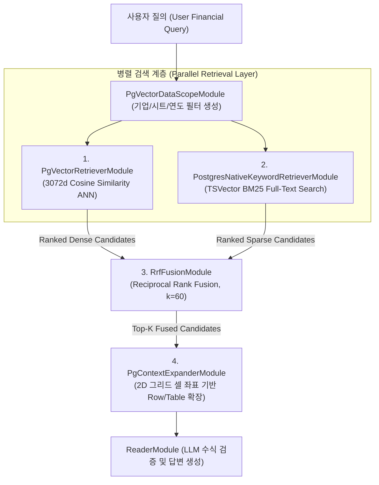
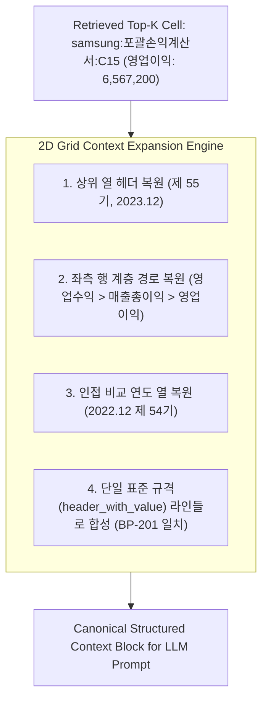

# [BP-303] Dense + Sparse + RRF 융합 & 셀 확장 회로
> **Document Code:** `BP-303` | **Category:** Retrieval & Fusion Blueprint | **Status:** Approved Baseline  
> **Source Files:** [`modules/retrieval/pgvector_retriever.py`](file:///c:/Repos/bist-mini-final/modules/retrieval/pgvector_retriever.py), [`modules/retrieval/postgres_native_keyword_retriever.py`](file:///c:/Repos/bist-mini-final/modules/retrieval/postgres_native_keyword_retriever.py), [`modules/retrieval/rrf_fusion.py`](file:///c:/Repos/bist-mini-final/modules/retrieval/rrf_fusion.py), [`modules/retrieval/context_expander.py`](file:///c:/Repos/bist-mini-final/modules/retrieval/context_expander.py)

---

## 1. 하이브리드 검색 및 융합 파이프라인 구조 (Hybrid Retrieval Flow)

재무 엑셀 데이터는 "영업이익", "당기순손익"과 같은 **정확한 용어 일치(Exact Term Match)**와 "작년 장사해서 번 돈", "회사 부채 규모"와 같은 **자연어 의미론적 질의(Semantic Query)**를 동시에 처리해야 합니다.

`bist-mini-final`은 pgvector Dense 벡터 검색과 PostgreSQL TSVector BM25 키워드 검색을 병렬 수행한 후 **RRF (Reciprocal Rank Fusion)**로 순위를 융합하고, 검색된 셀을 2D 테이블 문맥으로 확장합니다.



---

## 2. RRF (Reciprocal Rank Fusion) 수학적 공식

$$
\text{RRF Score}(d) = \sum_{m \in \{\text{Dense}, \text{BM25}\}} \frac{1}{k + r_m(d)}
$$

- $d$: 평가 대상 엑셀 셀 청크 (Candidate Cell Chunk)
- $m$: 검색 모델 채널 (Dense pgvector 또는 Sparse PostgreSQL FTS)
- $r_m(d)$: 해당 검색 모델 $m$ 내에서의 순위 (1-indexed Rank)
- $k$: 랭킹 스무딩 상수 (**기본값: $60$**)

### RRF 결합 효과 예시
- **사례 1 (Dense 1위, Sparse 5위)**: $\frac{1}{60 + 1} + \frac{1}{60 + 5} = 0.01639 + 0.01538 = 0.03177$ -> **최상위 승격**
- **사례 2 (Dense 단독 1위, Sparse 미검색)**: $\frac{1}{60 + 1} + 0 = 0.01639$
- **사례 3 (양쪽 모두 1위)**: $\frac{1}{60+1} + \frac{1}{60+1} = 0.03278$ -> **절대적 1위 확정**

---

## 3. 기하학적 2D 셀 컨텍스트 확장 회로 (`PgContextExpanderModule`)

단일 셀($C5$) 하나만으로는 해당 수치가 매출액인지 감가상각비인지, 직전 연도 대비 증감률이 얼마인지 LLM이 파악할 수 없습니다. 따라서 RRF로 선별된 상위 좌표를 기준으로 **2D 영역(상위 계층 헤더, 시계열 비교 열, 인접 행)을 단일 표준 규격(`header_with_value`)으로 복원 및 확장**합니다.



### [BP-201 표준 일치] 생성된 확장 컨텍스트 블록 예시 (Canonical Context Block)

```text
[Context Block: Top-K 융합 및 2D 이웃 확장 셀 목록]
Company: 삼성전자 | Sheet: 포괄손익계산서(연결) | Row: [영업수익 > 매출액] | Col: [2022.12 (제 54기)] | Value: 302,231,360 | Unit: 백만원
Company: 삼성전자 | Sheet: 포괄손익계산서(연결) | Row: [영업수익 > 매출액] | Col: [2023.12 (제 55기)] | Value: 258,935,494 | Unit: 백만원
Company: 삼성전자 | Sheet: 포괄손익계산서(연결) | Row: [영업수익 > 매출총이익 > 영업이익] | Col: [2022.12 (제 54기)] | Value: 43,370,290 | Unit: 백만원
Company: 삼성전자 | Sheet: 포괄손익계산서(연결) | Row: [영업수익 > 매출총이익 > 영업이익] | Col: [2023.12 (제 55기)] | Value: 6,567,200 | Unit: 백만원
```

* **토큰 절감 및 파편화 방지**: 마크다운 테이블 구문 대신 [BP-201] 단일 표준(`header_with_value`)을 그대로 유지함으로써, 토큰을 40~50% 절감하고 `ReaderModule` LLM이 환각 없이 명확한 Key-Value 및 시계열 관계를 인식합니다.

---

## 4. 리팩토링 타깃 (Refactoring Targets)

1. **Cross-Encoder Re-ranker — 범위 제외 (Out of Scope)**:
   - 검색 순위는 pgvector Dense 검색, BM25 Sparse 검색, RRF 융합의 현재 경로를 기준선으로 유지한다.
   - `bge-reranker-large`, Cohere Re-rank 등 별도 재순위 모델의 추가·운영은 이 프로젝트의 구현 범위에 포함하지 않는다.
2. **동적 윈도우 크기(Adaptive Window Sizing)**:
   - 고정된 $\pm 3$행 확장이 아닌, Luna VLM이 감지한 `data_range` 경계 내에서만 스마트하게 확장하여 토큰 낭비 방지.
3. **구현됨 — 비동기 검색 및 2D 컨텍스트 확장**:
   - Dense와 keyword 검색은 `AsyncConnectionPool`을 사용하고 동일 배치에서 `TaskGroup`으로 병렬 실행합니다.
   - Context Expander는 검색 후보를 컬렉션·시트별 행 집합으로 묶어 `fetch_rows_cells_async()`를 병렬 호출합니다. 동기·비동기 경로는 동일한 정규화·중복 제거·출력 렌더러를 공유합니다.
   - Reader의 `lookup_cell_metadata` 도구도 LangChain `ainvoke()`에서 `fetch_cells_by_metadata_async()`를 직접 await하므로 도구 반복 중 이벤트 루프를 차단하지 않습니다.
