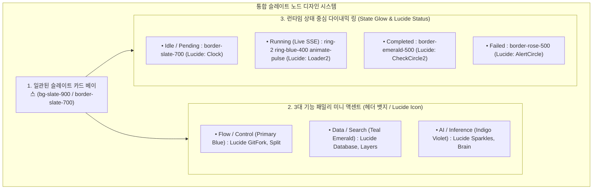

# [BP-401] [구현됨] Pipeline Playground 워크스페이스
> **Document Code:** `BP-401` | **Category:** Workspace Blueprint | **Status:** Implemented & Operational  
> **Source Directories:** [`frontend/src/features/playground/`](file:///c:/Repos/bist-mini-final/frontend/src/features/playground/), [`frontend/src/pages/PlaygroundPage.tsx`](file:///c:/Repos/bist-mini-final/frontend/src/pages/PlaygroundPage.tsx), [`backend/api/workflow_routes.py`](file:///c:/Repos/bist-mini-final/backend/api/workflow_routes.py)

---

## 1. 워크스페이스 개요 및 UI 결선도 (Workspace Overview)

**Pipeline Playground**는 개발자 및 연구자가 현재 등록된 19개 파이프라인 모듈을 시각적 2D 노드 그래프(React Flow) 상에서 배치하고 핀을 결선하여, durable PostgreSQL queue에 실행을 등록하고 상태를 SSE로 관찰하는 워크스페이스입니다. API·워커가 분리되어도 실행 상태가 보존되므로 브라우저를 새로고침하거나 API Pod가 바뀌어도 실행 이력이 유지됩니다.

```mermaid
flowchart TB
    subgraph UI_Canvas ["React Flow 2D Interactive Canvas (@xyflow/react)"]
        PALETTE["Module Sidebar Palette (19 Modules)"]
        CANVAS["Graph Canvas (Custom Workflow Nodes & Edges)"]
        INSPECTOR["Node Config Inspector & Parameter Tuner"]
        TRACE_PANEL["Execution Trace & I/O Inspector Panel"]
        SSE_BAR["Live SSE Run State & Progress Bar"]
    end

    subgraph ClientServices ["Playground Client Architecture"]
        CTX["PlaygroundStateContext (Zustand/React Context)"]
        ADAPTER["WorkflowGraphAdapter (React Flow <-> Backend DAG Model)"]
        API_CLIENT["Ky HTTP Client & EventSource SSE Streamer"]
    end

    PALETTE -->|Drag & Drop| CANVAS
    CANVAS -->|Select Node| INSPECTOR
    CANVAS -->|Run Pipeline| CTX
    CTX --> ADAPTER
    ADAPTER --> API_CLIENT
    API_CLIENT -->|POST /api/v1/workflows/{workflowId}/runs| BACKEND["FastAPI /api/v1/workflows"]
    BACKEND -.->|"SSE Stream: /api/v1/runs/{runId}/stream"| API_CLIENT
    API_CLIENT --> SSE_BAR
    API_CLIENT --> TRACE_PANEL
```

---

## 2. React Flow 커스텀 노드 디자인 시스템 (Unified Slate & 3-Family Design System)

기존 6가지 무지개색으로 인한 시각적 피로도와 디자인 불일치(Visual Fragmentation)를 해소하기 위해, **통합 뉴트럴 슬레이트 베이스(Unified Slate Base) + 3대 기능 패밀리 미니멀 액센트 + 상태 중심 다이내믹 링(Dynamic State Glow) + Lucide React 벡터 아이콘 표준** 체계로 통일합니다.



---

### 2.1 3대 기능 패밀리 및 핀아웃 매트릭스

모든 노드는 동일한 프리미엄 슬레이트 카드로 렌더링되며, 상단 헤더의 **정제된 미니 뱃지 색상 및 Lucide React 벡터 아이콘**으로만 역할을 깔끔하게 구분합니다:

| 기능 패밀리 | 액센트 톤 (Accent) | 표준 Lucide 아이콘 | 소속 모듈 (19개 모듈군) | 핸들 구성 (Handles) |
| :--- | :--- | :--- | :--- | :--- |
| **Flow & Control**<br>(입력 & 흐름 제어) | `Primary Blue`<br>(`#3B82F6`) | `<Workflow />`<br>`<GitFork />`<br>`<Split />` | • `QueryInput`<br>• `LlmQueryRouter`<br>• `Decomposer`<br>• `MultiQueryExpander` | • Target: 0~1개 (Query)<br>• Source: 1~3개 (Branch Edges) |
| **Data & Search**<br>(데이터 인덱싱 & 검색) | `Teal Emerald`<br>(`#10B981`) | `<Database />`<br>`<Search />`<br>`<Layers />` | • `TextEmbedder`<br>• `CellTextSerializer`<br>• `PgVectorRetriever`<br>• `SparseBm25Retriever`<br>• `RrfFuser`<br>• `ContextExpander` | • Target: 1~2개 (Vector / Chunks)<br>• Source: 1개 (Fused Context) |
| **AI & Inference**<br>(VLM, 추론 & 재무연산) | `Indigo Violet`<br>(`#6366F1`) | `<Sparkles />`<br>`<Brain />`<br>`<Calculator />` | • `LunaVlmStructureDetector`<br>• `DocumentProfiler`<br>• `FinancialCalculator`<br>• `CompanyEntityExtractor`<br>• `ReaderModule`<br>• `AgenticReasoner`<br>• `ContextCompressor`<br>• `FactChecker`<br>• `ConfidenceScorer` | • Target: 1~2개 (Query + Context / Metrics)<br>• Source: 1개 (Structured / Derived Output) |

---

### 2.2 Lucide React 벡터 아이콘 표준 (Zero Raw Emoji Policy)

UI 컴포넌트 내부에서 OS별 렌더링 편차가 심하고 유치한 인상을 주는 **유니코드 이모티콘(⚡, ✅, ❌ 등)의 사용을 엄격히 배제**하고, 100% SVG 기반의 [`lucide-react`](file:///c:/Repos/bist-mini-final/frontend/package.json#L18) 벡터 컴포넌트만을 사용합니다.

```tsx
// 표준 노드 상태 인디케이터 배선 예시
import { AlertCircle, CheckCircle2, Clock, Loader2, MinusCircle } from "lucide-react";

export function NodeStatusBadge({ status }: { status: NodeStatus }) {
  switch (status) {
    case "running":
      return <Loader2 className="w-3.5 h-3.5 animate-spin text-blue-400" />;
    case "completed":
      return <CheckCircle2 className="w-3.5 h-3.5 text-emerald-400" />;
    case "failed":
      return <AlertCircle className="w-3.5 h-3.5 text-rose-400" />;
    case "skipped":
      return <MinusCircle className="w-3.5 h-3.5 text-slate-500" />;
    case "pending":
    default:
      return <Clock className="w-3.5 h-3.5 text-slate-400" />;
  }
}
```

---

## 3. 실시간 실행 스트림 및 상태 동기화 프로토콜

1. 사용자가 **"파이프라인 실행"** 버튼을 클릭하면 `WorkflowGraphAdapter`가 React Flow 노드/엣지 객체를 백엔드 `WorkflowGraph` JSON으로 변환하여 전송합니다.
2. 백엔드로부터 `run_id`를 수신하면 `EventSource`를 열어 `/api/v1/runs/{run_id}/stream`에 연결합니다. SPA의 `/api` 호출은 정식 `/api/v1`의 비노출 호환 별칭이므로 신규 외부 클라이언트와 문서는 정식 경로를 사용합니다.
3. 수신되는 이벤트(`node_started`, `node_completed`, `node_failed`)에 따라 해당 노드의 테두리에 실시간 로딩 스피너 및 성공/실패 뱃지가 표시됩니다.
4. 노드를 클릭하면 해당 노드의 입력 데이터, 출력 데이터, 실행 소요 시간(ms), 토큰 사용량이 `TracePanel`에 즉시 렌더링됩니다.

---

## 4. 리팩토링 타깃 (Refactoring Targets)

1. **구현됨 — `playground.css` 컴포넌트 단위 분리**:
   - 기존 약 80KB 단일 파일에서 `SpreadsheetResultModal.css`, `ModuleSettingsModal.css`, `WorkflowLayersPanel.css`을 분리해 공통 캔버스 CSS를 약 42KB로 축소했습니다. 신규 컴포넌트 스타일은 해당 컴포넌트 옆 파일에 둡니다.
2. **구현됨 — 템플릿 프리셋 갤러리**:
   - 워크플로 레이어 패널에서 canonical `rag_query`, `excel_ingestion` 템플릿의 노드·연결 수와 모듈 흐름을 미리보고, 편집 가능한 신규 워크플로로 복제할 수 있습니다.
3. **구현됨 — 노드 설정 인스펙터 & 파라미터 튜너 (`ModuleSettingsModal`)**:
   - 노드 메뉴에서 설정 모달을 열고, `GET /api/v1/modules`가 제공하는 모듈 contract의 config schema·enum·preset을 사용해 설정값을 편집합니다.
   - 변경값은 선택 노드의 config에 즉시 반영되며 저장/실행 시 워크플로 문서의 node config로 전달됩니다. 존재하지 않는 `/api/modules/{module_type}/schema` 경로를 호출하지 않습니다.
