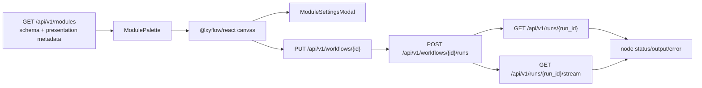

# [BP-401] Pipeline Playground 워크스페이스
> **Document Code:** `BP-401` | **Contract State:** Target Architecture | **Capability State:** Operational | **Structure State:** Backend Partial / Frontend Aligned
> **Target Ownership:** `backend/domains/workflow/presentation`, `backend/domains/workflow/application`, `frontend/src/features/playground`, `frontend/src/pages`
> **Current References:** [`frontend/src/features/playground/`](file:///c:/Repos/bist-mini-final/frontend/src/features/playground/), [`frontend/src/pages/PlaygroundPage.tsx`](file:///c:/Repos/bist-mini-final/frontend/src/pages/PlaygroundPage.tsx), [`backend/domains/workflow/presentation/routes.py`](file:///c:/Repos/bist-mini-final/backend/domains/workflow/presentation/routes.py)

---

## 1. 제품 책임

Pipeline Playground는 backend가 노출하는 19개 module contract로 DAG를 편집·저장하고 durable 실행을 등록한 뒤 REST/SSE로 상태를 관찰하는 워크스페이스입니다. frontend가 별도 module 목록이나 pin schema를 소유하지 않습니다.

---

## 2. 결선

`MODULE_PRESENTATION`은 icon/color 같은 UI metadata만 보완합니다. label, description, category, input/config/output schema는 backend catalog가 단일 기준입니다. category 순서는 Source, Logic, Transform, Storage / DB, Output을 우선하고 추가 category는 동적으로 표시합니다.

---

## 3. 편집과 실행 규칙

1. node는 `module_type`, config, input pin values를 가집니다.
2. edge 연결은 source output과 target input schema 호환성을 확인합니다.
3. 저장 전에 중복 node ID, dangling edge, cycle, 필수 input을 검증합니다.
4. 실행 요청은 저장된 workflow revision과 runtime inputs, cache 정책을 묶어 durable run을 생성합니다.
5. UI는 브라우저 새로고침 후에도 `GET /runs`와 `GET /runs/{id}`로 실행을 복구합니다.
6. SSE 연결이 끊겨도 실행 자체는 계속되며 REST 상태가 최종 기준입니다.

---

## 4. 등록 module catalog

정확한 type 목록과 pin 계약은 [`BP-302`](file:///c:/Repos/bist-mini-final/docs/blueprints/03_pipeline_module_blueprints/BP-302_module_pinout_catalog.md)를 사용합니다. 과거 UI 문서에 있던 `MultiQueryExpander`, `SparseBm25Retriever`, `AgenticReasoner`, `FactChecker`, `ConfidenceScorer` 등은 현재 registry type이 아닙니다.

---

## 5. UI 상태와 접근성

- node 상태는 pending/running/succeeded/skipped/failed를 시각적 text와 icon으로 함께 표현합니다.
- 설정 modal은 focus trap, Escape close, focus restore를 지킵니다.
- trace는 output 전체를 무조건 polling하지 않고 backend summary projection을 사용합니다.
- 실행 취소는 `POST /api/v1/runs/{run_id}/cancel`, 재개는 `/resume`으로 요청합니다.
- 캐시 정리는 별도 `DELETE /api/v1/cache` 계약을 사용합니다.

---

## 6. 책임 분리와 구조 완료 조건

- frontend feature는 편집 state, canvas, module catalog, run monitor를 소유하고 backend DTO를 runtime schema로 검증합니다.
- workflow presentation은 route·schema·SSE projection만 제공하고 DAG 검증·실행 판단은 application command/query로 위임합니다.
- module 설정 panel은 registry schema와 현재 run projection을 사용하며 DB/provider 내부 schema를 노출하지 않습니다.
- workflow HTTP 책임은 domain presentation으로 이동했습니다. page가 feature 조립만 수행하고 공개 workflow 계약 테스트가 통과할 때 구조 migration을 완료합니다.
