# [BP-402] Data Sources 워크스페이스
> **Document Code:** `BP-402` | **Contract State:** Target Architecture | **Capability State:** Operational | **Structure State:** Complete
> **Target Ownership:** `backend/domains/data_sources`, `backend/platform/pgvector`, `backend/platform/openai`, `frontend/src/features/data-sources`, `frontend/src/pages`
> **Current References:** [`backend/domains/data_sources/`](../../../backend/domains/data_sources), [`backend/bootstrap/application.py`](../../../backend/bootstrap/application.py), [`frontend/src/features/data-sources/`](../../../frontend/src/features/data-sources), [`frontend/src/pages/DataSourcesPage.tsx`](../../../frontend/src/pages/DataSourcesPage.tsx)

---

## 1. 제품 책임

Data Sources는 spreadsheet 원본 등록, preview/download, durable ingestion 작업, pgvector index 조회·검색·삭제, DB 연결 상태를 제공하는 데이터 엔지니어링 워크스페이스입니다. 현재 공개 기능에 수동 bounding-box 편집/승인 API와 전용 ingestion SSE는 없습니다.

도메인 presentation의 `routes.py`가 file/index/ingestion/database router를 조합합니다. 파일 수명주기와 index 검색·기업명 변경은 `DataSourceHttpController`, ingestion DTO 변환과 상태 projection은 `IngestionHttpController`가 담당하므로 개별 route는 입력 바인딩과 status code만 소유합니다. Bootstrap은 local source-file storage, PostgreSQL/pgvector adapter와 application service를 한 번 조립합니다.

---

## 2. 공개 API 계약

| 기능 | API |
| :--- | :--- |
| 파일 목록·업로드 | `GET /api/v1/data-sources/files`, `POST /api/v1/data-sources/files/upload` |
| 원본 확인 | `GET /files/{filename}/preview`, `GET /files/{filename}/download` |
| 원본 삭제 | `DELETE /files/{filename}` |
| ingestion 등록·목록 | `POST/GET /api/v1/data-sources/ingestion-jobs` |
| ingestion 상태·제어 | `GET/DELETE /ingestion-jobs/{run_id}`, `POST .../resume`, `POST .../cancel` |
| index 목록·상세·삭제 | `GET /indexes`, `GET/DELETE /indexes/{index_id}` |
| index 기업명 변경 | `PUT /indexes/{index_id}/company` |
| index 검색 | `POST /indexes/{index_id}/search` |
| DB probe | `GET /db-status`, `POST /db-connect` |

표의 축약 경로는 모두 `/api/v1/data-sources` 아래입니다.

---

## 3. Ingestion 흐름

```mermaid
flowchart LR
    UPLOAD["파일 업로드"] --> META["source_files/sheets 저장"]
    META --> QUEUE["durable ingestion run"]
    QUEUE --> KEDA["KEDA one-shot worker"]
    KEDA --> STRUCTURE["external vision 구조 감지"]
    STRUCTURE --> SERIALIZE["cell_text_serializer"]
    SERIALIZE --> EMBED_Q["embedding shard queue"]
    EMBED_Q --> EMBED_J["KEDA embedding Jobs x4"]
    EMBED_J --> ARTIFACT["ordered embedding artifact"]
    ARTIFACT --> COPY_Q["vector_copy shard queue"]
    COPY_Q --> COPY_J["KEDA Binary COPY Jobs x2"]
    COPY_J --> STAGE["private staging collection"]
    STAGE --> FINAL["count 검증 + HNSW + atomic publish"]
    FINAL --> INDEX["langchain_pg_embedding"]
    STRUCTURE --> PROFILE["통화·배율·기간·시트 역할 추출"]
    FINAL --> PROFILE
    PROFILE --> PROFILE_DB[("workbook_profiles")]
```

`auto_ingest=true` 업로드는 원본 저장 후 ingestion 작업도 등록합니다. `auto_ingest=false`이면 사용자가 이후 `POST /ingestion-jobs`로 등록할 수 있습니다. 실행 상태는 durable workflow store를 통해 목록·단일 run·index 기준으로 조회합니다.

---

## 4. 모듈과 저장 경계

| Module type | 책임 |
| :--- | :--- |
| `processed_file_selector` | 처리 대상 workbook/파일 선택 |
| `luna_vlm_structure_detector` | 외부 vision provider 기반 sheet region 감지 |
| `cell_text_serializer` | 2D 좌표와 header 문맥을 검색 텍스트로 직렬화 |
| `cell_text_embedder` | cell text를 embedding artifact로 변환 |
| `pgvector_index_writer` | artifact를 PostgreSQL/pgvector에 Binary COPY |
| `company_entity_extractor` | 기업 식별 정보 추출 |
| `sheet_metadata_persistence` | sheet 크기·감지 구조 메타데이터 영속화 |
| `workbook_profile_persistence` | 원본 workbook의 통화·배율·실제 FY/LTM·시트 역할 공통 프로필 영속화 |

전체 module pin 계약은 [`BP-302`](../03_pipeline_module_blueprints/BP-302_module_pinout_catalog.md)를 따릅니다.

---

## 5. 성능·안전 규칙

- Kubernetes 모드에서 embedding API 배치는 각각 durable child Job으로 실행하며 최대 동시성은 4입니다. 직접 로컬 실행에서는 `INGESTION_SHARDS_ENABLED=false`로 기존 bounded streaming fallback을 사용합니다.
- vector 적재는 최대 2개 COPY Job이 서로 다른 결정적 ID 범위를 private staging collection에 기록하며, 모든 경로가 `PgVectorBinaryCopyStream`을 사용합니다.
- UI는 부모 workflow의 SSE progress에서 완료/전체 shard, 처리 문서, 실행 중/대기 Job 수를 표시합니다.
- HNSW는 shard별로 만들지 않고 전체 row count 검증 뒤 finalizer가 한 번 생성합니다. 기존 검색 컬렉션은 atomic publish 시점까지 유지합니다.
- workbook 파싱·해시·파일 이동은 API 이벤트 루프 밖 worker thread 또는 one-shot worker에서 수행합니다.
- upload metadata와 상태 조회는 native async PostgreSQL 경계를 우선합니다.
- workbook profile은 embedding chunk 수와 무관한 원본 파일 파생 데이터입니다. 기존 index도 원본 hash가 일치하면 재임베딩 없이 on-demand resolver가 생성·교체할 수 있습니다.
- 원본·index 삭제는 연결된 데이터 범위를 명시적으로 식별하고 감사 가능한 결과를 반환해야 합니다.
- 처리량/메모리/지연의 숫자는 측정 결과가 있는 경우에만 성능 문서에 기록합니다.

---

## 6. 범위 제외

- 사용자가 box를 drag해 수정하고 승인하는 annotation workflow
- 브라우저에서 전체 workbook을 편집하는 virtualized spreadsheet editor

향후 수동 검수 기능이 필요하면 좌표 version, 승인 이력, 재색인 일관성을 먼저 설계해야 합니다.

---

## 7. 책임 분리와 구조 완료 조건

- data source aggregate, ingestion state와 삭제/rename policy는 domain, command/query와 ports는 application이 소유합니다.
- upload·preview·index REST/SSE는 presentation, workbook·PostgreSQL·pgvector adapter는 infrastructure가 소유합니다.
- UI feature는 파일/collection/job state를 분리하고 모든 mutation에 busy·error·revalidation 상태를 제공합니다.
- API controller, spreadsheet/artifact filesystem 구현, shard coordinator/repository/worker가 data sources vertical slice로 이동했고 route 내부 orchestration을 제거했습니다. 구조 계약 테스트는 application/presentation/worker의 legacy·역방향 import를 차단합니다.
- 범용 pgvector Binary COPY/오류 계약은 `backend/platform/pgvector`, collection/search/publish SQL은 data sources infrastructure로 분리됐습니다.
- 기업명 변경·파일/index 삭제·ingestion 등록/취소/재개 mutation은 UI에서 busy, 중복 제출 방지, 성공 후 재조회와 오류 feedback을 제공합니다.
- 원본 셀 검증은 `/api/v1/evidence/cells/resolve`와 sheet artifact API를 사용하며 답변 배지에서 sheet image·bbox로 추적할 수 있습니다.
- ingestion DAG, shard 수, index metadata 또는 rename/delete 정책을 바꾸면 BP-201·BP-203·BP-503 및 API/UI contract를 함께 갱신합니다.
