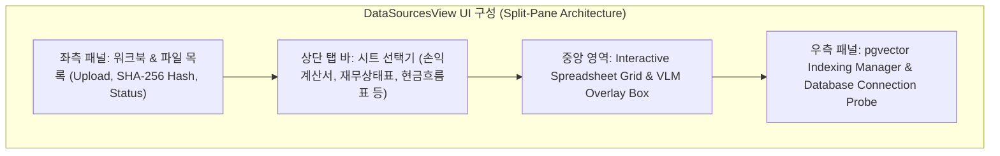
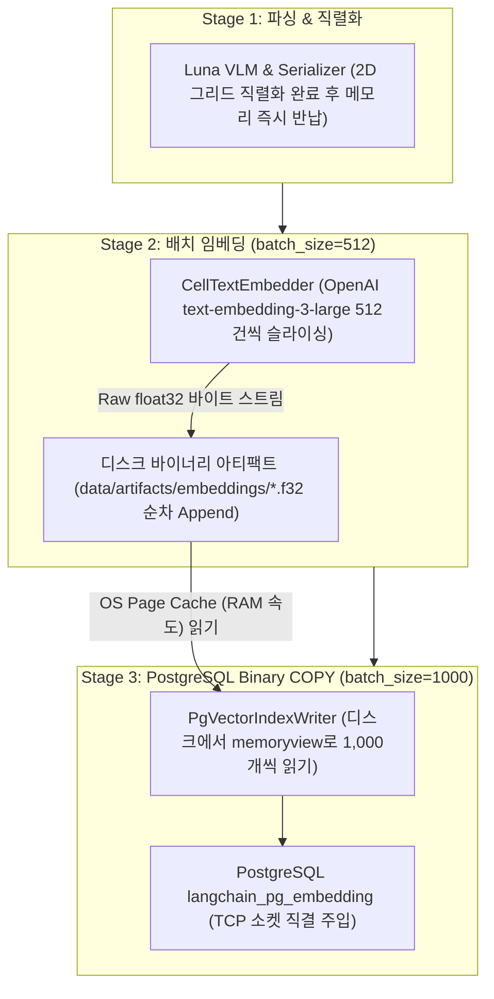
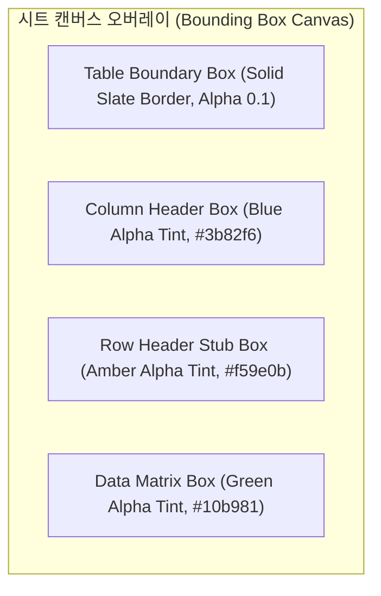
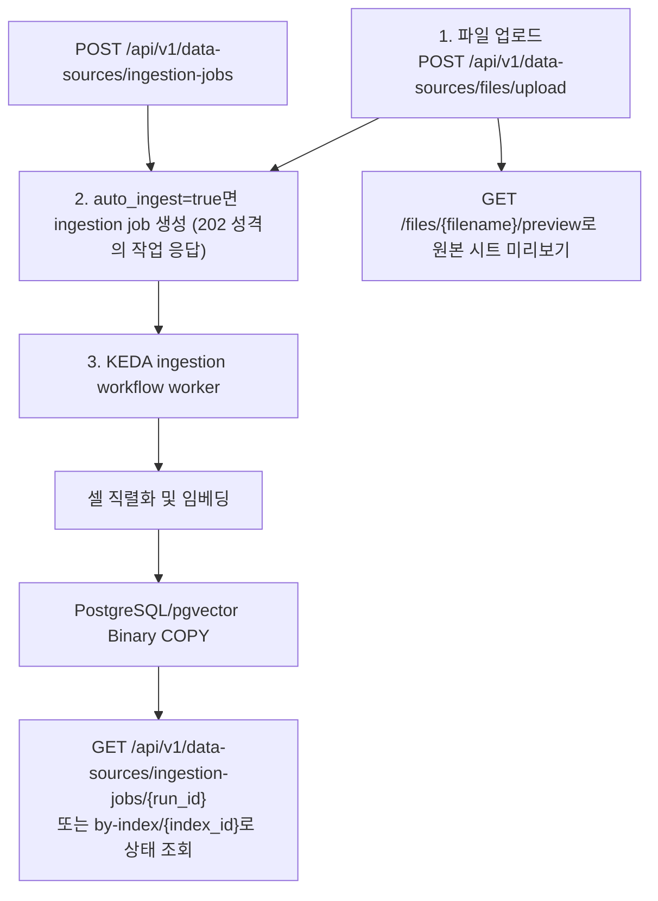

# [BP-402] [구현됨] Data Sources Management 워크스페이스
> **Document Code:** `BP-402` | **Category:** Workspace Blueprint | **Status:** Implemented & Operational  
> **Source Directories:** [`frontend/src/features/data-sources/`](file:///c:/Repos/bist-mini-final/frontend/src/features/data-sources/), [`frontend/src/pages/DataSourcesPage.tsx`](file:///c:/Repos/bist-mini-final/frontend/src/pages/DataSourcesPage.tsx), [`backend/api/data_source_routes.py`](file:///c:/Repos/bist-mini-final/backend/api/data_source_routes.py)

---

## 1. 워크스페이스 개요 및 UI 구성 (Workspace Overview)

**Data Sources Management**는 엑셀 파일 업로드, 시트별 가시성 확인, Luna VLM 구조 감지 결과(바운딩 박스) 시각적 검증, 2D 셀 데이터 그리드 뷰어, 그리고 pgvector 인덱스 생성 및 상태 프로브를 수행하는 종합 데이터 엔지니어링 워크스페이스입니다.

---

### 1.1 원자적 파이프라인 모듈과 백엔드 인프라의 결합 구조 (Module Composition)

`Data Sources Management`는 독립적인 **Layer 5 원자적 모듈 4종과 Layer 7 백엔드 스토리지 커넥션을 유기적으로 조합**하여 엔드투엔드 엑셀 인제스천 파이프라인을 완성합니다:

| 계층 | 구성 요소 / 파일 경로 | 역할 및 협력 방식 |
| :--- | :--- | :--- |
| **Layer 5 (원자적 모듈군)** | `structure.luna_vlm_structure_detector` ([`luna_vlm_structure_detector.py`](file:///c:/Repos/bist-mini-final/modules/structure/luna_vlm_structure_detector.py)) | • 엑셀 시트 이미지를 래스터라이징하여 GPT-5.6 Luna VLM으로 전송 • 표 경계(`TableBoundary`), 열 헤더, 행 스터브, 데이터 매트릭스 기하학 감지 |
| | `structure.cell_text_serializer` ([`cell_text_serializer.py`](file:///c:/Repos/bist-mini-final/modules/structure/cell_text_serializer.py)) | • 감지된 2D 좌표계를 단일 표준 규격(`header_with_value`) 텍스트 라인으로 직렬화 |
| | `retrieval.text_embedder` ([`text_embedder.py`](file:///c:/Repos/bist-mini-final/modules/embedding/cell_text_embedder.py)) | • 직렬화된 셀 텍스트를 `text-embedding-3-large`를 통해 **3072차원 고밀도 벡터**로 배치 임베딩 |
| | `storage.pgvector_index_writer` ([`BP-302 Module 7`](file:///c:/Repos/bist-mini-final/docs/blueprints/03_pipeline_module_blueprints/BP-302_21_modules_pinout_catalog.md#7-pgvectorindexwritermodule-storagepgvector_index_writer)) | • **[Layer 5 모듈화]** 임베딩 벡터와 메타데이터를 Layer 7 Binary COPY 엔진을 통해 PostgreSQL `langchain_pg_embedding` 테이블로 초고속 벌크 주입 |
| **Layer 7 (스토리지 인프라)** | `backend/storage/db_manager.py` `backend/storage/connection_pool.py` | • PostgreSQL 커넥션 풀링 및 pgvector 상태 조회(`GET /api/v1/data-sources/db-status`), 외부 DB 연결 확인(`POST /api/v1/data-sources/db-connect`) |

---

### 1.2 Bounded-Memory 바이너리 스트리밍 & I/O 무병목 아키텍처 (Zero I/O Bottleneck Mechanics)

수십만 셀 규모의 대형 재무 엑셀을 인덱싱할 때 시스템 메모리 폭발(OOM)과 I/O 병목을 원천 방지하기 위해 **단계별 순차 활성화(Stage-by-Stage) + Raw Float32 바이너리 아티팩트 + OS 페이지 캐시(Page Cache) 가속** 메커니즘을 적용합니다:

#### 4대 고성능·안전성 핵심 원리
1. **OS 페이지 캐시(Page Cache) 가속 (RAM 속도 동작)**:
   - 디스크 아티팩트(`.f32`)는 순차 쓰기/읽기(Sequential I/O)로 기록되므로, 운영체제(OS) 커널의 Page Cache(RAM)에서 즉시 처리됩니다.
   - 10,000개 벡터(약 120MB) 처리 시 **디스크 바이너리 I/O 시간은 단 24ms(0.024초)**로 전체 파이프라인 시간(수 초)의 1% 미만이며 병목이 전혀 발생하지 않습니다.
2. **바이너리 제로 직렬화 (Zero-Serialization Overhead)**:
   - JSON 텍스트 대신 Raw `float32` 바이너리(3072d 1개 벡터 = 정확히 12KB)를 사용하므로, 문자열 포매팅 및 float 변환에 따른 CPU 연산 오버헤드가 0초입니다.
3. **메모리 상한선 격리 (Bounded-Memory $\le$ 32MB)**:
   - 모든 모듈이 동시에 켜져 메모리를 중첩 점유하지 않고, 앞 단계 완료 시 메모리를 즉시 반납(GC)하여 서버 메모리 사용량을 32MB 이하로 완벽히 격리합니다.
4. **장애 복구성 및 제로 비용 재시도 (Fault Tolerance & Zero-Cost Retry)**:
   - DB 적재 중 네트워크 장애가 발생하더라도 이미 생성된 디스크 아티팩트(`artifact_id`)가 온전히 보존되므로, 비싼 외부 임베딩 API를 재결제하지 않고 **DB 적재만 즉시 0원 비용으로 재개(`Cache Hit`)**합니다.

---

## 2. Luna VLM 시각적 바운딩 박스 오버레이 (VLM Overlay Rendering)

감지된 표 기하학(`TableBoundary`)을 원본 스프레드시트 캔버스 위에 CSS 하이라이트 박스로 렌더링합니다:

- **상호작용 기능**: 사용자가 특정 테이블 경계 박스를 클릭하면 해당 테이블의 메타데이터(행 수, 열 수, 헤더 트리 계층)가 인스펙터에 표시되며, 오인식된 영역을 수동으로 보정할 수 있습니다.

---

## 3. 현재 인제스천 작업 흐름 (Durable Ingestion Job)

현재 제품 경로는 파일 업로드와 durable ingestion job을 중심으로 동작합니다. 과거 설계의 `detect-structure`, 수동 오버레이 승인, `ingest` REST 경로는 구현되어 있지 않으며 API 계약으로 사용하면 안 됩니다. 로컬 VLM 런타임도 범위에서 제외되어 있습니다.

---

### 3.1 단계별 실행 및 피드백 프로토콜

1. **업로드와 자동 등록**: `POST /api/v1/data-sources/files/upload`는 원본 파일을 저장하고 `auto_ingest=true`일 때 ingestion job을 생성합니다. `auto_ingest=false`이면 사용자가 나중에 `POST /api/v1/data-sources/ingestion-jobs`로 등록할 수 있습니다.
2. **상태 확인**: ingestion job은 워크플로 실행으로 저장됩니다. 목록, 단일 run, index 기준 조회 및 resume/cancel/delete API를 제공하며 현재 데이터 소스 UI는 이 상태를 조회합니다.
3. **원본 확인**: 파일 preview/download와 인덱스 조회/search API로 입력과 결과를 검증합니다. 인제스천 전용 SSE나 수동 바운딩 박스 편집기는 현재 계약에 없습니다.
4. **Database Connection Probe**: `GET /api/v1/data-sources/db-status`가 현재 저장소 상태를, `POST /api/v1/data-sources/db-connect`가 지정 연결의 검증을 담당합니다.

---

## 4. 리팩토링 타깃 (Refactoring Targets)

1. **구현됨 — Binary COPY 단일 스트리밍 경로 (Zero Legacy Code Policy)**:
   - `PgVectorIndexWriterModule`의 artifact 경로와 `PgVectorStore`의 동적 임베딩 경로가 모두 `PgVectorBinaryCopyStream`을 사용합니다. embedding row의 multi-row INSERT 구현은 제거했습니다.
2. **구현 방식 변경 — raster viewport 기반 대용량 시트 검사**:
   - 현재 UI는 셀마다 DOM 노드를 생성하는 grid가 아니라 서버가 만든 시트 raster image 한 장과 감지 region overlay만 렌더링합니다. 따라서 행 수에 비례하는 DOM 증가가 없어 `@tanstack/react-virtual` 의존성이 필요하지 않습니다.
   - 시트 이미지 자체는 zoom 가능한 scroll viewport에서 표시하고, 영역 목록만 제한된 sidebar scroll container에 렌더링합니다. 향후 실제 편집형 cell grid를 추가할 때만 row/column virtualization을 도입합니다.
3. **구현됨 — 업로드 메타데이터의 네이티브 async 저장**:
   - async 파일 업로드 route는 연결 확인과 `source_files` 메타데이터 저장을 `DatabaseManager`의 async pool로 직접 await합니다. 파일 이동·해시·Excel 파싱처럼 비동기 API가 없는 디스크/CPU 작업만 worker thread로 격리합니다.
   - Binary COPY는 대량 입력 스트림의 트랜잭션 일관성과 one-shot ingestion worker의 프로세스 격리를 활용하므로 동기 구현을 의도적으로 유지합니다.
4. **수동 바운딩 박스 드래그 편집기**:
   - 원격 VLM 결과를 사용자 승인·수정 가능한 좌표 계약과 함께 저장하는 별도 기능으로 재설계가 필요합니다. 로컬 VLM 구현은 프로젝트 범위에서 제외합니다.
