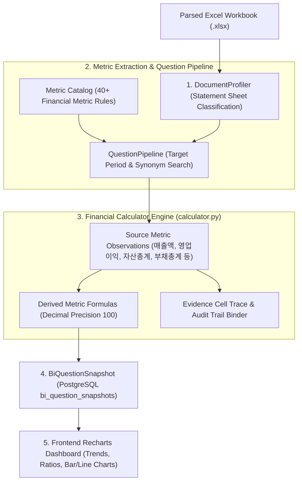

# [BP-403] [구현됨] Financial BI Analytics 워크스페이스
> **Document Code:** `BP-403` | **Category:** Workspace & Financial Analytics Blueprint | **Status:** Implemented & Operational  
> **Source Directories:** [`backend/features/bi/`](file:///c:/Repos/bist-mini-final/backend/features/bi/), [`frontend/src/features/bi/`](file:///c:/Repos/bist-mini-final/frontend/src/features/bi/)

---

## 1. 재무 BI 분석 파이프라인 아키텍처 (BI Pipeline Topology)

**Financial BI Analytics**는 엑셀 워크북을 자동으로 프로파일링하여 재무제표(손익계산서, 재무상태표, 현금흐름표)를 식별하고, 원천 계정과목을 추출한 후, **40개 이상의 핵심 재무 비율(수익성, 안정성, 활동성, 성장성)을 자동 산출 및 시각화**하는 엔진입니다.

---

### 1.1 원자적 RAG 모듈과 금융 BI 도메인 오케스트레이션 결합 구조 (Module & Domain Composition)

`Financial BI Analytics`는 범용 **Layer 5 원자적 RAG 모듈들**을 회계 비즈니스 로직을 관장하는 **Layer 3 도메인 오케스트레이션 엔진**과 유기적으로 결합하여 동작합니다:

| 계층 | 구성 요소 / 파일 경로 | 역할 및 상호작용 방식 |
| :--- | :--- | :--- |
| **Layer 5 (원자적 모듈군 6종)** | **`structure.document_profiler`** ([`BP-302 Module 20`](file:///c:/Repos/bist-mini-final/docs/blueprints/03_pipeline_module_blueprints/BP-302_21_modules_pinout_catalog.md#20-documentprofilermodule-structuredocument_profiler)) | • **[Layer 5 프로파일러 모듈]** • **Input Pins**: `workbook_hash`, `file_name`, `index_id`, `available_sheets` • **Output Pins**: `DocumentProfileDTO` (`periods: List[str]`, `currency: str`, `scale: int`, `relevant_sheets`, `evidence_cells`) • `BaseLLMModule` 계열의 구조화 생성(`complete_structured`)을 통해 회계기간(FY/LTM), 표시 통화/배율(단위), 재무제표 시트를 1-Shot 자동 발견 |
| | `retrieval.pgvector_retriever` `retrieval.sparse_bm25_retriever` | • Dense(3072d) 벡터 유사도 검색 및 PostgreSQL TSVector BM25 키워드 검색 병렬 수행 |
| | `retrieval.rrf_fuser` ([`rrf_fusion.py`](file:///c:/Repos/bist-mini-final/modules/retrieval/rrf_fusion.py)) | • Dense 및 Sparse 검색 순위를 상호 순위 융합(RRF, $k=60$)하여 최적의 원천 셀 후보 선별 |
| | `retrieval.context_expander` ([`context_expander.py`](file:///c:/Repos/bist-mini-final/modules/retrieval/context_expander.py)) | • 2D 그리드 이웃 셀 및 계층 헤더를 단일 표준(`header_with_value`) 문맥으로 복원 |
| | `generation.reader` ([`reader.py`](file:///c:/Repos/bist-mini-final/modules/reader/reader.py)) | • GPT-5.6 Luna 구조화 완성을 통해 정확한 회계 수치 및 감사 근거 추출 |
| | **`reader.financial_calculator`** ([`BP-302 Module 21`](file:///c:/Repos/bist-mini-final/docs/blueprints/03_pipeline_module_blueprints/BP-302_21_modules_pinout_catalog.md#21-financialcalculatormodule-readerfinancial_calculator)) | • **[Layer 5 재무 수식 연산 모듈]** • **Input Pins**: `raw_metrics` (원천 관측값), `evidence_cells` (감사 근거) • **Output Pins**: `derived_ratios` (40+ 파생비율), `bound_evidence` (파생 감사 근거) • `BaseModule` 직접 상속 순수 결정론적 알고리즘으로 무손실 고정소수점(`Decimal`) 40+ 비율 0ms 산출 |
| **Layer 3 (금융 BI 도메인 엔진)** | `MetricCatalog` ([`catalog.py`](file:///c:/Repos/bist-mini-final/backend/features/bi/catalog.py)) | • 현재 21개 근거 기반 지표의 원천 질문, 동의어, 파생 계산 규칙 정의 |
| | `FastRagPipelineAdapter` ([`fast_rag_adapter.py`](file:///c:/Repos/bist-mini-final/backend/features/bi/fast_rag_adapter.py)) | • 포트-어댑터 패턴으로 하위 19개 파이프라인 모듈을 결합하여 개별 재무 질문에 대한 답변 및 근거 인출 수행 |
| | `DashboardRecalculation` ([`dashboard_recalculation.py`](file:///c:/Repos/bist-mini-final/backend/features/bi/dashboard_recalculation.py)) | • 엑셀 재파싱 없이 기존 관측값 기반 1-Shot 고속 파생 지표 재계산 및 DB 스냅샷 저장 |

---

## 2. 현재 21개 근거 기반 지표 및 확장 공식 명세 (Financial Formulas Matrix)

현재 canonical 목록은 `MetricId`와 `METRIC_CATALOG`에 선언된 21개입니다. 구현된 파생 계산은 매출 성장률, 영업이익률, 순이익률, FCF, FCF 마진, 총차입금, 순차입금, 부채비율, 순차입금비율입니다. 아래 표의 나머지 항목은 원천 정의와 근거 셀이 추가된 뒤 확장할 후보이며 현재 API가 제공한다고 간주하지 않습니다.

| 분류 | 지표 ID / 영문명 | 한글 라벨 | 산출 공식 (Formula) | 단위 / 정책 |
| :--- | :--- | :--- | :--- | :--- |
| **수익성 (Profitability)** | `operating_margin` | **영업이익률** | $\frac{\text{영업이익 (Operating Income)}}{\text{매출액 (Revenue)}} \times 100$ | `%` (Percent) |
| | `net_margin` | **순이익률** | $\frac{\text{당기순이익 (Net Income)}}{\text{매출액 (Revenue)}} \times 100$ | `%` (Percent) |
| | `roe` | **자기자본이익률 (ROE)** | $\frac{\text{당기순이익}}{\text{자본총계 (Total Equity)}} \times 100$ | `%` (Percent) |
| | `roa` | **총자산순이익률 (ROA)**| $\frac{\text{당기순이익}}{\text{자산총계 (Total Assets)}} \times 100$ | `%` (Percent) |
| **안정성 (Stability)** | `debt_ratio` | **부채비율** | $\frac{\text{부채총계 (Total Liabilities)}}{\text{자본총계 (Total Equity)}} \times 100$ | `%` (Percent) |
| | `current_ratio` | **유동비율** | $\frac{\text{유동자산 (Current Assets)}}{\text{유동부채 (Current Liabilities)}} \times 100$ | `%` (Percent) |
| | `quick_ratio` | **당좌비율** | $\frac{\text{당좌자산 (Quick Assets)}}{\text{유동부채}} \times 100$ | `%` (Percent) |
| **활동성 (Activity)** | `asset_turnover` | **총자산회전율** | $\frac{\text{매출액}}{\text{평균 자산총계}}$ | 회 (Times) |
| **성장성 (Growth)** | `revenue_growth` | **매출액 증가율 (YoY)** | $\frac{\text{매출액}_t - \text{매출액}_{t-1}}{\text{매출액}_{t-1}} \times 100$ | `%` (Percent) |
| | `operating_income_growth`| **영업이익 증가율 (YoY)** | $\frac{\text{영업이익}_t - \text{영업이익}_{t-1}}{\text{영업이익}_{t-1}} \times 100$ | `%` (Percent) |

---

## 3. 근거 셀 감사 추적성 및 대시보드 제어 (Evidence Audit Trail & Reset Controls)

1. **근거 셀 감사 추적성 (Evidence Audit Trail)**:
   - 모든 계산된 지표값은 계산에 사용된 원천 엑셀 셀(`cell_id`, 예: `삼성전자:IS:C5`)과 시트명, 원본 텍스트를 `BiEvidence` 객체로 영구 바인딩합니다.
   - 프론트엔드 차트나 카드에서 특정 지표를 클릭하면, 해당 숫자가 도출된 실제 엑셀 시트 행과 열이 하이라이트되어 회계 감사 수준의 신뢰성을 보장합니다.
2. **재무 건전성 히트맵 (`FinancialHealthHeatmap`)**:
   - `FinancialHealthHeatmap` 컴포넌트가 수익성, 안정성, 활동성 등 4대 핵심 영역의 다년도 지표 상태를 신호등 색상(Healthy, Moderate, Caution)으로 집계하여 직관적인 종합 건전성 매트릭스를 렌더링합니다.
3. **대시보드 실시간 재계산 및 리셋 제어 (`ResetDataDialog`)**:
   - **원천 관측값 재계산 (`POST /api/v1/bi/companies/{id}/refresh`)**: 엑셀 재파싱 없이 기존 관측값으로부터 파생 재무 비율과 스냅샷만 1-Shot 고속 재계산.
   - **질의응답 초기화 및 재생성 (`POST /api/v1/bi/companies/{id}/reset`)**: `ResetDataDialog`를 통해 선택 기업의 질의응답을 트랜잭션으로 교체하고 새 질문 배치를 큐에 등록 후 SSE(`GET /api/v1/bi/question-jobs/{id}/stream`)로 진행률을 실시간 모니터링.
4. **적응형 음수 마진 Y축 스케일링 (`getProfitabilityMarginDomain`)**:
   - `chartViewModel.ts`의 셀렉터 로직을 통해 당기순손실이나 영업적자(음수 마진)가 발생한 기업의 경우에도 차트가 잘리거나 0에 고정되지 않고, 최소/최대 마진율을 고려한 적응형 대칭 Y축 도메인(`[min * 1.15, max * 1.15]`)을 자동 계산하여 Recharts 차트에 바인딩합니다.
5. **웹 접근성(a11y) 표준 대화상자 라이프사이클 (`useModalDialog`)**:
   - `ResetDataDialog`, `EvidenceDialog`, `CardLibraryDialog`, `ResetLayoutDialog` 등 모든 BI 모달 컴포넌트에 [`useModalDialog`](file:///c:/Repos/bist-mini-final/frontend/src/features/bi/components/useModalDialog.ts) 훅을 적용하여 `role="dialog"`, `aria-modal="true"`, `Escape` 키 닫기 이벤트 및 키보드 포커스 트랩을 표준 지원합니다.
6. **기업 선택 상태 경계 (`CompanySelector`, `useSelectedBiCompany`)**:
   - `CompanySelector`는 선택 대화상자를 통해 최신 기업 목록을 새로고침하고 키보드 탐색을 제공합니다. 선택값의 localStorage 영속화와 목록 변경 시 첫 유효 기업으로의 fallback은 `useSelectedBiCompany` 훅이 담당하므로 페이지 컴포넌트는 BI 상태 조합과 화면 배선만 수행합니다.
   - 로딩·오류·대기 상태에서도 선택기를 같은 워크스페이스 위치에 유지해, 기업 전환 뒤 포커스와 접근성 컨텍스트가 끊기지 않습니다.

---

## 4. 리팩토링 타깃 (Refactoring Targets)

1. **지표 수식 DSL(Domain-Specific Language) 엔진 분리**:
   - As-Is: `calculator.py` 내부에 하드코딩된 Python 함수(`calculate_operating_margin`, `calculate_debt_ratio`).
   - To-Be: JSON/YAML 기반 수식 정의 DSL 엔진(예: `formula: "operating_income / revenue * 100"`)으로 분리하여 비개발자도 신규 재무 비율 추가 가능하도록 개편.
2. **비교 가능 기간 정렬기(Calendar-Period Normalizer)**:
   - 12월 결산법인과 3월 결산법인의 회계기간 축을 글로벌 캘린더 분기(Q1, Q2, Q3, Q4)로 자동 정렬하는 보정기 추가.
