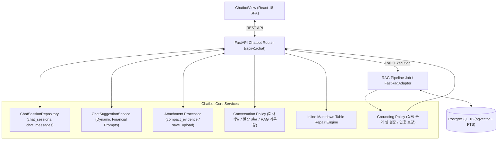

# [BP-404] AI Financial Chatbot 워크스페이스 명세서
> **Document Code:** `BP-404` | **Category:** Workspace Blueprint | **Status:** Implemented & Operational
> **Source Files:** [`backend/domains/chatbot/application/`](file:///c:/Repos/bist-mini-final/backend/domains/chatbot/application/), [`backend/domains/chatbot/infrastructure/`](file:///c:/Repos/bist-mini-final/backend/domains/chatbot/infrastructure/), [`frontend/src/features/chatbot/ChatbotView.tsx`](file:///c:/Repos/bist-mini-final/frontend/src/features/chatbot/ChatbotView.tsx), [`backend/features/chatbot/api_routes.py`](file:///c:/Repos/bist-mini-final/backend/features/chatbot/api_routes.py), [`backend/features/chatbot/conversation.py`](file:///c:/Repos/bist-mini-final/backend/features/chatbot/conversation.py), [`backend/features/chatbot/grounding.py`](file:///c:/Repos/bist-mini-final/backend/features/chatbot/grounding.py)

---

## 1. AI 금융 대화형 챗봇 아키텍처 개요

AI 금융 챗봇은 자연어 재무 질의에 대해 **PostgreSQL 기반 대화 세션 컨텍스트**, **스마트 추천 질문**, **엑셀/CSV 첨부파일 컨텍스트 바인딩**, **Fast RAG 하이브리드 검색** 및 **마크다운/LaTeX/인라인 차트 시각화**를 제공합니다:

---

## 2. 핵심 엔드포인트 명세

정식 경로는 `/api/v1/chat`입니다. 문서가 과거에 사용한 `/api/chatbot` 및 버전 경로 `/api/v1/chatbot`은 호환 별칭으로 유지합니다.

* `GET /api/v1/chat/sessions`: 세션 목록 조회
* `POST /api/v1/chat/sessions`: 세션 생성
* `GET /api/v1/chat/sessions/{session_id}`: 세션 상세 및 메시지 히스토리 조회
* `PATCH /api/v1/chat/sessions/{session_id}`: 세션 제목 수정
* `DELETE /api/v1/chat/sessions/{session_id}`: 세션 삭제
* `POST /api/v1/chat/sessions/{session_id}/messages`: 메시지 전송 및 RAG 실행 등록(202)
* `GET /api/v1/chat/runs/{run_id}`: durable RAG 실행 상태를 세션 메시지로 동기화
* `POST /api/v1/chat/sessions/{session_id}/attachments`: 엑셀/CSV 첨부파일 업로드
* `GET /api/v1/chat/suggestions`: 동적 스마트 질문 추천
* `POST /api/v1/chat/suggestions/refresh`: 추천 질문 재생성

## 3. 대화 라우팅과 근거 안전성

* 금융 용어의 일반 정의, 최근 질문 확인, 등록 회사명 확인은 `conversation.py`의 결정적 정책으로 처리하고 기업 수치·실적 조회만 `rag_query` 워크플로로 보냅니다.
* 검색 서브쿼리의 `Cell Value: ?`는 Dense 유사도 검색용 와일드카드이므로 검색 단계까지 보존합니다. Reader에는 실제 `Cell Value`가 확인된 셀만 전달하며, 원시 검색 힌트나 자리표시자 셀은 Context Blocks·근거·추가 DB 조회 결과에서 모두 제외합니다.
* RAG 응답은 실행 결과의 `expand-context` 셀 또는 실행 로그에서 복구한 pgvector 셀과 대조합니다. 검증 가능한 셀이 없거나 응답의 셀 인용이 실행 근거와 일치하지 않으면 답변과 인라인 시각화를 노출하지 않습니다.
* 모델이 근거 셀을 사용했지만 인용 표기를 생략한 경우 `grounding.py`가 최대 6개의 `[Sheet: ... | Cell: ...]` 근거를 보강합니다.
* 프런트엔드는 `chatMarkdown.ts`에서 접힌 GFM 표와 이스케이프 문자를 정규화하고, `shared/markdown/cellCitations.ts`에서 셀 인용과 상세 메타데이터를 분리합니다. 본문에는 `시트 · 셀` 배지만 노출하며 hover 또는 keyboard focus 시 기업, 행 항목, 열 항목, 셀 값 상세를 포털 툴팁으로 표시합니다. 같은 공용 Markdown 렌더러를 챗봇과 Playground Reader 노드가 사용합니다.
