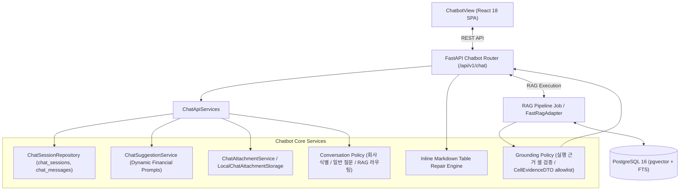

# [BP-404] AI Financial Chatbot 워크스페이스 명세서
> **Document Code:** `BP-404` | **Contract State:** Target Architecture | **Capability State:** Operational | **Structure State:** Complete
> **Target Ownership:** `backend/domains/chatbot`, `backend/domains/workflow/application`, `backend/platform/openai`, `frontend/src/features/chatbot`
> **Current References:** [`backend/domains/chatbot/domain/`](../../../backend/domains/chatbot/domain), [`backend/domains/chatbot/application/`](../../../backend/domains/chatbot/application), [`backend/domains/chatbot/infrastructure/`](../../../backend/domains/chatbot/infrastructure), [`backend/domains/chatbot/presentation/`](../../../backend/domains/chatbot/presentation), [`frontend/src/features/chatbot/ChatbotView.tsx`](../../../frontend/src/features/chatbot/ChatbotView.tsx)

---

## 1. AI 금융 대화형 챗봇 아키텍처 개요

AI 금융 챗봇은 자연어 재무 질의에 대해 **PostgreSQL 기반 대화 세션 컨텍스트**, **스마트 추천 질문**, **엑셀/CSV 첨부파일 컨텍스트 바인딩**, **Fast RAG 하이브리드 검색** 및 **마크다운/LaTeX/인라인 차트 시각화**를 제공합니다:

---

## 2. 핵심 엔드포인트 명세

정식 경로는 `/api/v1/chat`입니다. 문서가 과거에 사용한 `/api/chatbot` 및 버전 경로 `/api/v1/chatbot`은 호환 별칭으로 유지합니다.

* `GET /api/v1/chat/sessions`: 세션 목록 조회
* `POST /api/v1/chat/sessions`: 세션 생성
* `GET /api/v1/chat/sessions/{session_id}`: 세션 상세 및 메시지 히스토리 조회
* `PATCH /api/v1/chat/sessions/{session_id}`: 세션 제목 수정
* `DELETE /api/v1/chat/sessions/{session_id}`: 세션 삭제
* `POST /api/v1/chat/sessions/{session_id}/messages`: 메시지 전송 및 RAG 실행 등록(202)
* `GET /api/v1/chat/runs/{run_id}`: durable RAG 실행 상태를 세션 메시지로 동기화
* `POST /api/v1/chat/sessions/{session_id}/attachments`: 엑셀/CSV 첨부파일 업로드
* `GET /api/v1/chat/suggestions`: 동적 스마트 질문 추천
* `POST /api/v1/chat/suggestions/refresh`: 추천 질문 재생성
* `GET /api/v1/evidence/cells/resolve`: 구조화 셀 근거를 원본 workbook·rendered sheet 좌표와 연결
* `POST /api/v1/evidence/cells/resolve-batch`: 한 답변의 동일 시트 참조 셀을 단일 catalog snapshot으로 일괄 연결

## 3. 대화 라우팅과 근거 안전성

* 금융 용어의 일반 정의, 최근 질문 확인, 등록 회사명 확인은 chatbot application의 결정적 routing policy가 조율합니다. 기업 수치·실적 조회만 workflow application port를 통해 `rag_query` 실행으로 보냅니다.
* 세션 첨부파일 질문은 RAG collection 검색과 분리된 직접 Reader 경로입니다. infrastructure adapter는 숨김 시트를 제외한 visible worksheet의 모든 비어 있지 않은 행을 시트 구분자와 함께 평탄화하고, application은 질문 키워드 기반 행 축약이나 대표 행 fallback을 적용하지 않은 저장 컨텍스트 전체를 Reader에 전달합니다. 입력 폭주 방지를 위한 단일 전역 상한은 240,000자이며 시트별 임의 절단은 사용하지 않습니다.
* 검색 서브쿼리의 `Cell Value: ?`는 Dense 유사도 검색용 와일드카드이므로 검색 단계까지 보존합니다. Reader에는 실제 `Cell Value`가 확인된 셀만 전달하며, 원시 검색 힌트나 자리표시자 셀은 Context Blocks·근거·추가 DB 조회 결과에서 모두 제외합니다.
* RAG 응답은 Reader에 실제 전달된 `expand-context` 셀과만 대조합니다. compact run summary가 node output을 생략한 챗봇 경로에서는 durable `expand-context` 실행 로그를 읽습니다. `fuse` 검색 결과나 pgvector를 다시 조회해 컨텍스트를 추정하는 fallback은 사용하지 않습니다. 검증 가능한 확장 셀이 없거나 구조화 근거의 collection/workbook/company/sheet/cell identity가 정확히 일치하지 않으면 답변과 인라인 시각화를 노출하지 않습니다.
* `[검증 가능한 근거 셀]`은 LLM이 선택할 수 있는 후보일 뿐이며 자동 노출 목록이 아닙니다. Reader는 strict structured output `ReaderEvidenceSelectionDTO(answer_markdown, evidence_ids)`로 답변의 사실·수치·계산에 실제 사용한 최소 핵심 ID만 선택합니다. 계산 결과는 모든 피연산 셀 ID를 선택합니다.
* Reader 후처리는 모델이 선택한 ID가 허용된 실제 값 셀인지 전부 검증한 뒤 `CellEvidenceDTO(evidence_id, index_id, workbook_hash, file_name, company_name, sheet_name, cell_coord, row_header, column_header, cell_value, source_text)`로 투영합니다. `answer_markdown`에는 좌표나 `근거` section을 넣지 않으며, 모델이 셀을 선택하지 않거나 허용 목록 밖 ID를 만들면 검색 후보를 임의로 보강하지 않고 답변을 차단합니다.
* `grounding.py`는 Reader의 `CellEvidenceDTO[]` 전체를 실제 run evidence와 다시 대조합니다. 근거가 없는 답변에 실행 컨텍스트 앞 6개를 자동 첨부하지 않으며 검증된 DTO만 `chat_messages.evidence`에 저장합니다.
* 프런트엔드는 `chatMarkdown.ts`에서 답변 본문의 접힌 GFM 표와 이스케이프 문자만 정규화합니다. 출처는 Markdown을 정규식 파싱하지 않고 API의 `evidence[]`를 `shared/markdown/cellCitations.ts`가 view model로 투영합니다. 셀 DTO는 보존하되 workbook·company·sheet identity가 같은 항목을 `시트 · N개 셀` 배지 하나로 묶습니다. hover 또는 keyboard focus에는 기업, 시트, 참조 좌표 목록과 원본 파일만 요약하며 같은 공용 렌더러를 챗봇과 Playground Reader 노드가 사용합니다.
* 시트 배지를 활성화하면 `CellEvidenceProvider`가 batch resolve API를 한 번 호출하고 `CellEvidenceModal`에서 서버가 생성한 원본 sheet PNG를 엽니다. 검증된 모든 cell bbox를 반투명 빨간 경계 상자로 동시에 표시하며 확대·축소·화면 맞춤·전체 근거 영역 이동과 pointer drag pan을 지원합니다. 인덱스와 workbook 근거 연결이 없으면 임의 이미지를 대체하지 않고 명시적 실패 상태를 표시합니다.

---

## 4. 책임 분리와 구조 완료 조건

- 회사 식별·일반 질문·RAG 선택 정책과 attachment 오류는 chatbot domain이 소유하고, conversation/session/message orchestration과 grounded answer 검증은 application이 소유합니다.
- RAG 실행, BI 회사 조회, source cell 확인은 chatbot application에 정의된 소비자 관점 port로 요청하며 상대 domain repository를 직접 import하지 않습니다.
- OpenAI conversation transport는 platform, chat session·suggestion PostgreSQL repository와 로컬 attachment adapter는 chatbot infrastructure, REST DTO와 upload transport는 chatbot presentation에 둡니다.
- bootstrap은 `ChatApiServices`에 conversation, suggestion, attachment 유스케이스를 조립하며 presentation은 concrete 저장소나 provider를 생성하지 않습니다.
- 이전 feature/API 호환 경로는 제거됐고 애플리케이션 내부 import와 구조 계약 테스트는 canonical vertical slice만 사용합니다.
- `/`는 별도 홈을 렌더링하지 않고 `/chatbot`으로 연결되며 AppShell의 `새 채팅`과 대화 이력이 모든 workspace에서 유지됩니다.
- Reader 본문과 근거는 `answer_markdown`과 `CellEvidenceDTO[]`의 독립 필드입니다. UI는 셀 DTO를 workbook·company·sheet별로 묶어 `Sheet · N개 셀` 배지를 만들고, click은 시트 근거 modal을 열어 원본 sheet image와 선택된 모든 bbox를 검증합니다.
- 근거 배지는 retrieval/context 순서가 아니라 Reader가 답변 작성에 명시적으로 선택하고 backend allowlist 검증을 통과한 셀만 표시합니다.
- 검색 단계에는 `Cell Value: ?` 후보를 유지하지만 Reader·tool·근거 projection에는 `resolved_cell_value`를 통과한 값만 전달합니다.
- session/message/evidence DTO 또는 RAG routing policy를 바꾸면 BP-303·BP-501·BP-601과 backend/frontend schema tests를 함께 갱신합니다.
