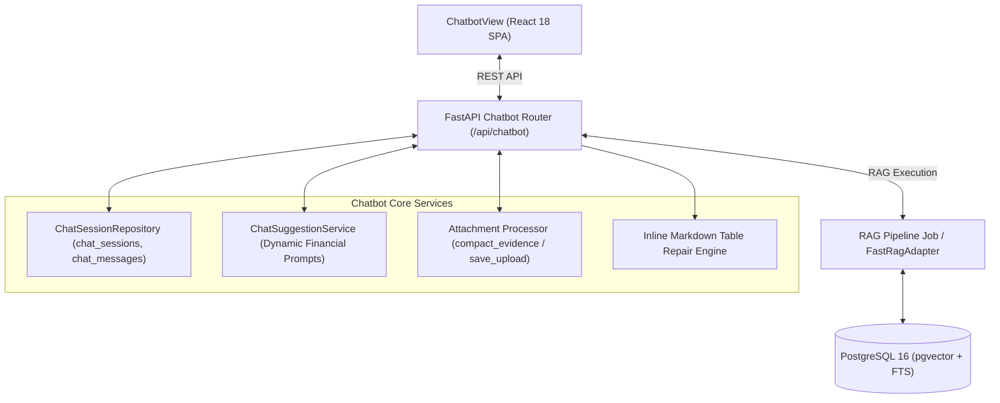

# [BP-404] AI Financial Chatbot 워크스페이스 명세서
> **Document Code:** `BP-404` | **Category:** Workspace Blueprint | **Status:** Approved Baseline  
> **Source Files:** [`frontend/src/features/chatbot/ChatbotView.tsx`](file:///c:/Repos/bist-mini-final/frontend/src/features/chatbot/ChatbotView.tsx), [`backend/features/chatbot/api_routes.py`](file:///c:/Repos/bist-mini-final/backend/features/chatbot/api_routes.py), [`backend/features/chatbot/repository.py`](file:///c:/Repos/bist-mini-final/backend/features/chatbot/repository.py)

---

## 1. AI 금융 대화형 챗봇 아키텍처 개요

AI 금융 챗봇은 자연어 재무 질의에 대해 **PostgreSQL 기반 대화 세션 컨텍스트**, **스마트 추천 질문**, **엑셀/CSV 첨부파일 컨텍스트 바인딩**, **Fast RAG 하이브리드 검색** 및 **마크다운/LaTeX/인라인 차트 시각화**를 제공합니다:

---

## 2. 핵심 엔드포인트 명세

* `GET /api/chatbot/sessions`: 세션 목록 조회
* `POST /api/chatbot/sessions`: 세션 생성
* `GET /api/chatbot/sessions/{session_id}`: 세션 상세 및 메시지 히스토리 조회
* `PATCH /api/chatbot/sessions/{session_id}`: 세션 제목 수정
* `DELETE /api/chatbot/sessions/{session_id}`: 세션 삭제
* `POST /api/chatbot/sessions/{session_id}/messages`: 메시지 전송 및 답변/시각화 생성
* `POST /api/chatbot/sessions/{session_id}/attachments`: 엑셀/CSV 첨부파일 업로드
* `GET /api/chatbot/suggestions`: 동적 스마트 질문 추천