# [BP-405] Company Comparison 스냅샷 워크스페이스 청사진
> **Document Code:** `BP-405` | **Category:** Workspace Blueprint | **Status:** Implemented & Operational
> **Source Files:** [`backend/api/company_comparison_routes.py`](file:///c:/Repos/bist-mini-final/backend/api/company_comparison_routes.py), [`backend/bootstrap/company_comparison.py`](file:///c:/Repos/bist-mini-final/backend/bootstrap/company_comparison.py), [`backend/domains/company_comparison/`](file:///c:/Repos/bist-mini-final/backend/domains/company_comparison/), [`backend/storage/versioned_snapshot_store.py`](file:///c:/Repos/bist-mini-final/backend/storage/versioned_snapshot_store.py), [`frontend/src/pages/CompanyComparisonPage.tsx`](file:///c:/Repos/bist-mini-final/frontend/src/pages/CompanyComparisonPage.tsx), [`frontend/src/features/company-comparison/`](file:///c:/Repos/bist-mini-final/frontend/src/features/company-comparison/)

---

## 1. 제품 경계

Company Comparison은 `/company-comparison` 단일 탭과 `/api/v1/company-comparisons` 전용 API namespace를 사용합니다. 과거의 직접 듀퐁 비교 화면과 `/company-comparison-v2` 화면은 제거하고, 재무 순위·선택 기업 분석·2개 기업 비교를 하나의 워크스페이스로 통합합니다.

BI Dashboard와 Company Comparison은 서로 다른 제품 도메인입니다. Company Comparison은 BI가 발행한 검증 스냅샷을 읽기 전용 원천으로 사용하지만, 비교 계산 결과는 별도의 `CompanyComparisonSnapshot`으로 발행합니다. 따라서 프론트 탭, API, DTO, 계산 정책과 저장 수명주기가 BI와 독립적으로 진화할 수 있습니다.

```mermaid
flowchart LR
    BI["BI Dashboard Snapshots\nbi_dashboard_snapshots"] --> SOURCE["CompanyComparisonSourcePort"]
    SOURCE --> BUILDER["CompanyComparisonSnapshotBuilder\nvalidate + score + forecast"]
    BUILDER --> SNAPSHOT["CompanyComparisonSnapshot"]
    SNAPSHOT --> REPO["VersionedSnapshotRepository"]
    REPO --> TABLES["domain_snapshots\ndomain_snapshot_heads"]
    TABLES --> API["GET /company-comparisons/snapshot"]
    API --> UI["/company-comparison"]
```

---

## 2. 스냅샷 생성 계약

1. 현재 BI 기업 목록과 각 기업의 `current_snapshot_id`를 조회합니다.
2. 매출·영업이익이 함께 존재하는 실제 FY 관측값을 최근 최대 5개년까지 읽습니다.
3. 비교 최신 FY의 총부채·총자산·순부채를 같은 연도·통화·배율로 정렬하고, 모든 사용 값의 원본 셀 근거를 검증합니다.
4. 필수 값 또는 근거가 누락된 기업은 값을 추정하지 않고 `exclusions`에 사유와 함께 기록합니다.
5. 검증 완료 기업이 2개 미만이면 스냅샷을 발행하지 않고 `409`를 반환합니다.
6. 성장성 35%, 수익성 35%, 안정성 30%의 버전형 절대 점수 정책으로 순위를 계산합니다.
7. 향후 3개년 값은 `historical-cagr-hold-v1` 가정으로 별도 표시하며 종합 점수에는 사용하지 않습니다.
8. 원천 BI 스냅샷 ID들의 SHA-256 지문과 계산 정책 버전으로 스냅샷 ID를 결정합니다. 원천이 바뀌지 않으면 기존 발행본을 재사용합니다.

가상 기업, 임의 부채율, 누락 연도 역산 및 저장소 장애 시 임시 데이터 fallback은 운영 계약에 포함하지 않습니다.

### 2.1 점수와 순위 정책

- 정책 버전: `financial-league-v3`
- 성장성: CAGR -10%를 0점, 12%를 100점으로 선형 변환 후 범위 제한
- 수익성: 영업이익률 -5%를 0점, 15%를 100점으로 선형 변환 후 범위 제한
- 안정성: 부채/자산 기반 70%와 순부채/최근 매출 기반 30%의 합성
- 종합: 성장성 35% + 수익성 35% + 안정성 30%
- 등급: S 90 이상, A 75 이상, B 50 이상, 그 외 C
- 동점은 competition ranking을 적용하므로 `1, 1, 3`처럼 다음 순위를 건너뜁니다.

### 2.2 예측과 근거 정책

`historical-cagr-hold-v1`은 실제 관측 구간 CAGR을 -12%~30%로 제한해 향후 3개년 매출에 적용하고, 최신 실제 영업이익률을 유지합니다. 예측 period는 `assumption_id`와 예측의 기반이 된 실제 셀 evidence ID를 반드시 가집니다. 실제 period에는 assumption ID를 넣지 않으며 예측치는 순위 점수에 포함하지 않습니다.

스냅샷 DTO는 기업별 최소 2개 실제 period와 정확히 3개 예측 period, source snapshot ID 일치, evidence/assumption 참조 무결성, 분포 bucket 총합, `PARTIAL` 상태와 exclusions의 일치를 자체 검증합니다.

---

## 3. 공통 스냅샷 추상화

공통화 범위는 도메인 payload가 아니라 다음 저장 수명주기뿐입니다.

- `VersionedSnapshotRecord`: `domain`, `scope_key`, `schema_version`, `source_fingerprint`, `generated_at`, JSON payload
- `VersionedSnapshotRepository.get_current()`: 현재 발행본 조회
- `VersionedSnapshotRepository.publish()`: 불변 버전 저장과 current head 원자적 전환
- `domain_snapshots`: 스냅샷 이력
- `domain_snapshot_heads`: 도메인·스코프별 현재 포인터. 복합 외래키로 동일 도메인·스코프의 스냅샷만 참조

BI의 계산식과 기업 비교의 점수 정책은 의미가 다르므로 공통 BaseService로 합치지 않습니다. BI는 기존 전용 스키마를 유지하고, 새 도메인이 필요할 때 동일한 저장 포트만 재사용합니다.

---

## 4. REST API

| Method | Endpoint | 역할 | 반환 |
| :--- | :--- | :--- | :--- |
| `GET` | `/api/v1/company-comparisons/snapshot` | 현재 발행된 기업 비교 스냅샷 조회 | `CompanyComparisonSnapshot` |
| `POST` | `/api/v1/company-comparisons/snapshot/refresh` | 최신 BI 원천을 검증·계산하고 새 비교 스냅샷을 원자적으로 발행 | `CompanyComparisonSnapshot` |

비교 계산은 외부 LLM을 호출하지 않는 짧은 결정론적 집계이므로 현재는 동기 요청 내 네이티브 async DB I/O로 처리합니다. 계산량이 작업 큐가 필요한 수준으로 증가할 때만 durable materialization job으로 승격합니다.

---

## 5. 프론트엔드 구성

- [`CompanyComparisonPage.tsx`](file:///c:/Repos/bist-mini-final/frontend/src/pages/CompanyComparisonPage.tsx): 단일 정식 페이지, 순위·선택·비교·스냅샷 갱신 조립
- [`api.ts`](file:///c:/Repos/bist-mini-final/frontend/src/features/company-comparison/api.ts): 조회와 refresh API
- [`schemas.ts`](file:///c:/Repos/bist-mini-final/frontend/src/features/company-comparison/schemas.ts): Zod 응답 계약 검증
- [`metricRanking.ts`](file:///c:/Repos/bist-mini-final/frontend/src/features/company-comparison/metricRanking.ts): 지표별 표시 순위
- [`analysis.ts`](file:///c:/Repos/bist-mini-final/frontend/src/features/company-comparison/analysis.ts): 순위 사유와 동적 관측 기간 추이
- [`CompanyComparisonCharts.tsx`](file:///c:/Repos/bist-mini-final/frontend/src/features/company-comparison/CompanyComparisonCharts.tsx): 단일 기업 및 공통 관측 기간 비교 차트

UI는 실제/예측 기간을 시각적으로 구분하고, 스냅샷 상태·생성 시각·scoring/forecast version·포함/제외 기업·근거 수를 서버 응답에서 표시합니다. refresh 실패 시 이전 응답을 새 데이터처럼 합성하지 않습니다.

기업명 링크는 `/dashboard?companyId={id}`로 이동합니다. 이 딥링크만 화면 간 선택 문맥을 전달하며 기업 비교 API가 BI API namespace를 대체하지 않습니다.
