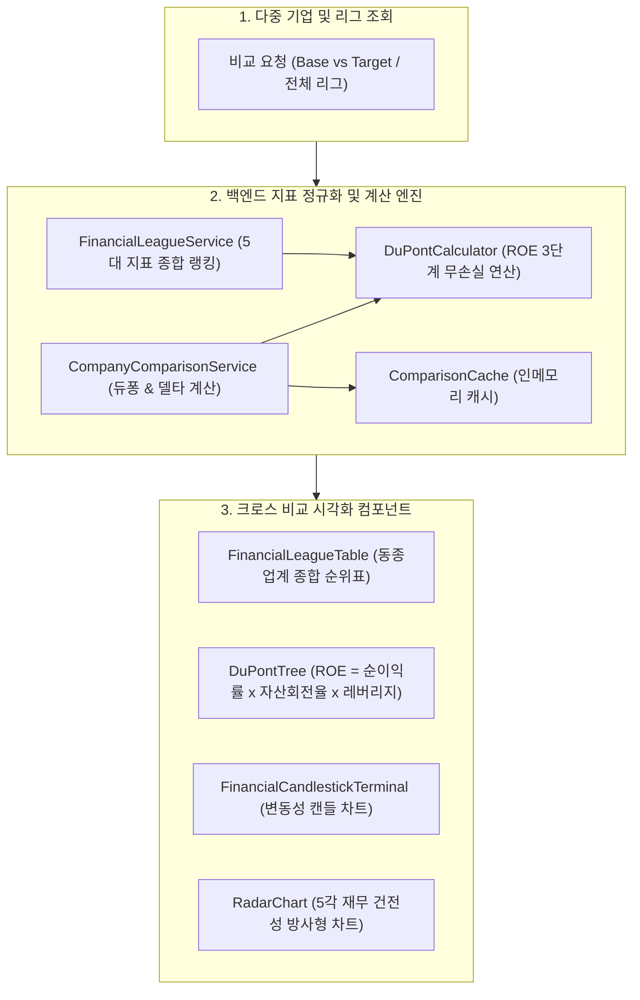

# [BP-405] Company Comparison & Financial League 대시보드 청사진
> **Document Code:** `BP-405` | **Category:** Workspace Blueprint | **Status:** Active Production Feature  
> **Source Files:** [`backend/features/company_comparison/`](file:///c:/Repos/bist-mini-final/backend/features/company_comparison/), [`frontend/src/pages/CompanyComparisonPage.tsx`](file:///c:/Repos/bist-mini-final/frontend/src/pages/CompanyComparisonPage.tsx), [`frontend/src/pages/CompanyComparisonV2Page.tsx`](file:///c:/Repos/bist-mini-final/frontend/src/pages/CompanyComparisonV2Page.tsx)

---

## 1. 기업 비교 및 파이낸셜 리그 아키텍처 (Cross-Company Comparison Architecture)

**Company Comparison Dashboard**는 2개 이상의 복수 기업(예: IBM, 비스텔리젼스, 콜드플레이, DH 이노베이션)을 선택하여 **수익성, 안정성, 성장성, 활동성 지표를 동일 회계 기준/통화 단위로 정규화하여 크로스 비교하고 듀퐁 3단계 분해 트리 및 파이낸셜 리그 테이블을 시각화**하는 분석 워크스페이스입니다.

---

## 2. 듀퐁 분석(DuPont Analysis) 분해 모델 및 수식

기업 간 ROE(자기자본이익률) 격차의 근본 원인을 분석하기 위해 3단계 듀퐁 분해 공식을 적용합니다:

$$
\text{ROE} = \underbrace{\left(\frac{\text{당기순이익}}{\text{매출액}}\right)}_{\text{순이익률 (Profit Margin)}} \times \underbrace{\left(\frac{\text{매출액}}{\text{총자산}}\right)}_{\text{총자산회전율 (Asset Turnover)}} \times \underbrace{\left(\frac{\text{총자산}}{\text{자기자본}}\right)}_{\text{재무레버리지 (Financial Leverage)}}
$$

---

## 3. REST API 규격

### ① `GET /api/bi/comparisons/league`
- **역할**: 전사 등록 기업의 5대 건전성 종합 점수 및 리그 순위 반환.
- **반환 DTO**: `FinancialLeagueResponse(standings, rankings, last_updated)`

### ② `POST /api/bi/comparisons/analyze`
- **역할**: Base 기업과 Target 기업 간의 듀퐁 3단계 분해, 5각 레이더 지표 및 전년 대비 증감률(Delta) 비교.
- **요청 Body**: `CompanyComparisonRequest(base_company_id, target_company_id, fiscal_year)`
- **반환 DTO**: `CompanyComparisonResponse(dupont_breakdown, radar_metrics, summary_delta)`

---

## 4. 프론트엔드 구현 컴포넌트
- [`CompanyComparisonPage.tsx`](file:///c:/Repos/bist-mini-final/frontend/src/pages/CompanyComparisonPage.tsx): 듀퐁 3단계 분해 트리 및 2개 기업 직접 비교 뷰.
- [`CompanyComparisonV2Page.tsx`](file:///c:/Repos/bist-mini-final/frontend/src/pages/CompanyComparisonV2Page.tsx): 파이낸셜 리그 테이블 및 캔들스틱 변동성 터미널 뷰.
- [`FinancialLeagueTable.tsx`](file:///c:/Repos/bist-mini-final/frontend/src/features/company-comparison-v2/FinancialLeagueTable.tsx): 리그 순위 및 지표 랭킹 테이블.
- [`FinancialCandlestickTerminal.tsx`](file:///c:/Repos/bist-mini-final/frontend/src/features/company-comparison-v2/FinancialCandlestickTerminal.tsx): 시계열 변동성 캔들 차트.
