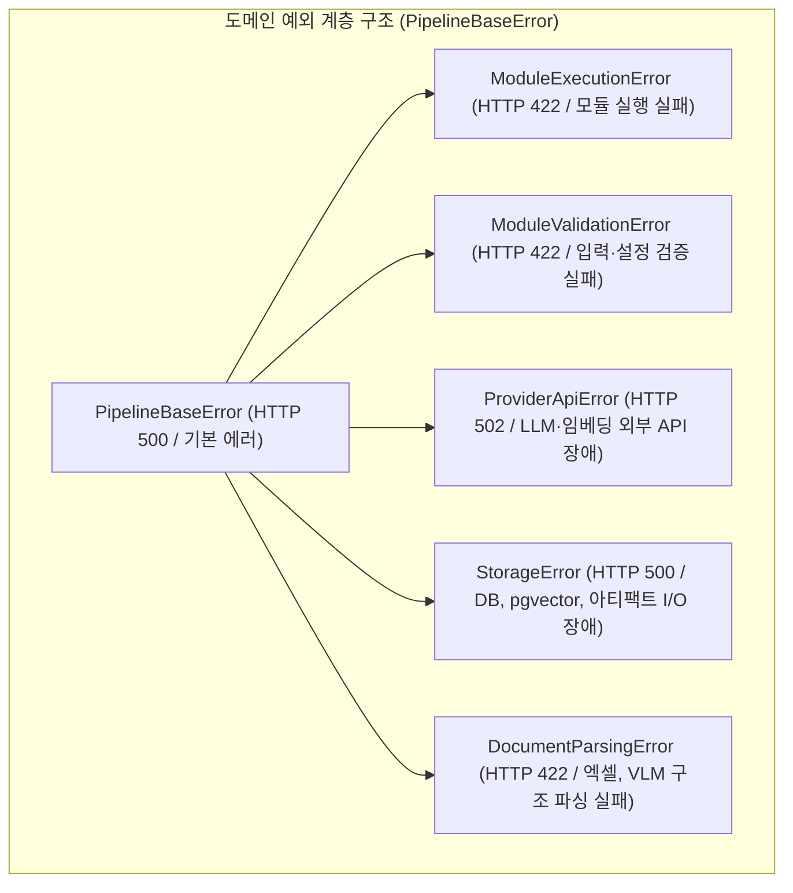

# [BP-501] REST API 엔드포인트 & DTO 규격서
> **Document Code:** `BP-501` | **Category:** Interface & API Blueprint | **Status:** Approved Baseline  
> **Source Files:** [`backend/api/router.py`](file:///c:/Repos/bist-mini-final/backend/api/router.py), [`backend/api/workflow_routes.py`](file:///c:/Repos/bist-mini-final/backend/api/workflow_routes.py), [`backend/api/data_source_routes.py`](file:///c:/Repos/bist-mini-final/backend/api/data_source_routes.py), [`backend/api/module_routes.py`](file:///c:/Repos/bist-mini-final/backend/api/module_routes.py), [`backend/features/bi/api_routes.py`](file:///c:/Repos/bist-mini-final/backend/features/bi/api_routes.py), [`backend/api/error_mapping.py`](file:///c:/Repos/bist-mini-final/backend/api/error_mapping.py)

---

## 1. REST API 아키텍처 및 표준 엔벨로프 (API Protocol & Envelope)

`bist-mini-final`의 정식 제품 API는 `/api/v1` 접두사를 가지며, 기존 `/api`는 `Deprecation`/`Link` 헤더를 제공하는 숨김 호환 경로입니다. OpenAPI에는 `/api/v1`만 노출합니다.

### 표준 에러 응답 형식 (RFC 7807 기반 확장)
```json
{
  "detail": {
    "code": "MODULE_EXECUTION_ERROR",
    "message": "VLM 표 감지 중 타임아웃이 발생했습니다 (40s)",
    "retryable": true,
    "context": {
      "module_type": "structure.luna_vlm_structure_detector",
      "file_name": "samsung_2023.xlsx"
    }
  }
}
```

---

## 2. 도메인별 엔드포인트 상세 명세서 (API Endpoint Matrix)

### [Group 1: 워크플로우 및 DAG 실행 (`/api/v1/workflows`, `/api/v1/runs`)]

| Method | Endpoint | 설명 | Request Body / Query | Response DTO |
| :--- | :--- | :--- | :--- | :--- |
| `GET` | `/api/v1/workflows` | 저장된 워크플로 문서 목록 조회 | - | `List[WorkflowDocumentSummary]` |
| `PUT` | `/api/v1/workflows/{workflow_id}` | 워크플로 DAG 저장/갱신 | `WorkflowSaveRequest` | `WorkflowDocument` |
| `GET/DELETE` | `/api/v1/workflows/{workflow_id}` | 워크플로 조회/삭제 | - | 문서 또는 삭제 응답 |
| `POST`| `/api/v1/workflows/{workflow_id}/runs` | durable PostgreSQL 큐에 실행 등록 | `WorkflowExecutionRequest` | `WorkflowRun` (202) |
| `GET` | `/api/v1/runs/{run_id}` | 실행 상태 조회 | - | `WorkflowRun` |
| `GET` | `/api/v1/runs/{run_id}/stream` | 실행 진행 상태 SSE | - | `EventSource` |
| `POST`| `/api/v1/runs/{run_id}/resume` | 실패/취소 실행 재등록 | - | `WorkflowRun` (202) |
| `POST`| `/api/v1/runs/{run_id}/cancel` | 실행 취소 요청 | - | `WorkflowRun` |

### [Group 2: 파이프라인 모듈 인트로스펙션 (`/api/v1/modules`)]

| Method | Endpoint | 설명 | Response DTO |
| :--- | :--- | :--- | :--- |
| `GET` | `/api/v1/modules` | 19개 등록 파이프라인 모듈 목록 및 메타데이터 | `List[ModuleDefinitionDTO]` |
| `GET` | `/api/v1/modules/categories` | 카테고리별 모듈 계약 | 카테고리 응답 |
| `GET` | `/api/v1/modules/schemas` | 전체 Pydantic 입출력/config JSON Schema | 스키마 맵 |
| `GET` | `/api/v1/modules/{module_type}` | 단일 모듈 계약과 스키마 | `ModuleDefinitionDTO` |
| `GET` | `/api/v1/modules/{module_type}/docs` | 단일 모듈 Markdown 문서 | `text/markdown` |

### [Group 3: 데이터 소스 및 인제스천 (`/api/v1/data-sources`)]

| Method | Endpoint | 설명 | Request / Response |
| :--- | :--- | :--- | :--- |
| `GET` | `/api/v1/data-sources/files` | 업로드된 파일 목록 조회 | 파일 목록 응답 |
| `POST`| `/api/v1/data-sources/files/upload` | 파일 업로드 및 선택적 인제스천 큐 등록 | 업로드/작업 응답 |
| `GET/DELETE` | `/api/v1/data-sources/files/{filename}` | 다운로드/삭제 | 파일 또는 삭제 응답 |
| `GET` | `/api/v1/data-sources/files/{filename}/preview` | 스프레드시트 미리보기 | 미리보기 DTO |
| `GET/POST` | `/api/v1/data-sources/ingestion-jobs` | 인제스천 작업 목록/등록 | 작업 DTO |
| `GET/DELETE` | `/api/v1/data-sources/ingestion-jobs/{run_id}` | 인제스천 작업 조회/삭제 | 작업 DTO |
| `POST` | `/api/v1/data-sources/ingestion-jobs/{run_id}/resume` | 실패 작업 재등록 | 작업 DTO |
| `POST` | `/api/v1/data-sources/ingestion-jobs/{run_id}/cancel` | 작업 취소 요청 | 작업 DTO |
| `GET` | `/api/v1/data-sources/indexes` | pgvector 인덱스 목록 | 인덱스 목록 |
| `GET/DELETE` | `/api/v1/data-sources/indexes/{index_id}` | 인덱스 조회/삭제 | 인덱스 DTO |
| `POST` | `/api/v1/data-sources/indexes/{index_id}/search` | 인덱스 검색 | 검색 결과 |
| `GET` | `/api/v1/data-sources/db-status` | PostgreSQL/pgvector 상태 | DB 상태 DTO |

### [Group 4: 재무 BI 및 프로파일러 (`/api/v1/bi`)]

| Method | Endpoint | 설명 | Request / Response |
| :--- | :--- | :--- | :--- |
| `GET` | `/api/v1/bi/companies` | 기업 목록 조회 | 기업 목록 DTO |
| `GET` | `/api/v1/bi/companies/{company_id}/dashboard` | 근거가 있는 21개 지표 대시보드 스냅샷 | `BiDashboardSnapshot` |
| `POST`| `/api/v1/bi/materializations` | 백그라운드 스냅샷 산출 등록 | 작업 승인 DTO (202) |
| `GET` | `/api/v1/bi/materializations/{job_id}` | 산출 작업 상태 | 작업 DTO |
| `GET` | `/api/v1/bi/materializations/{job_id}/stream` | 산출 작업 상태 SSE | `EventSource` |
| `POST`| `/api/v1/bi/companies/{company_id}/refresh` | 파생 지표와 스냅샷 재계산 | `BiDashboardSnapshot` |
| `POST`| `/api/v1/bi/companies/{company_id}/reset` | 질의응답 초기화 및 새 질문 배치 등록 | `BiQuestionJobProgress` (202) |
| `GET` | `/api/v1/bi/question-jobs/{job_id}` | 질문 배치 진행률 | `BiQuestionJobProgress` |
| `GET` | `/api/v1/bi/question-jobs/{job_id}/stream` | 질문 배치 진행 상태 SSE | `EventSource` |

### [Group 5: 기업 비교 분석 (`/api/v1/company-comparisons`)]

기업 비교는 BI 대시보드와 독립된 프런트엔드 탭·담당 도메인입니다. 따라서 대시보드의 단일 기업 스냅샷 API와 분리된 전용 namespace를 사용합니다. 기존 `/api/v1/bi/comparisons/*`는 OpenAPI에 노출하지 않는 호환 alias이며 `Deprecation`·`Link` 헤더로 새 경로를 안내합니다.

| Method | Endpoint | 설명 | Request / Response |
| :--- | :--- | :--- | :--- |
| `GET` | `/api/v1/company-comparisons/league` | 다중 기업 리그 순위 조회 | `FinancialLeagueResponse` |
| `POST` | `/api/v1/company-comparisons/analyze` | 근거 기반 선택 기업 비교 분석 | `CompanyComparisonResponse` |

### [Group 6: AI 금융 챗봇 대화 세션 (`/api/v1/chat`)]

`/api/v1/chatbot`은 기존 청사진 링크를 위한 숨김 호환 alias이며 신규 클라이언트는 `/api/v1/chat`을 사용합니다.

| Method | Endpoint | 설명 | Request / Response |
| :--- | :--- | :--- | :--- |
| `GET/POST` | `/api/v1/chat/sessions` | 최근 세션 목록/신규 세션 생성 | 세션 DTO |
| `GET/PATCH/DELETE` | `/api/v1/chat/sessions/{session_id}` | 세션 상세/제목 수정/삭제 | 세션 DTO 또는 삭제 응답 |
| `POST`| `/api/v1/chat/sessions/{session_id}/messages` | 메시지 전송 및 RAG 실행 등록 | 메시지 DTO |
| `POST`| `/api/v1/chat/sessions/{session_id}/attachments` | 파일 업로드 및 텍스트 추출 | 첨부 DTO |
| `GET` | `/api/v1/chat/suggestions` | 추천 질문 조회 | 추천 질문 목록 |
| `POST` | `/api/v1/chat/suggestions/refresh` | 추천 질문 재생성 | 추천 질문 목록 |

### [Group 7: 벤치마크 평가 (`/api/v1/benchmarks`)]

| Method | Endpoint | 설명 | Request / Response |
| :--- | :--- | :--- | :--- |
| `GET` | `/api/v1/benchmark-sets` | 실행 가능한 benchmark set 목록 | 세트 목록 |
| `POST`| `/api/v1/benchmarks/jobs` | Ground-Truth 기반 벤치마크 작업 등록 | 작업 DTO (202) |
| `GET/DELETE` | `/api/v1/benchmarks/jobs/{job_id}` | 작업 상태 조회/삭제 | 작업 DTO |
| `POST` | `/api/v1/benchmarks/jobs/{job_id}/pause` | 작업 일시정지 요청 | 작업 DTO |
| `POST` | `/api/v1/benchmarks/jobs/{job_id}/resume` | 작업 재개 | 작업 DTO |
| `GET` | `/api/v1/benchmarks` | 완료된 평가 목록 | 평가 목록 |
| `GET` | `/api/v1/benchmarks/{benchmark_id}` | 정확도·재현율·지연 평가 상세 | 평가 DTO |

### [Group 8: K8s 배치 잡 & 워커 읽기 전용 관제 (`/jobs`, `/api/v1/jobs`)]

| Method | Endpoint | 설명 | Request / Response |
| :--- | :--- | :--- | :--- |
| `GET` | `/jobs` | React SPA 작업 관제 화면 | HTML / SPA route |
| `GET` | `/api/v1/jobs` | ScaledJob, Job, Pod 요약 상태 조회 | `KubernetesWorkloadSnapshot` |

WebSocket 로그 터미널과 작업 취소/Lease 회수는 인증·감사·운영 정책이 필요한 To-Be 범위이며 현재 읽기 전용 API에는 포함하지 않습니다.

---

## 2. 전역 예외 처리 계층 및 표준 에러 응답 규격 (Global Exception Hierarchy & Error Envelope)

개별 비즈니스 로직과 모듈 코드의 가독성을 극대화하기 위해, **모듈 내부의 불필요한 `try-except` 보일러플레이트를 전면 배제(Zero Exception Boilerplate)**하고 최상위 `BaseModule.run()` 및 FastAPI 전역 핸들러가 에러를 일원화하여 포착·응답합니다:



---

### 2.1 단일 표준 전역 에러 응답 규격 (Standard Error Envelope)

모든 REST API 엔드포인트에서 예외 발생 시, 클라이언트(프론트엔드)는 일관된 JSON 에러 스키마를 수신합니다:

```json
{
  "error_code": "PROVIDER_API_ERROR",
  "message": "모듈 [reader] 외부 API 호출 실패: Rate limit exceeded",
  "module_type": "reader",
  "status_code": 502,
  "details": {
    "provider": "openai",
    "model": "gpt-5.6-luna",
    "retry_after_seconds": 5
  },
  "timestamp": "2026-08-26T16:00:00.000Z"
}
```

---

### 2.2 비즈니스 로직 순수성 및 제로 보일러플레이트 원칙 (Zero Exception Boilerplate Policy)

| 핵심 원칙 | 설계 및 구현 표준 |
| :--- | :--- |
| **비즈니스 로직 순수성** | `modules/*.execute()` 및 `backend/features/bi/*.py` 내부에는 `try-except` 예외 포장 코드를 일절 작성하지 않고, **순수 비즈니스 연산/수식/변환 코드만 간결하게 유지**합니다. |
| **템플릿 메서드 자동 가드** | 부모 클래스인 `BaseModule.run()`이 실행 중 발생하는 Pydantic 검증 에러, 네트워크 타임아웃, DB 커넥션 단절을 자동으로 감지하여 표준 도메인 예외(`ProviderApiError`, `ModuleValidationError`)로 변환합니다. |
| **FastAPI 전역 인터셉터** | `backend/main.py`의 `@app.exception_handler(PipelineBaseError)`가 모든 도메인 예외를 일괄 가로채어 적절한 HTTP 상태 코드(422, 500, 502)와 표준 Error Envelope로 응답합니다. |

---

## 3. 리팩토링 타깃 (Refactoring Targets)

1. **FastAPI 의존성 주입(`Depends`) 표준화**:
   - As-Is: `request.app.state.container`를 라우터 함수 내에서 직접 꺼내어 씀.
   - To-Be: `def get_bi_services(container: ApplicationContainer = Depends(get_container)) -> BiApiServices:` 표준 `Depends` 패턴으로 전면 리팩토링.
2. **API 버저닝 경로 도입**:
   - `/api/v1/workflows`, `/api/v1/bi` 형식의 URI 네임스페이스 버저닝 적용.

