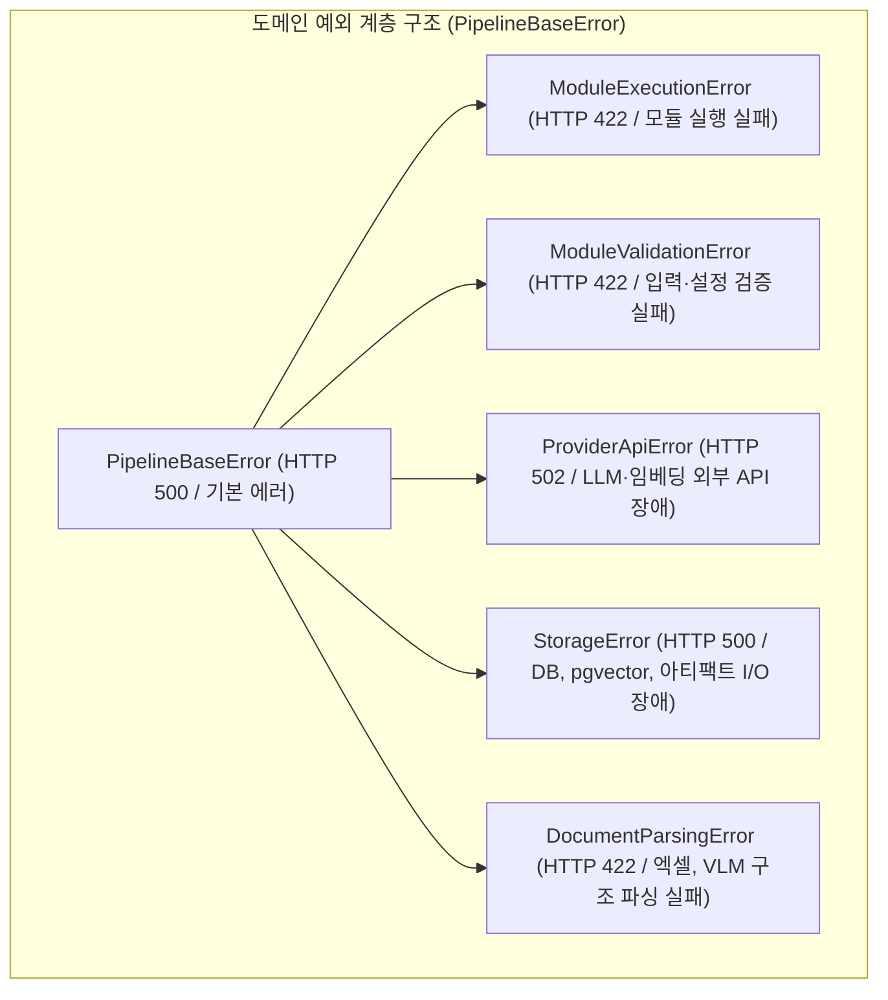

# [BP-501] REST API 엔드포인트 & DTO 규격서
> **Document Code:** `BP-501` | **Category:** Interface & API Blueprint | **Status:** Approved Baseline  
> **Source Files:** [`backend/api/router.py`](file:///c:/Repos/bist-mini-final/backend/api/router.py), [`backend/api/workflow_routes.py`](file:///c:/Repos/bist-mini-final/backend/api/workflow_routes.py), [`backend/api/data_source_routes.py`](file:///c:/Repos/bist-mini-final/backend/api/data_source_routes.py), [`backend/api/module_routes.py`](file:///c:/Repos/bist-mini-final/backend/api/module_routes.py), [`backend/features/bi/api_routes.py`](file:///c:/Repos/bist-mini-final/backend/features/bi/api_routes.py), [`backend/api/error_mapping.py`](file:///c:/Repos/bist-mini-final/backend/api/error_mapping.py)

---

## 1. REST API 아키텍처 및 표준 엔벨로프 (API Protocol & Envelope)

`bist-mini-final`의 모든 HTTP API는 `/api` 접두사를 가지며, 일관된 요청/응답 구조와 표준 에러 엔벨로프(Error Envelope)를 반환합니다.

### 표준 에러 응답 형식 (RFC 7807 기반 확장)
```json
{
  "error": {
    "code": "MODULE_EXECUTION_ERROR",
    "message": "VLM 표 감지 중 타임아웃이 발생했습니다 (40s)",
    "retryable": true,
    "context": {
      "module_type": "structure.luna_vlm_structure_detector",
      "file_name": "samsung_2023.xlsx"
    }
  }
}
```

---

## 2. 도메인별 엔드포인트 상세 명세서 (API Endpoint Matrix)

### [Group 1: 워크플로우 및 DAG 실행 (`/api/workflows`)]

| Method | Endpoint | 설명 | Request Body / Query | Response DTO |
| :--- | :--- | :--- | :--- | :--- |
| `GET` | `/api/workflows` | 저장된 워크플로우 문서 목록 조회 | - | `List[WorkflowDocumentSummary]` |
| `POST`| `/api/workflows` | 신규 워크플로우 DAG 생성/저장 | `WorkflowDocument` | `WorkflowDocument` (201 Created) |
| `GET` | `/api/workflows/{workflow_id}` | 특정 워크플로우 상세 그래프 조회 | - | `WorkflowDocument` |
| `POST`| `/api/workflows/run` | 워크플로우 전체 실행 (동기/비동기) | `WorkflowExecutionRequest` | `PipelineRunResult` or `RunDispatchAck` (202) |
| `POST`| `/api/workflows/node/run` | 단일 노드 인터랙티브 단독 실행 | `NodeExecutionRequest` | `NodeExecutionResult` |
| `GET` | `/api/workflows/runs/{run_id}` | 특정 실행의 전체 이력 및 상태 조회| - | `WorkflowRun` |
| `POST`| `/api/workflows/runs/{run_id}/cancel` | 실행 중인 작업 강제 취소 | - | `{"status": "cancelled"}` |

### [Group 2: 파이프라인 모듈 인트로스펙션 (`/api/modules`)]

| Method | Endpoint | 설명 | Response DTO |
| :--- | :--- | :--- | :--- |
| `GET` | `/api/modules` | 21개 등록된 모듈 목록 및 메타데이터 조회 | `List[ModuleDefinitionDTO]` |
| `GET` | `/api/modules/{module_type}/schema` | 특정 모듈의 동적 JSON Schema (Pydantic) 조회 | `{"input_schema": {...}, "output_schema": {...}}` |

### [Group 3: 데이터 소스 및 인제스천 (`/api/data-sources`)]

| Method | Endpoint | 설명 | Request / Response |
| :--- | :--- | :--- | :--- |
| `GET` | `/api/data-sources/files` | 업로드된 엑셀 워크북 목록 조회 | `List[WorkbookFileSummary]` |
| `POST`| `/api/data-sources/upload` | 엑셀 파일 업로드 (`multipart/form-data`) | `UploadFileAck` (file_id, hash) |
| `POST`| `/api/data-sources/detect-structure` | 시트별 Luna VLM 표 구조(바운딩 박스/헤더) 사전 감지 | `StructureDetectionResponse` |
| `POST`| `/api/data-sources/ingest` | 사용자 승인 구조 기반 직렬화 -> 임베딩 -> pgvector Binary COPY | `IngestionTaskResult` |
| `GET` | `/api/data-sources/probe` | PostgreSQL + pgvector 연결 및 인덱스 상태 헬스체크 | `{"status": "healthy", "pgvector": true}` |

### [Group 4: 재무 BI 및 프로파일러 (`/api/bi`)]

| Method | Endpoint | 설명 | Request / Response |
| :--- | :--- | :--- | :--- |
| `GET` | `/api/bi/profiles` | 기업별 재무 프로파일 및 시트 목록 조회 | `List[BiProfileSummary]` |
| `POST`| `/api/bi/questions/answer` | 단일 재무 질문에 대한 Fast RAG 답변 생성 | `BiQuestionAnswerRequest` -> `BiQuestionAnswerResponse` |
| `GET` | `/api/bi/snapshots/{profile_id}` | 사전 계산된 40+ 지표 스냅샷 조회 | `BiSnapshotProjection` |
| `POST`| `/api/bi/materialize` | 백그라운드 지표 일괄 산출 배치 트리거 | `MaterializeTaskAck` |
| `POST`| `/api/bi/companies/{company_id}/refresh` | 현재 원천 관측값으로 파생 지표 및 스냅샷 즉시 재계산 | `BiDashboardSnapshot` |
| `POST`| `/api/bi/companies/{company_id}/reset` | 질의응답 데이터 초기화 및 새 질문 배치 K8s 큐 등록 (202 Accepted) | `BiQuestionJobProgress` |
| `GET` | `/api/bi/question-jobs/{job_id}` | BI 지표 질문 배치 작업 진행률 집계 조회 | `BiQuestionJobProgress` |
| `GET` | `/api/bi/question-jobs/{job_id}/stream` | BI 지표 질문 배치 진행 상태 실시간 SSE 스트리밍 | `EventSource` (`question_job_progress`) |
| `GET` | `/api/bi/comparison/{comparison_id}` | 다중 기업 비교 레이더 차트 및 듀퐁 분해도 조회 | `BiComparisonProjection` |
| `POST`| `/api/bi/comparison/materialize` | 다중 기업 지표 일괄 산출 & 정규화 배치 트리거 (Tier 2 KEDA) | `MaterializeTaskAck` |

### [Group 5: AI 금융 챗봇 대화 세션 (`/api/chatbot`)]

| Method | Endpoint | 설명 | Request / Response |
| :--- | :--- | :--- | :--- |
| `GET` | `/api/chatbot/sessions` | 사용자의 최근 대화 세션 목록 조회 | `client_id: str` -> `List[ChatSessionDTO]` |
| `POST`| `/api/chatbot/sessions` | 신규 대화 세션 컨텍스트 생성 | `CreateSessionRequest(client_id)` -> `ChatSessionDTO` |
| `GET` | `/api/chatbot/sessions/{session_id}` | 특정 세션 상세 내역 및 메시지 히스토리 조회 | `ChatSessionDetailDTO(messages, attachments)` |
| `PATCH`| `/api/chatbot/sessions/{session_id}` | 세션 제목 수정 | `RenameSessionRequest(title)` -> `ChatSessionDTO` |
| `DELETE`| `/api/chatbot/sessions/{session_id}` | 세션 및 메시지/첨부파일 완전 삭제 | `{"deleted": true}` |
| `POST`| `/api/chatbot/sessions/{session_id}/messages` | 메시지 전송, RAG 답변 및 인라인 시각화 생성 | `CreateMessageRequest` -> `MessageResponseDTO` |
| `POST`| `/api/chatbot/sessions/{session_id}/attachments` | 엑셀/CSV 첨부파일 업로드 및 텍스트 추출 | `UploadFile` -> `AttachmentDTO` |
| `GET` | `/api/chatbot/suggestions` | 색인된 기업 목록 기반 스마트 추천 질문 인출 | `List[str]` |

### [Group 6: 벤치마크 평가 (`/api/benchmarks`)]

| Method | Endpoint | 설명 | Request / Response |
| :--- | :--- | :--- | :--- |
| `POST`| `/api/benchmarks/run` | Ground-Truth 데이터셋 기반 정확도 벤치마크 실행 | `BenchmarkRunRequest` -> `BenchmarkRunResult` |
| `GET` | `/api/benchmarks/runs/{run_id}` | 벤치마크 점수(Accuracy, Recall@K, Latency) 조회 | `BenchmarkEvaluationReport` |

### [Group 7: K8s 배치 잡 & 워커 실시간 관제 (`/jobs`, `/api/jobs`)]

| Method | Endpoint | 설명 | Request / Response |
| :--- | :--- | :--- | :--- |
| `GET` | `/jobs` | 백엔드 내장 K8s 배치 잡 & 워커 실시간 관제 대시보드 (1-depth 최상위 경로) | HTML / 대시보드 (200 OK) |
| `WS`  | `/api/jobs/ws` | K8s Pod 라이프사이클 및 컨테이너 stdout 로그 양방향 터미널 스트림 | WebSocket JSON Frames (Pod Events / Terminal Stream) |
| `GET` | `/api/jobs` | 현재 K8s 활성 워커 Pod 목록 및 Lease 락 상태 조회 | `List[K8sWorkerPodStatusDTO]` |
| `POST`| `/api/jobs/{run_id}/cancel` | 고아/응답 없는 작업 강제 회수 및 Lease 반환 | `{"status": "cancelled", "released_lease": true}` |

---

## 2. 전역 예외 처리 계층 및 표준 에러 응답 규격 (Global Exception Hierarchy & Error Envelope)

개별 비즈니스 로직과 모듈 코드의 가독성을 극대화하기 위해, **모듈 내부의 불필요한 `try-except` 보일러플레이트를 전면 배제(Zero Exception Boilerplate)**하고 최상위 `BaseModule.run()` 및 FastAPI 전역 핸들러가 에러를 일원화하여 포착·응답합니다:



---

### 2.1 단일 표준 전역 에러 응답 규격 (Standard Error Envelope)

모든 REST API 엔드포인트에서 예외 발생 시, 클라이언트(프론트엔드)는 일관된 JSON 에러 스키마를 수신합니다:

```json
{
  "error_code": "PROVIDER_API_ERROR",
  "message": "모듈 [reader] 외부 API 호출 실패: Rate limit exceeded",
  "module_type": "reader",
  "status_code": 502,
  "details": {
    "provider": "openai",
    "model": "gpt-5.6-luna",
    "retry_after_seconds": 5
  },
  "timestamp": "2026-08-26T16:00:00.000Z"
}
```

---

### 2.2 비즈니스 로직 순수성 및 제로 보일러플레이트 원칙 (Zero Exception Boilerplate Policy)

| 핵심 원칙 | 설계 및 구현 표준 |
| :--- | :--- |
| **비즈니스 로직 순수성** | `modules/*.execute()` 및 `backend/features/bi/*.py` 내부에는 `try-except` 예외 포장 코드를 일절 작성하지 않고, **순수 비즈니스 연산/수식/변환 코드만 간결하게 유지**합니다. |
| **템플릿 메서드 자동 가드** | 부모 클래스인 `BaseModule.run()`이 실행 중 발생하는 Pydantic 검증 에러, 네트워크 타임아웃, DB 커넥션 단절을 자동으로 감지하여 표준 도메인 예외(`ProviderApiError`, `ModuleValidationError`)로 변환합니다. |
| **FastAPI 전역 인터셉터** | `backend/main.py`의 `@app.exception_handler(PipelineBaseError)`가 모든 도메인 예외를 일괄 가로채어 적절한 HTTP 상태 코드(422, 500, 502)와 표준 Error Envelope로 응답합니다. |

---

## 3. 리팩토링 타깃 (Refactoring Targets)

1. **FastAPI 의존성 주입(`Depends`) 표준화**:
   - As-Is: `request.app.state.container`를 라우터 함수 내에서 직접 꺼내어 씀.
   - To-Be: `def get_bi_services(container: ApplicationContainer = Depends(get_container)) -> BiApiServices:` 표준 `Depends` 패턴으로 전면 리팩토링.
2. **API 버저닝 경로 도입**:
   - `/api/v1/workflows`, `/api/v1/bi` 형식의 URI 네임스페이스 버저닝 적용.

