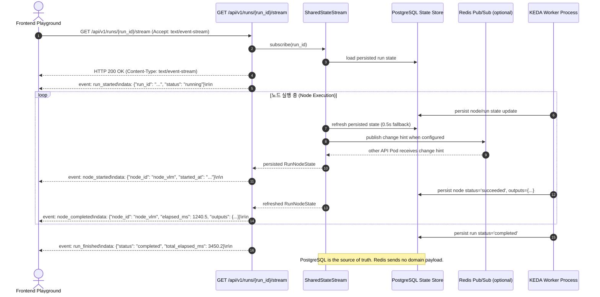

# [BP-502] SSE 실시간 파이프라인 스트리밍 규격서
> **Document Code:** `BP-502` | **Category:** Interface & Streaming Protocol Blueprint | **Status:** Implemented & Operational
> **Source Files:** [`backend/api/workflow_routes.py`](file:///c:/Repos/bist-mini-final/backend/api/workflow_routes.py), [`backend/core/state_stream.py`](file:///c:/Repos/bist-mini-final/backend/core/state_stream.py), [`backend/core/state_stream_broker.py`](file:///c:/Repos/bist-mini-final/backend/core/state_stream_broker.py), [`frontend/src/features/playground/`](file:///c:/Repos/bist-mini-final/frontend/src/features/playground/)

---

## 1. SSE 실시간 스트리밍 아키텍처 (SSE Streaming Architecture)

장시간 소요되는 엑셀 VLM 분석, 대규모 임베딩 색인, DAG 파이프라인 실행 시 브라우저가 주기적으로 폴링(Polling)하는 비효율을 제거하기 위해 **단방향 Server-Sent Events (SSE) 이벤트 버스**를 통해 노드 상태 전이와 진척도를 실시간 브로드캐스팅합니다.



---

## 2. SSE 이벤트 프레임 상세 규격서 (Event Frame Specifications)

### 1. `event: run_started`
- **발행 시점**: 스트림 연결 직후 초기 실행 상태 보고.
- **Payload Schema**:
  ```json
  {
    "run_id": "run-a1b2c3d4",
    "workflow_id": "wf-financial-hybrid-rag",
    "status": "running",
    "batches_count": 5,
    "nodes_count": 8
  }
  ```

### 2. `event: node_started`
- **발행 시점**: DAG 특정 배치 내의 노드가 입력을 수신하고 연산을 시작할 때.
- **Payload Schema**:
  ```json
  {
    "run_id": "run-a1b2c3d4",
    "node_id": "node_decomposer",
    "module_type": "query.decomposer",
    "status": "running",
    "started_at": "2026-08-26T01:30:00.123Z"
  }
  ```

### 3. `event: node_completed`
- **발행 시점**: 모듈 실행이 성공적으로 완료되고 출력이 확정되었을 때.
- **Payload Schema**:
  ```json
  {
    "run_id": "run-a1b2c3d4",
    "node_id": "node_decomposer",
    "status": "completed",
    "elapsed_ms": 342.8,
    "outputs": {
      "sub_queries": ["삼성전자 2023년 매출액", "삼성전자 2023년 영업이익"]
    }
  }
  ```

### 4. `event: node_failed`
- **발행 시점**: 모듈 실행 중 예외 또는 타임아웃 발생 시 ([BP-501 전역 에러 규격] 연동).
- **Payload Schema**:
  ```json
  {
    "run_id": "run-a1b2c3d4",
    "node_id": "node_vlm_detector",
    "status": "failed",
    "error": {
      "error_code": "PROVIDER_API_ERROR",
      "message": "모듈 [structure.luna_vlm_structure_detector] 외부 API 호출 실패: Timeout after 40s",
      "module_type": "structure.luna_vlm_structure_detector",
      "status_code": 502,
      "details": {
        "provider": "openai",
        "model": "gpt-5.6-luna"
      }
    }
  }
  ```

### 5. `event: run_finished`
- **발행 시점**: 모든 배치가 성공적으로 완료되었을 때.
- **Payload Schema**:
  ```json
  {
    "run_id": "run-a1b2c3d4",
    "status": "completed",
    "total_elapsed_ms": 2850.4,
    "completed_nodes": 8,
    "failed_nodes": 0
  }
  ```

### 6. `event: run_failed`
- **발행 시점**: 의존성 노드 실패로 전체 파이프라인이 조기 중단되었을 때.
- **Payload Schema**:
  ```json
  {
    "run_id": "run-a1b2c3d4",
    "status": "failed",
    "total_elapsed_ms": 1420.1,
    "failed_node_id": "node_vlm_detector",
    "error_code": "PROVIDER_API_ERROR",
    "message": "파이프라인 실행 중단: 필수 선행 노드(node_vlm_detector) 실행 실패"
  }
  ```

---

## 3. 네트워크 재연결 및 하트비트 정책 (Keep-Alive & Reconnection)

- **하트비트 (Keep-Alive Ping)**: 아무 이벤트가 발생하지 않더라도 TCP 프록시(Nginx, Cloudflare, Ingress)에 의한 타임아웃을 줄이기 위해 **15초마다 `: ping\n\n` 코멘트 프레임**을 자동 발송합니다.
- **클라이언트 자동 재연결**: 브라우저의 표준 `EventSource` 재연결 동작을 사용합니다. 클라이언트가 별도 재시도 간격을 제어해야 하면 UI 코드에서 명시적으로 구현합니다.

---

## 4. 다중 Pod 전달 보장 범위

1. **구현됨 — Redis Pub/Sub 변경 신호**: `REDIS_URL`이 설정되면 `SharedStateStream`이 `workflow-run:{run_id}`, `bi-materialization:{job_id}`, `bi-question-job:{job_id}` topic을 구독합니다. 다른 API Pod가 상태 변화를 감지하면 Pub/Sub 알림으로 즉시 저장 상태를 다시 읽습니다.
2. **구현됨 — 상태 정합성 및 fallback**: Redis에는 run/job payload를 저장하지 않습니다. PostgreSQL의 실행·작업 레코드만 전달 기준이며, 구독/발행 실패 또는 Pub/Sub 메시지 유실 시 기존 0.5초 polling이 계속 동작합니다.
3. **검증됨**: 단일 프로세스 팬아웃 테스트와 Redis를 사용한 두 `SharedStateStream` 인스턴스 간 알림 통합 테스트를 CI 서비스 컨테이너에서 실행합니다.
