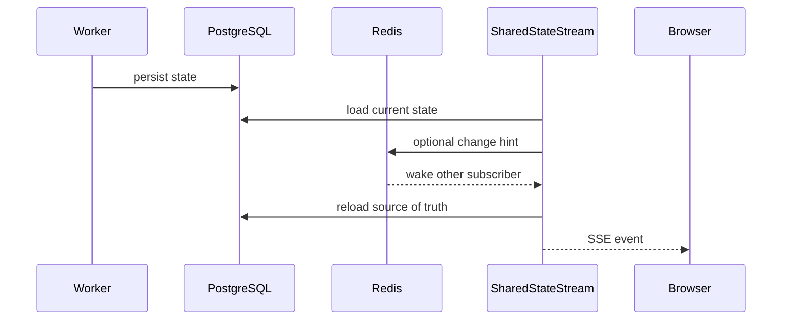

# [BP-502] SSE 상태 스트리밍 규격
> **Document Code:** `BP-502` | **Contract State:** Target Architecture | **Capability State:** Operational | **Structure State:** Partial Migration
> **Target Ownership:** `backend/domains/*/presentation/sse.py`, `backend/shared/application`, `backend/platform/redis`
> **Current References:** [`backend/api/workflow_routes.py`](file:///c:/Repos/bist-mini-final/backend/api/workflow_routes.py), [`backend/core/state_stream.py`](file:///c:/Repos/bist-mini-final/backend/core/state_stream.py), [`backend/core/state_stream_broker.py`](file:///c:/Repos/bist-mini-final/backend/core/state_stream_broker.py)

---

## 1. 상태 전달 모델

PostgreSQL이 상태 원본입니다. `SharedStateStream`은 같은 API process의 중복 browser 구독을 fan-out하고, Redis Pub/Sub가 설정된 경우 다른 API Pod가 저장 상태를 다시 읽도록 change hint만 전달합니다. Redis 메시지에는 도메인 payload를 저장하지 않습니다.

Redis가 없거나 메시지가 유실돼도 polling fallback이 계속 동작합니다.

---

## 2. Workflow stream

Endpoint: `GET /api/v1/runs/{run_id}/stream`

| Event | 발행 조건 | data |
| :--- | :--- | :--- |
| `run_started` | 첫 snapshot | run/workflow ID, status, batch/node count |
| `node_started` | node status가 running | `RunNodeState` |
| `node_progress` | pending 등 비terminal state/progress 변경 | `RunNodeState` |
| `node_completed` | succeeded 또는 skipped | `RunNodeState` |
| `node_failed` | failed | `RunNodeState` |
| `run_finished` | run completed | run ID/status와 full terminal run |
| `run_failed` | run failed 또는 paused | run ID/status와 full terminal run |
| `error` | stream loader/serialization 오류 | error message와 run ID |

연결은 15초 ping을 사용합니다. node fingerprint는 status, elapsed time, error, progress를 포함해 같은 상태의 반복 전송을 줄입니다.

---

## 3. BI streams

- `GET /api/v1/bi/materializations/{job_id}/stream`
- `GET /api/v1/bi/question-jobs/{job_id}/stream`

각 stream은 첫 DB 상태를 즉시 전달하고 이후 상태가 바뀔 때 전용 progress/terminal event를 발행합니다. event name과 payload는 해당 Pydantic job DTO가 기준이며 frontend는 알 수 없는 event를 무시하고 terminal status를 DTO에서 판정해야 합니다.

---

## 4. Client 규칙

1. SSE는 실행 명령 채널이 아니라 읽기 전용 상태 채널입니다.
2. reconnect 후 서버가 현재 snapshot을 다시 보내므로 client는 event를 idempotent하게 적용합니다.
3. SSE 단절을 작업 실패로 해석하지 않고 REST endpoint로 현재 상태를 재조회합니다.
4. terminal 상태를 받으면 stream을 닫고 최종 REST payload와 동기화합니다.
5. 민감하거나 지나치게 큰 node input/output은 summary projection에서 제외합니다.

---

## 5. 다중 Pod 검증

통합 테스트는 서로 다른 `SharedStateStream` 인스턴스가 Redis hint를 받고 polling interval을 기다리지 않고 DB loader를 다시 호출하는지, Redis 장애 때 polling으로 진행되는지, workflow terminal event가 한 번 전달되는지를 검증합니다.

---

## 6. 소유권과 구조 완료 조건

- event envelope와 cursor/reconnect semantics는 shared application contract, domain별 projection은 해당 presentation의 `sse.py`가 소유합니다.
- Redis adapter는 hint publish/subscribe만 제공하며 domain state를 저장하거나 event payload를 진실 공급원으로 만들지 않습니다.
- SSE endpoint는 application query로 현재 PostgreSQL snapshot을 읽고 hint 수신 시 재조회합니다.
- `backend/core/state_stream*` 책임이 shared/platform/domain presentation으로 분리되고 다중 Pod·Redis 장애 계약 테스트가 통과할 때 구조 migration을 완료합니다.
