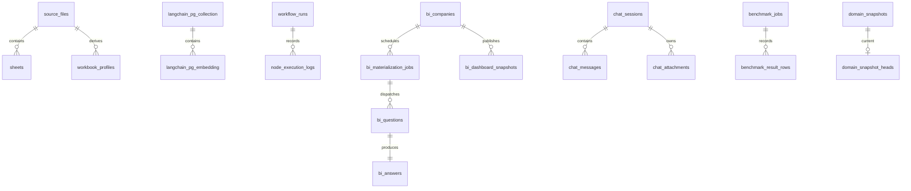

# [BP-503] PostgreSQL·pgvector 물리 스키마
> **Document Code:** `BP-503` | **Contract State:** Target Architecture | **Capability State:** Operational | **Structure State:** Complete
> **Target Ownership:** `backend/shared/application`, `backend/platform/postgres`, `backend/domains/*/infrastructure/postgres`, `migrations`
> **Current References:** [`backend/domains/data_sources/infrastructure/postgres/`](../../../backend/domains/data_sources/infrastructure/postgres), [`backend/domains/workflow/infrastructure/postgres/`](../../../backend/domains/workflow/infrastructure/postgres), [`backend/domains/chatbot/infrastructure/postgres/schema.py`](../../../backend/domains/chatbot/infrastructure/postgres/schema.py), [`backend/domains/bi/infrastructure/postgres/database_schema.py`](../../../backend/domains/bi/infrastructure/postgres/database_schema.py), [`backend/domains/benchmark/infrastructure/postgres/schema.py`](../../../backend/domains/benchmark/infrastructure/postgres/schema.py), [`backend/platform/postgres/versioned_snapshots.py`](../../../backend/platform/postgres/versioned_snapshots.py), [`migrations/versions/`](../../../migrations/versions)

---

## 1. 영속 스키마 계약

- 지원 데이터베이스는 PostgreSQL 16과 pgvector입니다.
- production DDL의 유일한 canonical source는 선형 Alembic revision chain입니다. 현재 head와 table 수는 구현 기준선에서 관리합니다.
- application startup initializer와 package별 `*_SCHEMA_SQL`은 migration 기간의 검증·개발 호환 경로이며 새 production schema를 정의하지 않습니다.
- table은 하나의 bounded context가 소유하고, 공유 pool/transaction을 제외한 SQL과 row mapping은 해당 domain infrastructure에 둡니다.
- 폐기된 table 이름은 새 코드·문서·migration 생성 기준으로 재사용하지 않습니다.

---

## 2. 도메인별 테이블

| 도메인 | 테이블 | 역할 |
| :--- | :--- | :--- |
| Data/Vector | `source_files`, `sheets`, `workbook_profiles` | 업로드 원본, 시트 구조와 workbook 공통 의미 프로필 |
| Data/Vector | `langchain_pg_collection`, `langchain_pg_embedding` | collection과 3072d embedding/metadata |
| Workflow | `workflow_runs`, `node_execution_logs` | durable run queue, lease/heartbeat, 노드 실행 이력 |
| Ingestion | `ingestion_shards` | embedding/vector COPY child queue, lease, retry, usage |
| BI | `bi_companies` | 기업 current snapshot pointer |
| BI | `bi_materialization_jobs`, `bi_questions`, `bi_answers` | materialization/question durable 작업과 결과 |
| BI | `bi_dashboard_snapshots` | 기업별 불변 BI dashboard payload |
| Chat | `chat_sessions`, `chat_messages`, `chat_attachments`, `chat_suggested_questions` | 대화와 첨부·추천 질문 |
| Benchmark | `benchmark_jobs`, `benchmark_result_rows` | 평가 queue와 case별 결과 |
| Shared Snapshot | `domain_snapshots`, `domain_snapshot_heads` | 도메인 payload 이력과 scope별 current pointer |
| Audit | `audit_logs` | soft-delete 등 변경 감사 |

---

## 3. 핵심 관계



`bi_companies.current_snapshot_id`는 BI 전용 current dashboard를 가리킵니다. `domain_snapshot_heads`는 Company Comparison처럼 공통 저장 수명주기를 쓰는 도메인의 `(domain, scope_key)`별 current pointer입니다. 두 저장 모델을 같은 계산 도메인으로 해석하면 안 됩니다.

`workbook_profiles`는 `(workbook_hash, index_id, profile_version)`별 JSON profile과 `ready|partial` 상태를 저장합니다. 원본 통화·배율·FY/LTM·시트 역할 및 좌표 근거는 data sources가 소유하며 BI는 adapter로 읽습니다. 셀별 `cmetadata`에는 이 전역 값을 반복 저장하지 않고 좌표·header·value·variant·lineage만 유지합니다.

`chat_messages.evidence`는 assistant 답변 본문과 독립된 JSONB 배열이며 기본값은 `[]`입니다. 저장 전 chatbot application은 각 항목을 공유 `CellEvidenceDTO`로 검증하고 해당 RAG run이 실제로 확장한 collection/workbook/company/sheet/cell identity allowlist와 대조합니다. Markdown 인용 문자열은 근거의 canonical 저장 형식이 아닙니다.

`chat_messages.created_at`은 message row 생성 시각입니다. 비동기 RAG assistant는 processing row가 먼저 만들어지므로 실제 응답 도착 시각을 `completed_at`에 별도로 저장합니다. completed/failed 전이는 status·content·evidence·`completed_at=NOW()`를 같은 update로 확정하고 동일 시각으로 `chat_sessions.updated_at`을 갱신합니다.

---

## 4. 버전형 도메인 스냅샷 계약

```sql
domain_snapshots(
  snapshot_id,
  domain,
  scope_key,
  schema_version,
  source_fingerprint,
  snapshot_payload,
  generated_at,
  created_at
)

domain_snapshot_heads(
  domain,
  scope_key,
  current_snapshot_id,
  updated_at
)
```

주요 제약은 다음과 같습니다.

1. `source_fingerprint`는 64자리 소문자 SHA-256입니다.
2. `snapshot_payload`는 JSON object이고 발행 후 불변입니다.
3. `(domain, scope_key, snapshot_id)`가 unique입니다.
4. head의 복합 외래키 `(domain, scope_key, current_snapshot_id)`는 같은 domain/scope에 속한 스냅샷만 가리킵니다.
5. publish는 snapshot insert와 head upsert를 한 트랜잭션에서 수행합니다.
6. 이력 손실을 막기 위해 0003 downgrade는 의도적으로 차단합니다.

현재 Company Comparison은 `domain=company_comparison`, 전체 리그를 나타내는 scope를 사용하며 payload 자체의 schema version은 도메인 DTO가 관리합니다.

---

## 5. Queue와 일관성 규칙

- `workflow_runs`, `ingestion_shards`, `bi_materialization_jobs`, `benchmark_jobs`는 status, `available_at`, `worker_id`, `attempt_count`, `heartbeat_at`을 이용해 durable queue/lease를 표현합니다.
- `ingestion_shards`의 복합 PK는 `(operation_id, phase, shard_index)`이며 phase는 `embedding` 또는 `vector_copy`입니다. payload는 immutable range/model/staging 계약을 담고 terminal row에는 token usage와 worker duration을 기록합니다.
- terminal 상태 전이는 worker token 검증과 함께 수행하여 stale worker가 최신 결과를 덮어쓰지 못하게 합니다.
- `bi_questions`는 materialization/metric/period/question version 조합 중복을 막고 completed/failed payload의 필수 조건을 CHECK로 검증합니다.
- `bi_answers`는 성공과 실패 행의 필드 조합을 CHECK로 구분합니다.
- `bi_companies`는 soft delete를 사용하며 `audit_logs`에 변경 근거를 남깁니다.
- pgvector row의 metadata에는 spreadsheet 좌표와 source scope를 보존해 검색 결과에서 원본 셀을 추적합니다.

---

## 6. Alembic 이력

| Revision | 내용 |
| :--- | :--- |
| `20260827_0001` | 현재 runtime schema baseline |
| `20260828_0002` | soft delete와 audit 제약 |
| `20260828_0003` | 재사용 가능한 `domain_snapshots`, `domain_snapshot_heads` |
| `20260828_0004` | head가 같은 domain/scope snapshot만 참조하도록 복합 FK 강화 |
| `20260829_0005` | 분산 Excel embedding/vector COPY용 `ingestion_shards` durable queue |
| `20260831_0006` | BI 전용 profile cache를 폐기하고 data sources 소유 `workbook_profiles` 도입 |
| `20260831_0007` | `chat_messages.evidence` 구조화 셀 근거 JSONB 추가 |
| `20260901_0008` | assistant 응답 완료 시각 `chat_messages.completed_at` 추가 및 기존 완료 메시지 backfill |
| `20260901_0009` | benchmark job 생성·상태 전이·삭제를 질문/답변 원문 없이 append-only `audit_logs`에 기록 |

새 배포는 애플리케이션 시작 전에 `alembic upgrade head`를 완료해야 합니다. 애플리케이션의 idempotent schema initializer는 개발·호환 안전망이지 migration을 대체하지 않습니다.

---

## 7. 스키마 소유권과 구조 완료 조건

- 각 table·constraint·mapping은 하나의 domain infrastructure가 소유하고 다른 domain은 공개 application port로만 접근합니다.
- sync/async connection pool, transaction/repository primitive와 driver/codec은 `backend/platform/postgres`·`backend/platform/pgvector`에 둡니다. `shared/application`에는 concrete session이 아니라 필요한 protocol만 둡니다.
- cross-domain foreign key는 aggregate 수명주기를 실제로 공유할 때만 허용하고 편의 join을 위해 repository 소유권을 섞지 않습니다.
- production schema 변경은 Alembic만 수행하며 bootstrap schema composer는 개발·테스트 초기화와 drift 검증 보조 경로로만 관리합니다.
- data sources, workflow, chatbot, BI와 benchmark schema/repository 소유권은 각 vertical slice에 있고 migration baseline은 domain schema fragment를 명시적으로 결합합니다. 수평 storage facade는 제거됐습니다.
- 현재 선형 revision은 `20260827_0001`부터 `20260901_0009`까지이며 application table은 `alembic_version`을 제외하고 22개입니다. 이 수치는 baseline schema 검증과 함께 갱신합니다.
- table/constraint/index/queue column을 바꾸면 domain schema fragment, Alembic upgrade/downgrade, repository/model, BP-103/BP-501과 migration tests를 같은 변경에서 갱신합니다.
