# [BP-503] PostgreSQL + pgvector 물리 DDL & ERD
> **Document Code:** `BP-503` | **Category:** Interface & Physical Schema Blueprint | **Status:** Approved Baseline  
> **Source Files:** [`backend/storage/db_manager.py`](file:///c:/Repos/bist-mini-final/backend/storage/db_manager.py), [`backend/features/bi/database_schema.py`](file:///c:/Repos/bist-mini-final/backend/features/bi/database_schema.py), [`backend/features/benchmark/database_schema.py`](file:///c:/Repos/bist-mini-final/backend/features/benchmark/database_schema.py)

---

## 1. 물리 데이터베이스 ERD (Physical Entity-Relationship Diagram)

PostgreSQL 16 + pgvector 데이터베이스는 **스토리지(Storage), 워크플로우 실행 엔진(Workflows), 금융 BI 분석(Financial BI), 벤치마크 평가(Benchmarks)** 4대 도메인의 10개 핵심 물리 테이블로 구성됩니다:

```mermaid
erDiagram
    %% 1. Storage Domain
    source_files ||--o{ sheets : "owns (1:N)"
    langchain_pg_collection ||--o{ langchain_pg_embedding : "groups (1:N)"
    
    %% 2. Workflow Orchestration Domain
    workflow_runs ||--o{ node_execution_logs : "records telemetry (1:N)"
    
    %% 3. Financial BI Domain
    bi_companies ||--o{ bi_materialization_jobs : "targets (1:N)"
    bi_companies ||--o{ bi_dashboard_snapshots : "maintains (1:N)"
    bi_materialization_jobs ||--o{ bi_questions : "dispatches (1:N)"
    bi_questions ||--|| bi_answers : "produces (1:1)"
    workflow_runs ||--o| bi_questions : "executes query (1:1)"

        %% 5. AI Chatbot Domain
    chat_sessions ||--o{ chat_messages : "contains (1:N)"
    chat_sessions ||--o{ chat_attachments : "has_attachments (1:N)"
    workflow_runs ||--o| chat_messages : "executes_rag (1:1)"

    chat_sessions {
        varchar session_id PK "세션 고유 식별자"
        varchar client_id "클라이언트 식별자"
        varchar title "세션 제목"
        timestamptz created_at "생성 일시"
        timestamptz updated_at "수정 일시"
    }

    chat_messages {
        varchar message_id PK "메시지 고유 식별자"
        varchar session_id FK "chat_sessions.session_id"
        varchar role "발화 주체 (user/assistant)"
        text content "메시지 본문 (GFM Markdown / LaTeX)"
        varchar status "상태 (pending/completed/failed)"
        varchar workflow_run_id FK "workflow_runs.run_id"
        jsonb visualization "인라인 차트 시각화 데이터"
        jsonb attachments "첨부파일 메타데이터"
        timestamptz created_at "생성 일시"
    }

    chat_attachments {
        varchar attachment_id PK "첨부파일 고유 식별자"
        varchar session_id FK "chat_sessions.session_id"
        varchar file_name "파일명"
        varchar content_type "MIME 타입"
        bigint file_size "바이트 크기"
        varchar storage_path "물리 저장 경로"
        text extracted_text "추출된 텍스트/표 요약"
        timestamptz created_at "생성 일시"
    }

    chat_suggested_questions {
        date suggestion_date PK "추천 날짜"
        smallint position PK "배열 순서"
        varchar question "스마트 추천 질문 문장"
        timestamptz created_at "생성 일시"
    }

    %% 4. Benchmark Domain
    benchmark_runs ||--o{ benchmark_results : "evaluates (1:N)"

    source_files {
        varchar file_id PK "SHA-256 워크북 해시"
        varchar file_name "원본 파일명"
        varchar file_hash "SHA-256 해시"
        varchar file_type "파일 형식 (excel/parquet)"
        bigint file_size "바이트 크기"
        varchar storage_path "서버 물리 저장 경로"
        timestamptz created_at "등록 일시"
    }

    sheets {
        varchar sheet_id PK "{file_id}:{sheet_name}"
        varchar file_id FK "source_files.file_id"
        varchar sheet_name "시트 명칭"
        int sheet_index "시트 순서 인덱스"
        boolean is_visible "표시 여부"
        int row_count "총 행 수"
        int column_count "총 열 수"
        jsonb detected_tables "Luna VLM 감지 표 경계 배열"
        timestamptz parsed_at "파싱 완료 일시"
    }

    langchain_pg_collection {
        uuid uuid PK "컬렉션 고유 UUID"
        varchar name UK "인덱스 ID (idx_{hash})"
        json cmetadata "컬렉션 부가 메타데이터"
    }

    langchain_pg_embedding {
        varchar id PK "청크 고유 식별자"
        uuid collection_id FK "langchain_pg_collection.uuid"
        vector embedding "3072차원 float32 벡터"
        varchar document "단일 표준 직렬화 텍스트 (header_with_value)"
        jsonb cmetadata "셀 좌표 및 계층 헤더 메타데이터"
    }

    workflow_runs {
        varchar run_id PK "런 고유 식별자 (run-...)"
        varchar workflow_id "워크플로우 템플릿 식별자"
        varchar queue_name "분산 큐 명칭 (workflow-core/bi/ingest)"
        varchar worker_id "할당된 K8s 워커 Pod ID"
        varchar lease_token "3단계 동시성 분산 리스 토큰"
        varchar status "상태 (queued/running/completed/failed)"
        int priority "우선순위 (0~100)"
        boolean cancel_requested "강제 취소 요청 플래그"
        jsonb inputs "입력 파라미터 맵"
        jsonb outputs "노드별 출력 결과 맵"
        jsonb error "표준 Error Envelope JSON"
        timestamptz available_at "실행 가능 예약 일시"
        timestamptz heartbeat_at "워커 5초 생존 하트비트"
        timestamptz created_at "생성 일시"
        timestamptz finished_at "종료 일시"
    }

    node_execution_logs {
        varchar log_id PK "노드 실행 로그 UUID"
        varchar run_id FK "workflow_runs.run_id"
        varchar node_id "DAG 노드 식별자"
        varchar module_type "21개 모듈 타입명"
        int batch_index "위상 정렬 배치 번호"
        varchar status "상태 (completed/failed)"
        jsonb input_payload "노드 입력 데이터"
        jsonb config_payload "노드 런타임 설정"
        jsonb output "노드 출력 DTO"
        float elapsed_ms "실행 소요 시간 (ms)"
        float cost_usd "OpenAI 토큰 사용 비용"
        jsonb usage "프롬프트/완성 토큰 집계"
        timestamptz started_at "노드 시작 일시"
        timestamptz completed_at "노드 완료 일시"
    }

    bi_companies {
        varchar company_id PK "기업 고유 식별자 (삼성전자 등)"
        varchar display_name "기업 표시 명칭"
        varchar current_snapshot_id "최신 확정 스냅샷 ID"
        timestamptz created_at "등록 일시"
        timestamptz updated_at "갱신 일시"
    }

    bi_materialization_jobs {
        varchar job_id PK "BI 전체 인출 잡 UUID"
        varchar company_id FK "bi_companies.company_id"
        char workbook_hash "대상 엑셀 워크북 해시"
        jsonb request_payload "프로파일링 및 타깃 기간 요청 DTO"
        varchar status "상태 (queued/profiling/extracting/ready)"
        int completed_requests "완료된 지표 질문 수"
        int total_requests "총 질문 수"
        varchar published_snapshot_id "발행된 스냅샷 ID"
        varchar worker_id "담당 워커 ID"
        timestamptz started_at "잡 시작 일시"
        timestamptz updated_at "잡 갱신 일시"
    }

    bi_dashboard_snapshots {
        varchar snapshot_id PK "스냅샷 UUID (snap-...)"
        varchar company_id FK "bi_companies.company_id"
        char workbook_hash "대상 엑셀 워크북 해시"
        jsonb snapshot_payload "40+ 지표 시계열 및 근거 셀 전체 JSON"
        timestamptz generated_at "산출 일시"
        timestamptz created_at "저장 일시"
    }

    bi_questions {
        varchar question_id PK "지표별 질문 UUID"
        varchar materialization_job_id "bi_materialization_jobs.job_id"
        varchar company_id "bi_companies.company_id"
        char workbook_hash "워크북 해시"
        varchar metric_id "원천 지표 ID (revenue, op_income 등)"
        varchar period_id "회계기간 (2023_FY 등)"
        text question_text "Fast RAG 생성 자연어 질문"
        varchar status "상태 (queued/running/completed/failed)"
        varchar workflow_run_id FK "workflow_runs.run_id"
        timestamptz created_at "생성 일시"
        timestamptz completed_at "완료 일시"
    }

    bi_answers {
        varchar answer_id PK "답변 UUID"
        varchar question_id FK "bi_questions.question_id"
        varchar outcome "결과 (completed/failed)"
        text answer_text "LLM 리더 응답 텍스트"
        jsonb answer_payload "수치, 단위, 통화 구조화 DTO"
        jsonb evidence_cell_ids "감사 추적용 원본 셀 좌표 배열"
        varchar model_name "추론 모델 (gpt-5.6-luna)"
        int latency_ms "응답 지연시간"
        int prompt_tokens "입력 토큰 수"
        int completion_tokens "출력 토큰 수"
        timestamptz created_at "저장 일시"
    }

    benchmark_runs {
        varchar run_id PK "벤치마크 런 UUID"
        varchar dataset_id "Ground-Truth 데이터셋 명칭"
        numeric accuracy_score "정확도 점수 (0.0~100.0)"
        numeric latency_avg_ms "평균 지연시간"
        jsonb evaluation_summary "카테고리별 정밀 지표 맵"
        timestamptz evaluated_at "평가 일시"
    }

    benchmark_results {
        varchar result_id PK "개별 평가 결과 UUID"
        varchar run_id FK "benchmark_runs.run_id"
        varchar example_id "테스트 케이스 ID"
        text predicted_answer "파이프라인 생성 답변"
        text ground_truth "정답 답변"
        boolean is_correct "정답 일치 여부"
        int latency_ms "소요 시간"
        timestamptz created_at "기록 일시"
    }
```



---

### 1.1 `workflow_runs` 범용 워크플로우 실행 원장 매트릭스 (Universal Workflow Ledger)

`workflow_runs` 테이블은 특정 비즈니스에 국한되지 않고, **시스템 내의 모든 비동기 DAG 실행, 인제스천 파이프라인, BI 분석, 벤치마크 평가 및 샌드박스 실험 이력을 총괄하는 단일 중앙 원장(Single Central Ledger)**입니다:

| 워크플로우 유형 | `workflow_id` 식별자 | `queue_name` | 주요 실행 내용 및 입출력 (`inputs` / `outputs`) | 연계 테이블 / 워크스페이스 |
| :--- | :--- | :--- | :--- | :--- |
| **Playground DAG 실험** | `wf-interactive-playground` | `workflow-core` | • 21개 모듈 임의 2D 결선 그래프 비동기 실행<br>• `inputs`: 사용자 질의, 노드별 파라미터<br>• `outputs`: 각 노드별 중간 산출물 맵 | `node_execution_logs`<br>([`BP-401`](file:///c:/Repos/bist-mini-final/docs/04_workspace_blueprints/BP-401_ws_pipeline_playground.md)) |
| **엑셀 인제스천 파이프라인** | `wf-excel-ingestion` | `workflow-ingest` | • Luna VLM 표 감지, 직렬화, 3072d 임베딩, Binary COPY<br>• `inputs`: `file_id`, `sheet_names`<br>• `outputs`: `persisted_vectors_count`, `artifact_id` | `source_files`, `sheets`<br>([`BP-402`](file:///c:/Repos/bist-mini-final/docs/04_workspace_blueprints/BP-402_ws_data_sources_management.md)) |
| **재무 BI 자동 분석** | `wf-financial-bi-analytics` | `workflow-bi` | • 프로파일링(기간/단위 탐색) ➡️ 40+ 지표 질의 ➡️ 수식 계산<br>• `inputs`: `company_name`, `workbook_hash`<br>• `outputs`: 기간별 40개 파생비율 및 스냅샷 ID | `bi_questions`, `bi_answers`<br>([`BP-403`](file:///c:/Repos/bist-mini-final/docs/04_workspace_blueprints/BP-403_ws_financial_bi_analytics.md)) |
| **정확도 벤치마크 평가** | `wf-accuracy-benchmark` | `workflow-benchmark` | • Ground-Truth Q&A 데이터셋 대량 배치 평가<br>• `inputs`: `dataset_path`, `target_pipeline_config`<br>• `outputs`: Recall@K, Exact Match율, 평균 레이턴시 | `benchmark_runs`<br>(Benchmark Evaluation) |
| **AI 챗봇 추론 세션** | `wf-ai-chatbot-session` | `workflow-fast` | • 사용자 멀티턴 금융 질의에 대한 Fast RAG 및 에이전틱 리즈너 실행<br>• `inputs`: `session_id`, `user_prompt`<br>• `outputs`: 생성 답변, 인용 셀 목록 | `node_execution_logs`<br>(AI Chatbot Session) |

---

## 2. 물리 DDL 스크립트 명세 (Core DDL Definitions)

```sql
-- =============================================================================
-- 1. PostgreSQL Extensions
-- =============================================================================
CREATE EXTENSION IF NOT EXISTS vector;
CREATE EXTENSION IF NOT EXISTS "uuid-ossp";

-- =============================================================================
-- 2. Storage & Ingestion Tables (BP-201, BP-203, BP-402)
-- =============================================================================
CREATE TABLE IF NOT EXISTS source_files (
    file_id VARCHAR(64) PRIMARY KEY,
    file_name VARCHAR(255) NOT NULL,
    file_hash VARCHAR(64) NOT NULL,
    file_type VARCHAR(32) NOT NULL,
    file_size BIGINT NOT NULL,
    storage_path VARCHAR(512) NOT NULL,
    created_at TIMESTAMPTZ DEFAULT NOW()
);

CREATE TABLE IF NOT EXISTS sheets (
    sheet_id VARCHAR(128) PRIMARY KEY,
    file_id VARCHAR(64) REFERENCES source_files(file_id) ON DELETE CASCADE,
    sheet_name VARCHAR(128) NOT NULL,
    sheet_index INT NOT NULL,
    is_visible BOOLEAN DEFAULT TRUE,
    row_count INT NOT NULL DEFAULT 0,
    column_count INT NOT NULL DEFAULT 0,
    detected_tables JSONB DEFAULT '[]'::jsonb,
    parsed_at TIMESTAMPTZ DEFAULT NOW()
);

CREATE TABLE IF NOT EXISTS langchain_pg_collection (
    uuid UUID PRIMARY KEY DEFAULT gen_random_uuid(),
    name VARCHAR NOT NULL UNIQUE,
    cmetadata JSON
);

CREATE TABLE IF NOT EXISTS langchain_pg_embedding (
    id VARCHAR PRIMARY KEY,
    collection_id UUID REFERENCES langchain_pg_collection(uuid) ON DELETE CASCADE,
    embedding VECTOR(3072),
    document VARCHAR NOT NULL,
    cmetadata JSONB NOT NULL DEFAULT '{}'::jsonb
);

CREATE INDEX IF NOT EXISTS idx_embedding_hnsw 
ON langchain_pg_embedding 
USING hnsw (embedding vector_cosine_ops) 
WITH (m = 16, ef_construction = 64);

CREATE INDEX IF NOT EXISTS idx_embedding_metadata_gin 
ON langchain_pg_embedding 
USING gin (cmetadata jsonb_path_ops);

CREATE INDEX IF NOT EXISTS idx_source_files_hash ON source_files(file_hash);
CREATE INDEX IF NOT EXISTS idx_sheets_file_id ON sheets(file_id);

-- =============================================================================
-- 3. Universal Workflow Engine & Telemetry Tables (BP-104, BP-301, BP-401)
-- =============================================================================
CREATE TABLE IF NOT EXISTS workflow_runs (
    run_id VARCHAR(64) PRIMARY KEY,
    workflow_id VARCHAR(128) NOT NULL,
    queue_name VARCHAR(64) NOT NULL DEFAULT 'workflow-core',
    worker_id VARCHAR(128),
    lease_token VARCHAR(64),
    status VARCHAR(32) NOT NULL DEFAULT 'queued',
    priority INT NOT NULL DEFAULT 0,
    cancel_requested BOOLEAN NOT NULL DEFAULT FALSE,
    attempt_count INT NOT NULL DEFAULT 0,
    inputs JSONB DEFAULT '{}'::jsonb,
    outputs JSONB DEFAULT '{}'::jsonb,
    error JSONB,
    available_at TIMESTAMPTZ NOT NULL DEFAULT NOW(),
    claimed_at TIMESTAMPTZ,
    heartbeat_at TIMESTAMPTZ,
    created_at TIMESTAMPTZ DEFAULT NOW(),
    updated_at TIMESTAMPTZ DEFAULT NOW(),
    finished_at TIMESTAMPTZ
);

CREATE INDEX IF NOT EXISTS idx_workflow_runs_queue_claim
ON workflow_runs(queue_name, status, available_at, priority DESC, created_at)
WHERE cancel_requested = FALSE;

CREATE INDEX IF NOT EXISTS idx_workflow_runs_stale_lease
ON workflow_runs(queue_name, heartbeat_at)
WHERE status = 'running' AND cancel_requested = FALSE;

CREATE TABLE IF NOT EXISTS node_execution_logs (
    log_id VARCHAR(128) PRIMARY KEY,
    run_id VARCHAR(64) REFERENCES workflow_runs(run_id) ON DELETE CASCADE,
    node_id VARCHAR(128) NOT NULL,
    module_type VARCHAR(64) NOT NULL,
    batch_index INT DEFAULT 0,
    status VARCHAR(32) NOT NULL,
    input_payload JSONB,
    config_payload JSONB DEFAULT '{}'::jsonb,
    output JSONB,
    error TEXT,
    cache_hit BOOLEAN DEFAULT FALSE,
    outcome VARCHAR(32),
    progress JSONB DEFAULT '{}'::jsonb,
    elapsed_ms FLOAT,
    cost_usd FLOAT,
    usage JSONB,
    started_at TIMESTAMPTZ,
    completed_at TIMESTAMPTZ,
    created_at TIMESTAMPTZ DEFAULT NOW()
);

CREATE INDEX IF NOT EXISTS idx_node_logs_run_id ON node_execution_logs(run_id);
CREATE INDEX IF NOT EXISTS idx_node_logs_status ON node_execution_logs(status);

-- =============================================================================
-- 4. Financial BI Domain & Snapshots Tables (BP-403)
-- =============================================================================
CREATE TABLE IF NOT EXISTS bi_companies (
    company_id VARCHAR(128) PRIMARY KEY,
    display_name VARCHAR(200) NOT NULL,
    current_snapshot_id VARCHAR(128),
    created_at TIMESTAMPTZ NOT NULL DEFAULT NOW(),
    updated_at TIMESTAMPTZ NOT NULL DEFAULT NOW()
);

CREATE TABLE IF NOT EXISTS bi_materialization_jobs (
    job_id VARCHAR(128) PRIMARY KEY,
    company_id VARCHAR(128) NOT NULL REFERENCES bi_companies(company_id) ON DELETE CASCADE,
    workbook_hash CHAR(64) NOT NULL CHECK (workbook_hash ~ '^[a-f0-9]{64}$'),
    request_payload JSONB NOT NULL CHECK (jsonb_typeof(request_payload) = 'object'),
    status VARCHAR(32) NOT NULL CHECK (
        status IN ('queued', 'indexing', 'profiling', 'extracting', 'materializing', 'ready', 'partial', 'failed')
    ),
    completed_requests INTEGER NOT NULL DEFAULT 0 CHECK (completed_requests >= 0),
    total_requests INTEGER NOT NULL DEFAULT 0 CHECK (total_requests >= 0),
    published_snapshot_id VARCHAR(128),
    error_code VARCHAR(128),
    message VARCHAR(500),
    worker_id VARCHAR(128),
    attempt_count INTEGER NOT NULL DEFAULT 0 CHECK (attempt_count >= 0),
    available_at TIMESTAMPTZ NOT NULL DEFAULT NOW(),
    heartbeat_at TIMESTAMPTZ,
    started_at TIMESTAMPTZ NOT NULL,
    updated_at TIMESTAMPTZ NOT NULL
);

CREATE TABLE IF NOT EXISTS bi_dashboard_snapshots (
    snapshot_id VARCHAR(128) PRIMARY KEY,
    company_id VARCHAR(128) NOT NULL REFERENCES bi_companies(company_id) ON DELETE CASCADE,
    workbook_hash CHAR(64) NOT NULL CHECK (workbook_hash ~ '^[a-f0-9]{64}$'),
    snapshot_payload JSONB NOT NULL CHECK (jsonb_typeof(snapshot_payload) = 'object'),
    generated_at TIMESTAMPTZ NOT NULL,
    created_at TIMESTAMPTZ NOT NULL DEFAULT NOW()
);

CREATE TABLE IF NOT EXISTS bi_questions (
    question_id VARCHAR(128) PRIMARY KEY,
    materialization_job_id VARCHAR(128) NOT NULL,
    company_id VARCHAR(128) NOT NULL,
    workbook_hash CHAR(64) NOT NULL CHECK (workbook_hash ~ '^[a-f0-9]{64}$'),
    index_id VARCHAR(128) NOT NULL,
    metric_id VARCHAR(64) NOT NULL,
    period_id VARCHAR(128) NOT NULL,
    question_version VARCHAR(128) NOT NULL,
    question_text TEXT NOT NULL CHECK (char_length(question_text) BETWEEN 1 AND 2000),
    status VARCHAR(16) NOT NULL CHECK (
        status IN ('queued', 'running', 'completed', 'failed')
    ),
    workflow_run_id VARCHAR(64) REFERENCES workflow_runs(run_id) ON DELETE SET NULL,
    attempt_count INTEGER NOT NULL DEFAULT 0 CHECK (attempt_count >= 0),
    created_at TIMESTAMPTZ NOT NULL DEFAULT NOW(),
    updated_at TIMESTAMPTZ NOT NULL DEFAULT NOW(),
    started_at TIMESTAMPTZ,
    completed_at TIMESTAMPTZ,
    UNIQUE (materialization_job_id, metric_id, period_id, question_version)
);

CREATE TABLE IF NOT EXISTS bi_answers (
    answer_id VARCHAR(128) PRIMARY KEY,
    question_id VARCHAR(128) NOT NULL UNIQUE REFERENCES bi_questions(question_id) ON DELETE CASCADE,
    outcome VARCHAR(16) NOT NULL CHECK (outcome IN ('completed', 'failed')),
    answer_text TEXT,
    answer_payload JSONB,
    evidence_cell_ids JSONB NOT NULL DEFAULT '[]'::jsonb CHECK (jsonb_typeof(evidence_cell_ids) = 'array'),
    error_code VARCHAR(128),
    error_message TEXT,
    model_name VARCHAR(128),
    latency_ms INTEGER NOT NULL CHECK (latency_ms >= 0),
    prompt_tokens INTEGER CHECK (prompt_tokens >= 0),
    completion_tokens INTEGER CHECK (completion_tokens >= 0),
    created_at TIMESTAMPTZ NOT NULL DEFAULT NOW(),
    updated_at TIMESTAMPTZ NOT NULL DEFAULT NOW()
);

-- =============================================================================
-- 5. Benchmark Evaluation Tables
-- =============================================================================
CREATE TABLE IF NOT EXISTS benchmark_runs (
    run_id VARCHAR(64) PRIMARY KEY,
    dataset_id VARCHAR(128) NOT NULL,
    accuracy_score NUMERIC(5, 2) NOT NULL DEFAULT 0.00,
    latency_avg_ms NUMERIC(10, 2) NOT NULL DEFAULT 0.00,
    evaluation_summary JSONB NOT NULL DEFAULT '{}'::jsonb,
    evaluated_at TIMESTAMPTZ NOT NULL DEFAULT NOW()
);

CREATE TABLE IF NOT EXISTS benchmark_results (
    result_id VARCHAR(128) PRIMARY KEY,
    run_id VARCHAR(64) NOT NULL REFERENCES benchmark_runs(run_id) ON DELETE CASCADE,
    example_id VARCHAR(128) NOT NULL,
    predicted_answer TEXT,
    ground_truth TEXT,
    is_correct BOOLEAN NOT NULL DEFAULT FALSE,
    latency_ms INTEGER NOT NULL DEFAULT 0,
    created_at TIMESTAMPTZ NOT NULL DEFAULT NOW()
);
```

---

## 3. 리팩토링 타깃 (Refactoring Targets)

1. **Alembic 데이터베이스 마이그레이션 도구 도입**:
   - As-Is: `db_manager.py` 및 `database_schema.py` 내부의 raw SQL DDL 문자열을 서버 시작 시 실행.
   - To-Be: Alembic 마이그레이션 스크립트로 버전 관리 및 안전한 롤백(Down-migration) 지원.
2. **소프트 삭제(Soft Delete) 및 감사 로그(Audit Log)**:
   - `source_files`, `bi_companies`에 `is_deleted`, `deleted_at` 컬럼 추가 및 데이터 변경 이력 테이블(`audit_logs`) 구축.
