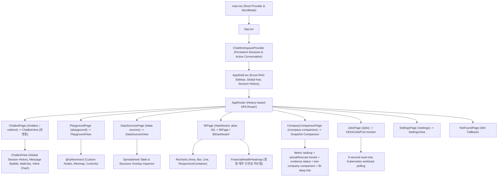

# [BP-601] 프론트엔드 SPA 컴포넌트 배선도 & 접근성(a11y) 표준
> **Document Code:** `BP-601` | **Category:** Frontend Architecture Blueprint | **Status:** Implemented & Operational
> **Source Files:** [`frontend/src/App.tsx`](file:///c:/Repos/bist-mini-final/frontend/src/App.tsx), [`frontend/src/app/routes.ts`](file:///c:/Repos/bist-mini-final/frontend/src/app/routes.ts), [`frontend/src/features/`](file:///c:/Repos/bist-mini-final/frontend/src/features/)

---

## 1. 프론트엔드 컴포넌트 계층 트리 (Component Hierarchy Tree)

---

## 2. 라우팅 및 시스템 포털 배선표

| URL Path | 라우트 이름 | 렌더링 컴포넌트 | 워크스페이스 상태 |
| :--- | :--- | :--- | :--- |
| `/` | `Redirect` | `/chatbot` | 별도 홈 없이 새 채팅 워크스페이스로 이동 |
| `/playground` | `Pipeline Playground` | [`PlaygroundPage`](file:///c:/Repos/bist-mini-final/frontend/src/pages/PlaygroundPage.tsx) | **[운영중]** React Flow 2D DAG 빌더 & 실행 |
| `/data-sources` | `Data Sources` | [`DataSourcesPage`](file:///c:/Repos/bist-mini-final/frontend/src/pages/DataSourcesPage.tsx) | **[운영중]** 스프레드시트 뷰어 & pgvector 관리 |
| `/dashboard` (`/bi` 호환 별칭) | `Financial BI` | [`BiPage`](file:///c:/Repos/bist-mini-final/frontend/src/pages/BiPage.tsx) | **[운영중]** 재무제표 프로파일러 & 21개 근거 기반 지표 차트 |
| `/chatbot` | `새 채팅` | [`ChatbotPage`](file:///c:/Repos/bist-mini-final/frontend/src/pages/ChatbotPage.tsx) | **[운영중]** 전역 세션 이력 기반 대화형 챗봇 & 인라인 시각화 |
| `/company-comparison` | `Company Comparison` | [`CompanyComparisonPage`](file:///c:/Repos/bist-mini-final/frontend/src/pages/CompanyComparisonPage.tsx) | **[운영중]** 버전형 비교 스냅샷 기반 순위, 실제/예측 추이, evidence 상태, 선택 기업·2개 기업 비교 및 BI 딥링크 |
| `/jobs` | `Jobs` | [`JobsPage`](file:///c:/Repos/bist-mini-final/frontend/src/pages/JobsPage.tsx) | **[운영중]** KEDA/Job/Pod와 PostgreSQL 큐·Lease 읽기 전용 상관 관제 |
| `/settings` | `Settings` | [`SettingsPage`](file:///c:/Repos/bist-mini-final/frontend/src/pages/SettingsPage.tsx) | **[운영중]** 시스템·연결 설정 화면 |

---

## 3. 공용 UI 계층과 제어 크기 계약

페이지의 일반 액션은 [`frontend/src/shared/ui/`](file:///c:/Repos/bist-mini-final/frontend/src/shared/ui/)의 공용 컴포넌트를 사용합니다.

| 컴포넌트 | 책임 | 허용 변형 |
| :--- | :--- | :--- |
| `Button` | 텍스트 또는 아이콘+텍스트 액션 | `primary`, `secondary`, `ghost`, `danger`, `danger-solid` |
| `IconButton` | 아이콘 전용 액션과 필수 접근성 이름 | `Button`과 동일하며 `aria-label` 필수 |
| `StatusBadge` | 읽기 전용 상태 표현 | `neutral`, `success`, `warning`, `danger`, `info` |
| `PageHeader` | eyebrow·제목·설명·페이지 액션의 공통 리듬 | 문서형 페이지의 중복 헤더 마크업 금지 |
| `Surface` | 카드·패널·문서 section 표면 | 기본, `elevated` |
| `Dialog` | focus trap·Escape·focus 복귀를 가진 modal 기반 | `sm`, `md`, `lg`, `xl` |
| `ConfirmDialog` / `PromptDialog` | 삭제 확인·이름 입력 등 표준 상호작용 | busy/error 상태 포함 |

제어 높이는 `global.css`의 `--control-h-sm`, `--control-h-md`, `--control-h-lg` 세 단계만 사용하고, 실제 렌더링은 각각 36px, 40px, 44px입니다. 페이지 CSS는 배치와 너비만 소유하며 일반 버튼의 높이·padding·색상·disabled 상태를 다시 정의하지 않습니다. 표 정렬 헤더, React Flow 노드 핸들, 기간 segmented control, 차트 확대/축소처럼 선택 상태나 공간 모델이 별도인 도메인 전용 컨트롤은 native `button`을 유지할 수 있지만 접근성 이름과 키보드 동작을 제공해야 합니다.

---

## 4. 페이지 viewport와 시각 토큰

- `AppShell`이 모든 문서형 route를 `.product-page__viewport`에 배치하고 `--page-max`, `--page-gutter`, `--page-top`, `--page-section-gap`을 적용합니다. 각 `page.tsx`가 좌우·상단 여백이나 자체 viewport를 다시 만들지 않습니다.
- Playground처럼 전체 canvas가 필요한 route만 표준 문서 viewport를 우회하고 `overflow: hidden`을 사용합니다.
- UI 본문·button·input·select·table은 `--font-ui`, 코드·좌표·로그만 `--font-code`를 사용합니다.
- primary action은 단색 `--brand-600` 계열을 사용합니다. 일반 버튼에 개별 gradient를 추가하지 않습니다.
- surface, border, radius, shadow, status color는 `global.css` token을 사용하며 page CSS에 유사 색상을 반복 선언하지 않습니다.

## 5. Dialog와 비동기 피드백

- modal은 `Dialog` portal을 사용해 `aria-modal`, 제목/설명 연결, focus trap, Escape, 닫은 뒤 focus 복귀를 보장합니다.
- 삭제·이름 변경·생성처럼 서버 mutation이 있는 동작은 `busy` 동안 중복 제출과 닫기를 막고 버튼 label 또는 spinner로 처리 중 상태를 보여줍니다.
- API 실패는 dialog 내부 `role="alert"` 또는 페이지 error state로 표시하며 브라우저 `alert`/`prompt`에 의존하지 않습니다.

## 6. 셀 근거 검증 viewport

`CellEvidenceProvider`는 Markdown 셀 배지의 활성화를 전역에서 받아 lazy-loaded `CellEvidenceModal`을 엽니다. modal은 resolve API가 반환한 sheet image와 cell bbox를 연결하고 확대·축소·화면 맞춤·근거 셀 이동을 제공합니다. 큰 sheet canvas는 공용 `useDragPan` pointer hook으로 이동하며 button·link·form control 위의 drag는 시작하지 않습니다.
