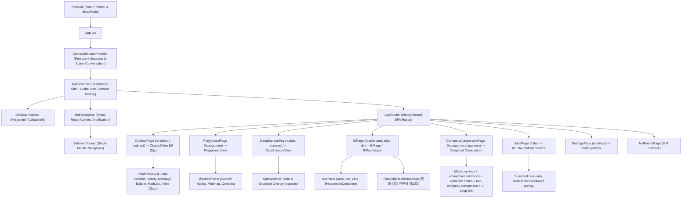

# [BP-601] 프론트엔드 SPA 컴포넌트 배선도 & 접근성(a11y) 표준
> **Document Code:** `BP-601` | **Contract State:** Target Architecture | **Capability State:** Operational | **Structure State:** Complete
> **Target Ownership:** `frontend/src/app`, `frontend/src/pages`, `frontend/src/features`, `frontend/src/shared`
> **Current References:** [`frontend/src/App.tsx`](../../../frontend/src/App.tsx), [`frontend/src/app/AppShell.tsx`](../../../frontend/src/app/AppShell.tsx), [`frontend/src/app/MobileAppBar.tsx`](../../../frontend/src/app/MobileAppBar.tsx), [`frontend/src/app/routes.ts`](../../../frontend/src/app/routes.ts), [`frontend/src/styles/app.css`](../../../frontend/src/styles/app.css), [`frontend/src/features/`](../../../frontend/src/features)

---

## 1. 프론트엔드 컴포넌트 계층 트리 (Component Hierarchy Tree)

---

## 2. 라우팅 및 시스템 포털 배선표

| URL Path | 라우트 이름 | 렌더링 컴포넌트 | 워크스페이스 상태 |
| :--- | :--- | :--- | :--- |
| `/` | `Redirect` | `/chatbot` | 별도 홈 없이 새 채팅 워크스페이스로 이동 |
| `/playground` | `Pipeline Playground` | [`PlaygroundPage`](../../../frontend/src/pages/PlaygroundPage.tsx) | **[운영중]** React Flow 2D DAG 빌더 & 실행 |
| `/data-sources` | `Data Sources` | [`DataSourcesPage`](../../../frontend/src/pages/DataSourcesPage.tsx) | **[운영중]** 스프레드시트 뷰어 & pgvector 관리 |
| `/dashboard` (`/bi` 호환 별칭) | `Financial BI` | [`BiPage`](../../../frontend/src/pages/BiPage.tsx) | **[운영중]** 재무제표 프로파일러 & 21개 근거 기반 지표 차트 |
| `/chatbot` | `새 채팅` | [`ChatbotPage`](../../../frontend/src/pages/ChatbotPage.tsx) | **[운영중]** 전역 세션 이력, DB 기준 메시지 생성·응답 완료 시각, 첨부+RAG 결합 답변 & 인라인 시각화 |
| `/company-comparison` | `Company Comparison` | [`CompanyComparisonPage`](../../../frontend/src/pages/CompanyComparisonPage.tsx) | **[운영중]** 버전형 비교 스냅샷 기반 순위, 실제/예측 추이, evidence 상태, 선택 기업·2개 기업 비교 및 BI 딥링크 |
| `/jobs` | `Jobs` | [`JobsPage`](../../../frontend/src/pages/JobsPage.tsx) | **[운영중]** KEDA/Job/Pod와 PostgreSQL 큐·Lease 읽기 전용 상관 관제 |
| `/settings` | `Settings` | [`SettingsPage`](../../../frontend/src/pages/SettingsPage.tsx) | **[운영중]** 시스템·연결 설정 화면 |

---

## 3. 공용 UI 계층과 제어 크기 계약

페이지의 일반 액션은 [`frontend/src/shared/ui/`](../../../frontend/src/shared/ui)의 공용 컴포넌트를 사용합니다.

| 컴포넌트 | 책임 | 허용 변형 |
| :--- | :--- | :--- |
| `Button` | 텍스트 또는 아이콘+텍스트 액션 | `primary`, `secondary`, `ghost`, `danger`, `danger-solid` |
| `IconButton` | 아이콘 전용 액션과 필수 접근성 이름 | `Button`과 동일하며 `aria-label` 필수 |
| `StatusBadge` | 읽기 전용 상태 표현 | `neutral`, `success`, `warning`, `danger`, `info` |
| `PageHeader` | eyebrow·제목·설명·페이지 액션의 공통 리듬 | 문서형 페이지의 중복 헤더 마크업 금지 |
| `Surface` | 카드·패널·문서 section 표면 | 기본, `elevated` |
| `Dialog` | focus trap·Escape·focus 복귀를 가진 modal 기반 | `sm`, `md`, `lg`, `xl` |
| `ConfirmDialog` / `PromptDialog` | 삭제 확인·이름 입력 등 표준 상호작용 | busy/error 상태 포함 |

제어 높이는 `global.css`의 `--control-h-sm`, `--control-h-md`, `--control-h-lg` 세 단계만 사용하고, 실제 렌더링은 각각 36px, 40px, 44px입니다. 페이지 CSS는 배치와 너비만 소유하며 일반 버튼의 높이·padding·색상·disabled 상태를 다시 정의하지 않습니다. 표 정렬 헤더, React Flow 노드 핸들, 기간 segmented control, 차트 확대/축소처럼 선택 상태나 공간 모델이 별도인 도메인 전용 컨트롤은 native `button`을 유지할 수 있지만 접근성 이름과 키보드 동작을 제공해야 합니다.

---

## 4. 페이지 viewport와 시각 토큰

- `AppShell`이 모든 문서형 route를 `.product-page__viewport`에 배치하고 `--page-max`, `--page-gutter`, `--page-top`, `--page-section-gap`을 적용합니다. 각 `page.tsx`가 좌우·상단 여백이나 자체 viewport를 다시 만들지 않습니다.
- Playground처럼 전체 canvas가 필요한 route만 표준 문서 viewport를 우회하고 `overflow: hidden`을 사용합니다.
- UI 본문·button·input·select·table은 `--font-ui`, 코드·좌표·로그만 `--font-code`를 사용합니다.
- primary action은 단색 `--brand-600` 계열을 사용합니다. 일반 버튼에 개별 gradient를 추가하지 않습니다.
- surface, border, radius, shadow, status color는 `global.css` token을 사용하며 page CSS에 유사 색상을 반복 선언하지 않습니다.

## 5. 반응형 Shell과 모바일 탐색 계약

`AppShell`은 화면 크기에 따라 표현만 바꾸고 route·세션·알림 상태의 단일 소유권을 유지합니다.

| 범위 | 탐색 표면 | 본문 배치 계약 |
| :--- | :--- | :--- |
| `> 900px` | 고정·접기 가능한 좌측 sidebar | 문서형 route는 공용 viewport, Playground는 full-bleed canvas |
| `<= 900px` | 고정 상단 `MobileAppBar`와 modal sidebar drawer | shell이 상단 safe area와 앱바 높이만큼 본문 시작점을 보정 |
| `<= 767px` | 위와 동일하며 별도 하단 탭바를 만들지 않음 | 좌우 gutter만 축소하고 하단 고정 navigation 여백을 예약하지 않음 |

- 모바일 상단 앱바는 전체 메뉴 버튼, `Excel RAG` 브랜드, 현재 route 이름과 알림 버튼만 제공합니다.
- 전체 기능 route, 새 채팅, 대화 이력, 작업 관제와 설정은 상단 메뉴 버튼이 여는 기존 sidebar drawer에서 탐색합니다. 같은 route 집합을 하단 navigation으로 중복 렌더링하지 않습니다.
- drawer는 `role="dialog"`, `aria-modal`, Escape 닫기, backdrop 닫기, focus trap과 메뉴 버튼으로의 focus 복귀를 보장합니다.
- 상단 앱바는 `env(safe-area-inset-top)`을 포함하고, 하단 safe area가 필요한 chatbot composer 같은 feature 고정 UI는 해당 feature가 자체적으로 처리합니다.
- shell은 모바일 하단 navigation을 렌더링하거나 그 높이만큼 `.product-page`에 padding을 추가하지 않습니다. 따라서 작은 화면에서도 콘텐츠 세로 공간과 canvas 조작 영역을 보존합니다.

## 6. Dialog와 비동기 피드백

- modal은 `Dialog` portal을 사용해 `aria-modal`, 제목/설명 연결, focus trap, Escape, 닫은 뒤 focus 복귀를 보장합니다.
- 삭제·이름 변경·생성처럼 서버 mutation이 있는 동작은 `busy` 동안 중복 제출과 닫기를 막고 버튼 label 또는 spinner로 처리 중 상태를 보여줍니다.
- API 실패는 dialog 내부 `role="alert"` 또는 페이지 error state로 표시하며 브라우저 `alert`/`prompt`에 의존하지 않습니다.

## 7. 시트 단위 근거 검증 viewport

`CellEvidenceProvider`는 구조화 근거 배지의 활성화를 전역에서 받아 lazy-loaded `CellEvidenceModal`을 엽니다. 입력은 Reader가 선택하고 backend가 실제 값 allowlist로 검증한 `CellEvidenceDTO[]`만 허용합니다. `MarkdownAnswer`는 cell-level DTO를 잃지 않은 채 index/workbook/file/company/sheet identity로 그룹화해 시트당 `Sheet · N개 셀` 배지 하나를 렌더링합니다. Markdown 좌표 문자열, 컨텍스트 전체 또는 자유 형식 좌표를 파싱해 임의로 뱃지화하지 않습니다.

modal은 batch resolve API로 그룹의 모든 좌표를 한 번에 검증한 뒤 한 sheet image 위에 모든 cell bbox를 반투명 빨간 경계 상자로 표시합니다. sidebar는 참조 좌표 목록과 연결 성공 개수를 제공하고 viewport는 확대·축소·화면 맞춤·전체 근거 영역 이동을 제공합니다. 큰 sheet canvas는 공용 `useDragPan` pointer hook으로 이동하며 button·link·form control 위의 drag는 시작하지 않습니다. 같은 이름의 시트라도 workbook identity가 다르면 절대 한 배지로 합치지 않습니다.

---

## 8. 프론트엔드 소유권과 완료 조건

- `app`은 provider·router·shell, `pages`는 route 단위 feature 조립, `features`는 제품 상태·API·view, `shared`는 도메인 비종속 UI·hook·token을 소유합니다.
- page는 고유 viewport와 중복 header/card/button CSS를 만들지 않고 공용 `PageShell`, layout primitive와 design token을 사용합니다.
- feature 간 공유는 상대 feature 내부 파일 import가 아니라 명시적 public entrypoint 또는 shared primitive로 제한합니다.
- API response는 feature 경계에서 runtime schema로 검증하고 server state와 local draft state를 분리합니다.
- route registry는 7개 정식 제품 route와 `/`·`/bi` alias를 단일 소스로 제공하고 AppShell이 Excel RAG 브랜드, 새 채팅, 기능 navigation, 대화 이력, 작업 관제/설정을 조립합니다. 모바일에서는 `MobileAppBar`와 sidebar drawer만 사용하며 하단 navigation을 두지 않습니다.
- 공용 `Button`, `IconButton`, `Dialog`, `StatusBadge`, page layout/token과 drag-pan primitive가 적용됐으며 일반 primary action은 단색 초록 계열만 사용합니다.
- route/page viewport, 모바일 shell 탐색 표면, 공용 action variant, typography/token 또는 modal interaction을 바꾸면 AppShell/router/shared UI와 visual·interaction tests 및 이 문서를 함께 갱신합니다.
- 위 계약과 회귀 테스트가 유지되는 동안 `Structure State: Complete`로 판정합니다.
