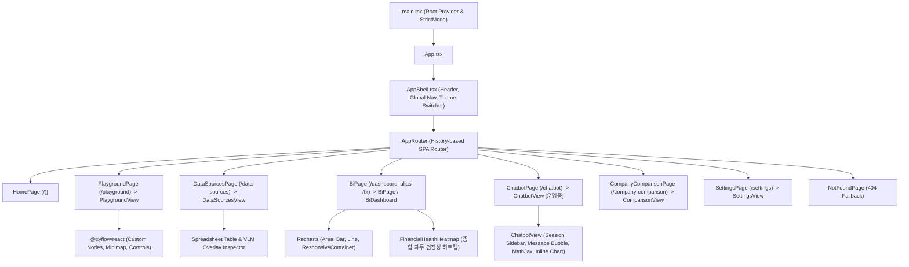

# [BP-601] 프론트엔드 SPA 컴포넌트 배선도 & 접근성(a11y) 표준
> **Document Code:** `BP-601` | **Category:** Frontend Architecture Blueprint | **Status:** Approved Baseline  
> **Source Files:** [`frontend/src/App.tsx`](file:///c:/Repos/bist-mini-final/frontend/src/App.tsx), [`frontend/src/app/routes.ts`](file:///c:/Repos/bist-mini-final/frontend/src/app/routes.ts), [`frontend/src/features/`](file:///c:/Repos/bist-mini-final/frontend/src/features/)

---

## 1. 프론트엔드 컴포넌트 계층 트리 (Component Hierarchy Tree)

---

## 2. 라우팅 및 시스템 포털 배선표

| URL Path | 라우트 이름 | 렌더링 컴포넌트 | 워크스페이스 상태 |
| :--- | :--- | :--- | :--- |
| `/` | `Home` | [`HomePage`](file:///c:/Repos/bist-mini-final/frontend/src/pages/HomePage.tsx) | 메인 랜딩 & 워크스페이스 런처 허브 |
| `/playground` | `Pipeline Playground` | [`PlaygroundPage`](file:///c:/Repos/bist-mini-final/frontend/src/pages/PlaygroundPage.tsx) | **[운영중]** React Flow 2D DAG 빌더 & 실행 |
| `/data-sources` | `Data Sources` | [`DataSourcesPage`](file:///c:/Repos/bist-mini-final/frontend/src/pages/DataSourcesPage.tsx) | **[운영중]** 스프레드시트 뷰어 & pgvector 관리 |
| `/dashboard` (`/bi` 호환 별칭) | `Financial BI` | [`BiPage`](file:///c:/Repos/bist-mini-final/frontend/src/pages/BiPage.tsx) | **[운영중]** 재무제표 프로파일러 & 21개 근거 기반 지표 차트 |
| `/chatbot` | `AI Financial Chatbot` | [`ChatbotPage`](file:///c:/Repos/bist-mini-final/frontend/src/pages/ChatbotPage.tsx) | **[운영중]** 세션 기반 대화형 챗봇 & 인라인 시각화 |
| `/company-comparison` | `Company Comparison` | [`CompanyComparisonPage`](file:///c:/Repos/bist-mini-final/frontend/src/pages/CompanyComparisonPage.tsx) | **[운영중]** 다중 기업 듀퐁 3단계 분해 비교 |
