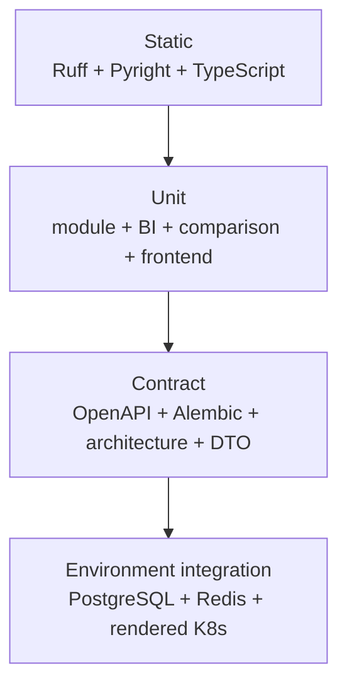

# [BP-701] 계약 테스트와 벤치마크 청사진
> **Document Code:** `BP-701` | **Contract State:** Target Architecture | **Capability State:** Operational | **Structure State:** Complete
> **Target Ownership:** `tests`, `frontend/src/**/*.test.*`, `.github/workflows`, architecture contract tooling
> **Current References:** [`tests/`](../../../tests), [`tests/modules/test_blueprint_consistency.py`](../../../tests/modules/test_blueprint_consistency.py), [`frontend/src/`](../../../frontend/src), [`.github/workflows/ci.yml`](../../../.github/workflows/ci.yml)

---

## 1. 테스트 피라미드



---

## 2. 핵심 불변식

- `domains/*/domain`은 같은 domain과 `shared/domain`만 import합니다.
- `domains/*/application`은 domain, shared application/domain과 명시적 port만 의존하며 concrete infrastructure를 import하지 않습니다.
- domain infrastructure와 presentation은 application 쪽으로 의존하고 서로를 직접 호출하지 않습니다.
- 서로 다른 domain은 상대 infrastructure/presentation을 import하지 않습니다.
- `backend/api` allowlist는 router composition, middleware, error/exception mapping, versioning, OpenAPI, SPA fallback과 system probe 같은 공통 HTTP edge 정책뿐입니다.
- `backend/bootstrap` 외 위치에서 concrete adapter object graph를 조립하지 않습니다.
- module은 DB/provider 객체를 직접 생성하지 않고 capability port를 사용합니다.
- platform은 domain use case를 import하지 않고 범용 transport/client만 제공합니다.
- 동일한 one-shot lease 수명주기의 worker는 공통 template을 상속합니다.
- rendered KEDA worker spec은 queue/command/environment 계약과 일치합니다.
- Alembic revision chain의 head는 하나이며 runtime schema와 migration schema 사이 drift가 없어야 합니다.
- `/api/v1` OpenAPI에 정식 route가 노출되고 제거된 comparison legacy route는 나타나지 않습니다.
- registry는 정확히 17개 module type을 노출합니다.
- scope-aware Decomposer는 다중 scope의 미등록 collection ID를 거부하고, 서버가 고정한 단일 scope에서만 ID 오탈자를 유일한 catalog 항목으로 복구합니다.
- Reader terminal LLM 출력은 strict `answer_markdown + evidence_ids` schema를 따르고, 반환 `CellEvidenceDTO[]`는 실제 값 후보 및 실행 근거 allowlist를 통과해야 합니다.
- 챗봇 message의 `content`와 `evidence[]`는 독립 저장·API 필드이며 frontend는 Markdown 좌표 문자열을 근거 배지로 파싱하지 않습니다.
- BI는 21개 metric ID와 evidence 계약을 지킵니다.
- BI source metric exact-evidence는 collection/workbook/file lineage, catalog alias/exclusion, concrete value, FY/LTM 구분을 지키며 exact hit 시 generic RAG를 실행하지 않습니다.
- Company Comparison은 source snapshot, evidence, rank, forecast assumption, exclusion, current head 무결성을 지킵니다.
- frontend에는 `/company-comparison-v2`가 없고 정식 `/company-comparison`만 존재합니다.
- 모바일 AppShell은 상단 앱바와 접근 가능한 메뉴 drawer를 제공하고 중복 하단 navigation을 렌더링하지 않습니다.
- C901 최대 복잡도 10을 backend와 modules 전체에 적용합니다. 현재 migration budget은 비어 있으므로 새 hotspot은 즉시 실패합니다.
- 20개 BP의 code/state/catalog, 모든 docs 상대 링크, 제외 기능·로컬 절대 경로 부재와 BP-501↔OpenAPI operation 집합이 일치해야 합니다.

---

## 3. Company Comparison 회귀 세트

[`tests/company_comparison/test_company_comparison_snapshot.py`](../../../tests/company_comparison/test_company_comparison_snapshot.py)는 다음을 검증합니다.

1. 실제 BI source에서 deterministic snapshot 생성.
2. 필수 metric/evidence 결손 기업 제외.
3. 최소 기업 수 미달 오류.
4. 점수·tier·competition rank.
5. actual/forecast period와 assumption link.
6. snapshot identity와 source fingerprint.
7. repository publish/current head.
8. GET/refresh HTTP 응답과 error mapping.

Frontend는 Zod snapshot schema, metric ranking, API hook, canonical route를 Vitest로 검증합니다.

---

## 4. Durable runtime 통합

CI의 PostgreSQL/pgvector·Redis service 환경에서는 다음 경로를 검증합니다.

- HTTP workflow 등록 → PostgreSQL queue → worker → terminal SSE
- lease/heartbeat와 stale worker protection
- 서로 다른 state stream 인스턴스 간 Redis change hint 후 DB 재조회
- BI materialization/question의 native async API
- benchmark queue와 case result persistence
- Alembic upgrade와 KEDA ScaledJob renderer

외부 OpenAI 호출과 실제 Kubernetes cluster 배포는 비용·credential·환경 의존성이 있으므로 기본 결정론적 CI와 분리합니다.

---

## 5. 표준 검증 명령

```bash
uv run ruff check .
uv run pyright
uv run pytest -q
cd frontend
npm run typecheck
npm test -- --run
npm run build
```

최근 실행 수치와 현재 통과 상태는 [`CURRENT_IMPLEMENTATION_BASELINE.md`](../../CURRENT_IMPLEMENTATION_BASELINE.md)에서만 관리합니다. 이 문서는 수치가 아니라 필수 검증 종류와 통과 조건을 정의합니다.

---

## 6. 변경 동반 규칙

- module 변경: unit/schema/registry/OpenAPI/BP-302 동시 수정
- DB 변경: migration/runtime schema/repository/model/BP-503 동시 수정
- API 변경: route/DTO/OpenAPI contract/frontend client/BP-501 동시 수정
- 문서 변경: BP metadata/catalog/relative link/OpenAPI table과 현재 기준선 정합성 검사 동시 통과
- frontend route 변경: router/sidebar/deep link/route test/BP-601 동시 수정
- frontend responsive shell 변경: AppShell/MobileAppBar/CSS/accessibility interaction test/BP-601 동시 수정
- Reader evidence 변경: Pydantic schema/Reader allowlist/chat persistence/frontend DTO·renderer/BP-303·404·501·503·601 동시 수정
- BI metric retrieval 변경: catalog/period policy/exact-evidence adapter/fallback RAG/BI snapshot regression/BP-303·403 동시 수정
- comparison policy 변경: version 상향, golden calculation tests, BP-405 동시 수정
- benchmark 목표와 실제 결과를 구분해 기록

---

## 7. 구조 migration hard gate와 ratchet

구조 검증은 완료된 migration 경계를 hard gate로 유지하고 새 위반을 즉시 차단합니다.

| 단계 | Hard gate |
| :--- | :--- |
| 1. Shared/ports | 완료: domain/application concrete import 금지와 shared 최소 경계 강제 |
| 2. Workflow slice | 완료: workflow domain/application import allowlist, presentation/infrastructure/workers 위치 강제 |
| 3. Product slices | 완료: data sources, BI, comparison, chatbot, benchmark, operations에 같은 allowlist 적용 |
| 4. Composition | 완료: `backend/api` 파일 allowlist와 bootstrap-only object construction 강제 |
| 5. Compatibility removal | 완료: `features/providers/engine/contracts/storage`와 route/core shim 삭제, 재도입 금지 |

새 경계를 hard gate에 추가할 때는 다음 조건을 모두 만족해야 합니다.

1. 대상 slice의 unit·application·adapter·presentation contract test가 존재합니다.
2. 공개 API와 DB schema snapshot diff가 의도된 변경만 포함합니다.
3. 전체 정적 검사와 회귀 테스트가 통과합니다.
4. 제거된 compatibility import를 재도입하지 않고 새 예외 allowlist를 추가하지 않습니다.
5. BP 문서의 `Structure State`와 현재 기준선을 같은 변경에서 갱신합니다.
