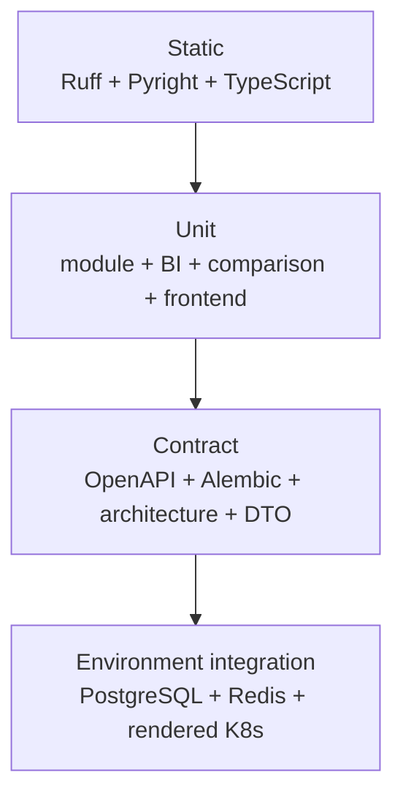

# [BP-701] 계약 테스트와 벤치마크 청사진
> **Document Code:** `BP-701` | **Category:** Validation Blueprint | **Status:** Implemented & Operational
> **Source Files:** [`tests/`](file:///c:/Repos/bist-mini-final/tests/), [`frontend/src/`](file:///c:/Repos/bist-mini-final/frontend/src/), [`.github/workflows/ci.yml`](file:///c:/Repos/bist-mini-final/.github/workflows/ci.yml)

---

## 1. 테스트 피라미드



---

## 2. 핵심 불변식

- feature는 `backend.api`를 import하지 않습니다.
- `backend/domains`는 API/platform/provider/legacy storage를 import하지 않습니다.
- module은 DB/provider 객체를 직접 생성하지 않습니다.
- module은 pgvector SQL gateway 대신 capability port를 사용합니다.
- feature repository는 private DB connection에 접근하지 않습니다.
- 동일한 one-shot lease 수명주기의 worker는 공통 template을 상속합니다.
- rendered KEDA worker spec은 queue/command/environment 계약과 일치합니다.
- Alembic revision chain의 head는 하나이며 현재 `20260829_0005`입니다.
- `/api/v1` OpenAPI에 정식 route가 노출되고 제거된 comparison legacy route는 나타나지 않습니다.
- registry는 정확히 19개 module type을 노출합니다.
- BI는 21개 metric ID와 evidence 계약을 지킵니다.
- Company Comparison은 source snapshot, evidence, rank, forecast assumption, exclusion, current head 무결성을 지킵니다.
- frontend에는 `/company-comparison-v2`가 없고 정식 `/company-comparison`만 존재합니다.
- C901 최대 복잡도 10을 backend와 modules 전체에 적용합니다. 현재 migration budget은 비어 있으므로 새 hotspot은 즉시 실패합니다.

---

## 3. Company Comparison 회귀 세트

[`tests/company_comparison/test_company_comparison_snapshot.py`](file:///c:/Repos/bist-mini-final/tests/company_comparison/test_company_comparison_snapshot.py)는 다음을 검증합니다.

1. 실제 BI source에서 deterministic snapshot 생성.
2. 필수 metric/evidence 결손 기업 제외.
3. 최소 기업 수 미달 오류.
4. 점수·tier·competition rank.
5. actual/forecast period와 assumption link.
6. snapshot identity와 source fingerprint.
7. repository publish/current head.
8. GET/refresh HTTP 응답과 error mapping.

Frontend는 Zod snapshot schema, metric ranking, API hook, canonical route를 Vitest로 검증합니다.

---

## 4. Durable runtime 통합

CI의 PostgreSQL/pgvector·Redis service 환경에서는 다음 경로를 검증합니다.

- HTTP workflow 등록 → PostgreSQL queue → worker → terminal SSE
- lease/heartbeat와 stale worker protection
- 서로 다른 state stream 인스턴스 간 Redis change hint 후 DB 재조회
- BI materialization/question의 native async API
- benchmark queue와 case result persistence
- Alembic upgrade와 KEDA ScaledJob renderer

외부 OpenAI 호출과 실제 Kubernetes cluster 배포는 비용·credential·환경 의존성이 있으므로 기본 결정론적 CI와 분리합니다.

---

## 5. 표준 검증 명령

```bash
uv run ruff check .
uv run pyright
uv run pytest -q
cd frontend
npm run typecheck
npm test -- --run
npm run build
```

2026-08-31 기준 최근 전체 결과는 backend **235 passed, 2 skipped**, frontend **48 files / 168 passed**, Ruff/Pyright/ESLint/TypeScript typecheck/production build 통과, Kubernetes renderer **6 ScaledJobs**입니다. 새 검증을 실행하면 이 수치는 실제 결과로 갱신합니다.

---

## 6. 변경 동반 규칙

- module 변경: unit/schema/registry/OpenAPI/BP-302 동시 수정
- DB 변경: migration/runtime schema/repository/model/BP-503 동시 수정
- API 변경: route/DTO/OpenAPI contract/frontend client/BP-501 동시 수정
- frontend route 변경: router/nav/home launcher/route test/BP-601 동시 수정
- comparison policy 변경: version 상향, golden calculation tests, BP-405 동시 수정
- benchmark 목표와 실제 결과를 구분해 기록
