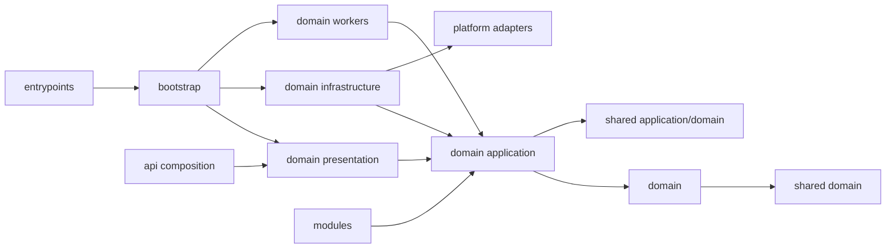

# 청사진 해석 규칙과 목표 아키텍처

> **Contract State:** Target Architecture
> **Current State Source:** [`CURRENT_IMPLEMENTATION_BASELINE.md`](file:///c:/Repos/bist-mini-final/docs/CURRENT_IMPLEMENTATION_BASELINE.md)
> **Canonical Backend Structure:** [`BP-102`](file:///c:/Repos/bist-mini-final/docs/blueprints/01_system_blueprints/BP-102_backend_layered_architecture.md)

이 디렉터리의 문서는 현재 폴더 배치를 설명하거나 정당화하는 자료가 아니다. 제품이 장기적으로 지켜야 할 책임, 의존 방향, 런타임 계약과 완료 조건을 정의하는 **To-Be 규격**이다. 현재 구현 파일은 목표 계약의 증거 또는 migration 출발점일 뿐이며, 최종 소유권을 뜻하지 않는다.

## 1. 문서 상태 해석

각 청사진은 다음 상태를 독립적으로 기록한다.

| 상태 | 의미 |
| :--- | :--- |
| `Contract State` | 문서가 목표 계약인지 여부. 모든 BP 문서는 `Target Architecture`다. |
| `Capability State` | 사용자가 사용하는 기능과 런타임 계약의 가동 상태다. |
| `Structure State` | 코드가 목표 소유 경계와 의존 규칙까지 이동했는지 나타낸다. |
| `Target Ownership` | 최종적으로 책임을 소유해야 하는 패키지다. 존재하지 않는 목표 경로도 포함할 수 있다. |
| `Current References` | 현재 동작을 추적하기 위한 구현 링크다. canonical target이 아니다. |

`Capability State: Operational`은 `Structure State: Complete`를 의미하지 않는다. 기능이 동작해도 수평 호환 패키지나 composition 계층에 도메인 코드가 남아 있으면 구조 migration은 완료되지 않은 것이다.

## 2. 목표 설계 원칙

1. **도메인 우선 modular monolith**: workflow, data sources, BI, company comparison, chatbot, benchmark, read-only operations를 독립 bounded context로 둔다.
2. **안쪽으로 향하는 의존성**: `presentation → application → domain`, `infrastructure → application ports`만 허용한다.
3. **entrypoint와 composition 분리**: `backend/entrypoints`는 프로세스를 시작하고, concrete adapter 생성과 결합은 `backend/bootstrap`만 수행한다.
4. **최소 shared kernel**: 식별자, 시간, 오류, 결과, pagination, transaction처럼 의미가 안정적인 도메인 비종속 primitive만 공유한다.
5. **외부 시스템과 도메인 저장소 분리**: 범용 transport/client는 `platform`, 도메인 SQL·mapping은 해당 domain의 `infrastructure`가 소유한다.
6. **계약 기반 모듈**: `modules/`는 원자적 DAG 실행 단위이며 application port를 통해 capability를 받고 concrete DB/provider를 생성하지 않는다.
7. **상속보다 조합**: 공통 base class는 lease worker나 LLM 호출처럼 lifecycle과 불변식이 완전히 동일할 때만 사용한다. 범용 `BaseService`, 도메인 의미를 지우는 CRUD repository 상속은 만들지 않는다.
8. **공개 계약 보존**: 구조 이동만으로 REST API, SSE envelope, DB schema, 저장 데이터 의미를 바꾸지 않는다.
9. **영속 상태 우선**: PostgreSQL이 상태의 단일 진실 공급원이고 Redis는 상태 변경 신호에만 사용한다.
10. **검증 가능한 완료**: 디렉터리 이름이 아니라 import graph, composition 위치, 계약 테스트와 삭제된 호환 경로로 완료를 판정한다.

## 3. 목표 소유권 지도

| 책임 | 최종 소유 위치 | 금지되는 대체 위치 |
| :--- | :--- | :--- |
| ASGI·CLI·worker 프로세스 시작 | `backend/entrypoints` | bootstrap 내부 business branch, legacy `main.py` |
| 프로세스 조립·수명주기 | `backend/bootstrap` | domain/application, route 내부 factory |
| 공통 HTTP 정책과 router 결합 | `backend/api` | 도메인별 route/controller/schema |
| 비즈니스 상태·정책 | `backend/domains/<domain>/domain` | `features`, `storage`, `api` |
| 유스케이스·port | `backend/domains/<domain>/application` | `bootstrap`, concrete provider/client |
| 도메인 DB·filesystem adapter | `backend/domains/<domain>/infrastructure` | 범용 `backend/storage` facade |
| 도메인 REST·SSE DTO | `backend/domains/<domain>/presentation` | `backend/api/*_controller.py` |
| 도메인 one-shot 실행 | `backend/domains/<domain>/workers` | 범용 engine entrypoint에 도메인 분기 추가 |
| 범용 외부 시스템 adapter | `backend/platform/<system>` | `providers`, `core`, 도메인 규칙 |
| 공통 계약·primitive | `backend/shared/domain`, `backend/shared/application` | catch-all `utils`, concrete infrastructure, 도메인 객체 공유 |
| 원자적 DAG 모듈 | `modules` | workspace service, HTTP controller |
| 선언형 표준 Job | `jobs` | UI 템플릿, runtime if/else catalog |
| DB schema evolution | `migrations` | application startup DDL |
| 제품 UI | `frontend/src/features/<feature>` | 거대한 page component |
| 공용 시각 primitive | `frontend/src/shared` | 페이지별 복제 CSS/component |

## 4. 허용 의존성

- 서로 다른 domain은 상대 domain의 infrastructure나 presentation을 import하지 않는다.
- domain 간 협력이 필요하면 소비자 application이 port를 정의하고 provider domain의 application facade 또는 integration adapter가 이를 구현한다.
- shared는 domain을 import하지 않는다. platform은 application use case를 호출하지 않는다.
- `backend/api`는 domain router 결합과 middleware/error/versioning만 알고 business branch를 갖지 않는다.
- `bootstrap`은 모든 계층을 알 수 있지만 business decision을 하지 않는다.
- `entrypoints`는 bootstrap factory를 선택해 실행할 뿐 domain/infrastructure를 직접 조립하지 않는다.

## 5. 구조 migration 완료 조건

다음 조건을 모두 만족해야 전체 backend 구조를 `Complete`로 표시할 수 있다.

1. 모든 bounded context가 필요한 `domain/application/infrastructure/presentation/workers` slice를 갖고 책임 없는 빈 계층은 만들지 않는다.
2. domain과 application에서 `backend.features`, `backend.storage`, `backend.providers`, `backend.engine`, `backend.core`, `backend.contracts` concrete import가 0이다.
3. `backend/api`에는 router composition, middleware, exception handler, versioning 외 도메인 파일이 없다.
4. concrete client와 repository 조립은 `backend/bootstrap`에서만 일어나고 entrypoint는 bootstrap의 공개 factory만 호출한다.
5. 외부 client는 `platform`, 도메인 mapping/query는 domain infrastructure에 위치한다.
6. 호환 수평 패키지는 호출자가 0이 된 순서대로 삭제된다.
7. architecture contract test가 목표 패키지 allowlist와 import 방향을 CI에서 강제한다.
8. 전체 backend/frontend test, typecheck, lint, migration 검증과 Kubernetes render가 통과한다.

## 6. Migration 순서

1. shared primitive와 application port를 먼저 확정한다.
2. workflow vertical slice를 reference implementation으로 완성한다.
3. data sources → BI → company comparison → chatbot → benchmark → operations 순서로 같은 규칙을 적용한다.
4. 각 slice 이동과 동시에 presentation route와 worker entrypoint를 옮긴다.
5. 범용 외부 adapter를 platform으로 통합하고 bootstrap object graph를 단순화한다.
6. `backend/api`를 축소하고 수평 호환 패키지를 제거한다.
7. 단계별 architecture gate를 warning에서 hard failure로 전환한다.

현재 파일 수, import 위반 수, 테스트 결과와 실제 배치 상태는 이 문서에 중복 기록하지 않는다. 그런 사실은 [`CURRENT_IMPLEMENTATION_BASELINE.md`](file:///c:/Repos/bist-mini-final/docs/CURRENT_IMPLEMENTATION_BASELINE.md)에서만 갱신한다.
