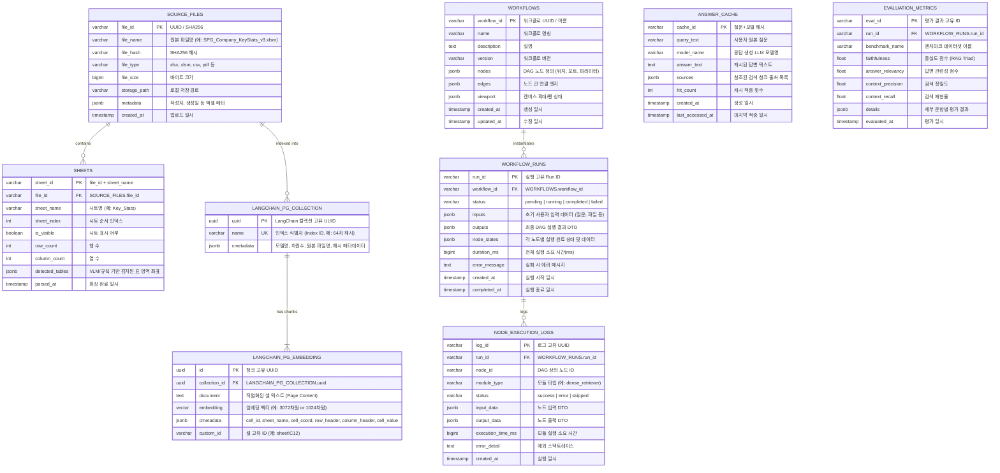

# RAG Flow Workbench 데이터베이스 설계 및 ERD 명세서

본 문서는 **RAG Flow Workbench** 시스템의 데이터 계보, 워크플로 실행 기록, 엑셀 구조 데이터, 그리고 LangChain 기반의 고차원 벡터 임베딩을 저장·관리하는 PostgreSQL 16 + pgvector 데이터베이스의 논리적/물리적 ERD(Entity Relationship Diagram)와 테이블 명세를 정의합니다.

---

## 1. 데이터베이스 개요 및 설계 원칙

### 1.1 저장소 아키텍처 개요
- **DBMS**: PostgreSQL 16
- **벡터 확장**: `pgvector v0.8.6` (`CREATE EXTENSION IF NOT EXISTS vector;`)
- **데이터베이스명**: `rag_flow`
- **표준 프레임워크**: `LangChain` (`langchain-postgres`)
- **핵심 목표**: 
  1. 엑셀 원본 파일 $\rightarrow$ 시트/영역 파싱 $\rightarrow$ 셀 텍스트 직렬화 $\rightarrow$ 벡터 임베딩 간의 **완전한 데이터 계보(Data Lineage) 보장**
  2. 프론트엔드 DAG 캔버스에서 생성된 워크플로와 배치 실행 이력의 **영속성 및 추적성 제공**
  3. LLM 질의응답 캐시 및 RAG 평가 메트릭 데이터의 **효율적인 인덱싱**

### 1.2 pgAdmin 테이블 통합 및 정제 방향
현재 초기 개발 과정에서 생성된 raw 테이블과 LangChain 표준 테이블이 공존하고 있습니다:
- `document_chunks`, `vector_indexes`: 초기 raw SQL 프로토타입 테이블 (정리 대상)
- `langchain_pg_collection`, `langchain_pg_embedding`: **LangChain 표준 벡터 저장소 테이블 (운영 기준)**

> [!NOTE]
> 도메인 엔티티(`files`, `workflows`, `workflow_runs`, `answer_cache`)는 표준 RDB 테이블로 구성하고, 벡터 검색 영역은 LangChain 표준 테이블(`langchain_pg_collection`, `langchain_pg_embedding`)과 외래키/식별자로 유기적으로 연동합니다.

---

## 2. 전체 ERD 다이어그램 (Mermaid)



---

## 3. 상세 테이블 명세 (DDL 및 컬럼 정의)

### 3.1 `source_files` (원본 데이터 소스 파일)
| 컬럼명 | 데이터 타입 | 제약조건 | 설명 |
| :--- | :--- | :--- | :--- |
| `file_id` | `VARCHAR(64)` | `PRIMARY KEY` | 파일 고유 식별자 (SHA256 해시 또는 UUID) |
| `file_name` | `VARCHAR(255)` | `NOT NULL` | 원본 파일명 (예: `SPG_Company_KeyStats_v3.xlsm`) |
| `file_hash` | `VARCHAR(64)` | `NOT NULL` | 파일 무결성 검증용 SHA256 해시 |
| `file_type` | `VARCHAR(32)` | `NOT NULL` | 확장자 (`xlsx`, `xlsm`, `csv`, `pdf` 등) |
| `file_size` | `BIGINT` | `NOT NULL` | 파일 크기 (바이트 단위) |
| `storage_path` | `VARCHAR(512)` | `NOT NULL` | 서버 로컬 또는 스토리지 저장 경로 (`data/processed/...`) |
| `metadata` | `JSONB` | `DEFAULT '{}'` | 엑셀 작성자, 시트 목록 요약 등 부가 정보 |
| `created_at` | `TIMESTAMPTZ` | `DEFAULT NOW()` | 업로드 일시 |

---

### 3.2 `sheets` (스프레드시트 시트 정보)
| 컬럼명 | 데이터 타입 | 제약조건 | 설명 |
| :--- | :--- | :--- | :--- |
| `sheet_id` | `VARCHAR(128)` | `PRIMARY KEY` | `file_id:sheet_name` 복합 식별자 |
| `file_id` | `VARCHAR(64)` | `FOREIGN KEY` | `source_files.file_id` 참조 (`ON DELETE CASCADE`) |
| `sheet_name` | `VARCHAR(128)` | `NOT NULL` | 시트명 (예: `Key_Stats`, `Income_Statement`) |
| `sheet_index` | `INT` | `NOT NULL` | 워크북 내 탭 순서 인덱스 (0부터 시작) |
| `is_visible` | `BOOLEAN` | `DEFAULT TRUE` | 숨김 시트 여부 |
| `row_count` | `INT` | `NOT NULL` | 시트 내 유효 데이터 행 수 |
| `column_count` | `INT` | `NOT NULL` | 시트 내 유효 데이터 열 수 |
| `detected_tables` | `JSONB` | `DEFAULT '[]'` | VLM 또는 휴리스틱으로 감지된 표 Bounding Box 목록 |
| `parsed_at` | `TIMESTAMPTZ` | `DEFAULT NOW()` | 파싱 완료 일시 |

---

### 3.3 `langchain_pg_collection` (LangChain 인덱스 마스터)
*LangChain 공식 `langchain-postgres` 테이블*
| 컬럼명 | 데이터 타입 | 제약조건 | 설명 |
| :--- | :--- | :--- | :--- |
| `uuid` | `UUID` | `PRIMARY KEY` | LangChain 컬렉션 고유 식별자 |
| `name` | `VARCHAR` | `UNIQUE NOT NULL` | 인덱스 고유 ID (예: `bf94446eb7...`) |
| `cmetadata` | `JSONB` | `DEFAULT '{}'` | `file_name`, `workbook_hash`, `model`, `dimension`, `doc_count` 등 |

---

### 3.4 `langchain_pg_embedding` (LangChain 벡터 청크 저장소)
*LangChain 공식 `langchain-postgres` 테이블*
| 컬럼명 | 데이터 타입 | 제약조건 | 설명 |
| :--- | :--- | :--- | :--- |
| `id` | `UUID` | `PRIMARY KEY` | 청크 고유 UUID |
| `collection_id` | `UUID` | `FOREIGN KEY` | `langchain_pg_collection.uuid` 참조 (`ON DELETE CASCADE`) |
| `document` | `TEXT` | `NOT NULL` | 직렬화된 텍스트 (`[SHEET] ... [COL] ... [ROW] ... [VALUE] ...`) |
| `embedding` | `VECTOR(3072)` | `NOT NULL` | 고차원 임베딩 벡터 (HNSW / IVFFlat 인덱스 적용) |
| `cmetadata` | `JSONB` | `NOT NULL` | `cell_id`, `sheet_name`, `cell_coord`, `row_header`, `column_header`, `cell_value` |
| `custom_id` | `VARCHAR` | `NULLABLE` | 셀 고유 식별자 (예: `c1`, `c2`) |

#### 인덱스 설정
- **Cosine Similarity 검색용 HNSW 인덱스**:
  ```sql
  CREATE INDEX IF NOT EXISTS idx_langchain_pg_embedding_hnsw 
  ON langchain_pg_embedding 
  USING hnsw (embedding vector_cosine_ops);
  ```
- **메타데이터 JSONB GIN 인덱스** (필터링 가속):
  ```sql
  CREATE INDEX IF NOT EXISTS idx_langchain_pg_embedding_cmetadata 
  ON langchain_pg_embedding 
  USING gin (cmetadata);
  ```

---

### 3.5 `workflows` (DAG 캔버스 워크플로 정의)
| 컬럼명 | 데이터 타입 | 제약조건 | 설명 |
| :--- | :--- | :--- | :--- |
| `workflow_id` | `VARCHAR(64)` | `PRIMARY KEY` | 워크플로 고유 식별자 (예: `default`, `custom_rag_1`) |
| `name` | `VARCHAR(128)` | `NOT NULL` | 워크플로 표시 명칭 |
| `description` | `TEXT` | `NULLABLE` | 워크플로 설명 |
| `version` | `VARCHAR(16)` | `DEFAULT '1.0.0'` | 워크플로 버전 |
| `nodes` | `JSONB` | `NOT NULL` | 노드 목록 (ID, 타입, 위치 `x,y`, 설정값) |
| `edges` | `JSONB` | `NOT NULL` | 노드 간 연결선 (`source`, `target`, 포트 정보) |
| `viewport` | `JSONB` | `DEFAULT '{"x":0,"y":0,"zoom":1}'` | React Flow 캔버스 상태 |
| `created_at` | `TIMESTAMPTZ` | `DEFAULT NOW()` | 생성 일시 |
| `updated_at` | `TIMESTAMPTZ` | `DEFAULT NOW()` | 수정 일시 |

---

### 3.6 `workflow_runs` (워크플로 실행 이력)
| 컬럼명 | 데이터 타입 | 제약조건 | 설명 |
| :--- | :--- | :--- | :--- |
| `run_id` | `VARCHAR(64)` | `PRIMARY KEY` | 실행 고유 Run ID (예: `run_20260818_123456`) |
| `workflow_id` | `VARCHAR(64)` | `FOREIGN KEY` | `workflows.workflow_id` 참조 |
| `status` | `VARCHAR(32)` | `NOT NULL` | `pending`, `running`, `completed`, `failed` |
| `inputs` | `JSONB` | `NOT NULL` | 시작 질문, 선택 파일 등 초기 입력 데이터 |
| `outputs` | `JSONB` | `NULLABLE` | 최종 DAG 모듈들의 실행 결과값 |
| `node_states` | `JSONB` | `DEFAULT '{}'` | 각 노드별 상태 (`idle`, `running`, `completed`, `error`) |
| `duration_ms` | `BIGINT` | `DEFAULT 0` | 총 실행 소요 시간 (밀리초) |
| `error_message` | `TEXT` | `NULLABLE` | 실행 중단 시 발생한 오류 메시지 |
| `created_at` | `TIMESTAMPTZ` | `DEFAULT NOW()` | 실행 시작 일시 |
| `completed_at` | `TIMESTAMPTZ` | `NULLABLE` | 실행 완료 일시 |

---

### 3.7 `answer_cache` (질의응답 캐시)
| 컬럼명 | 데이터 타입 | 제약조건 | 설명 |
| :--- | :--- | :--- | :--- |
| `cache_id` | `VARCHAR(64)` | `PRIMARY KEY` | `SHA256(query + model_name)` |
| `query_text` | `TEXT` | `NOT NULL` | 원본 질의문 |
| `model_name` | `VARCHAR(64)` | `NOT NULL` | 답변 생성에 사용된 LLM 모델 |
| `answer_text` | `TEXT` | `NOT NULL` | 캐시된 최종 답변 텍스트 |
| `sources` | `JSONB` | `DEFAULT '[]'` | 답변 작성에 인용된 셀 청크 및 파일 출처 |
| `hit_count` | `INT` | `DEFAULT 1` | 캐시 히트 횟수 |
| `created_at` | `TIMESTAMPTZ` | `DEFAULT NOW()` | 최초 캐시 생성 일시 |
| `last_accessed_at` | `TIMESTAMPTZ` | `DEFAULT NOW()` | 마지막 캐시 접근 일시 |

---

## 4. LangChain `cmetadata` 표준 매핑 규격

모든 엑셀 셀 벡터 청크는 `langchain_pg_embedding.cmetadata`에 다음 JSON 스키마로 표준화되어 적재됩니다:

```json
{
  "cell_id": "c12",
  "file_name": "SPG_Company_KeyStats_v3.xlsm",
  "sheet_name": "Key_Stats",
  "cell_coord": "C12",
  "row_header": ["Financial Summary", "Total Revenue"],
  "column_header": ["2024", "Annual"],
  "cell_value": "1,200M",
  "workbook_hash": "67bad6e2365a6a682..."
}
```

---

## 5. 데이터베이스 정제 및 단계별 적용 계획

### 1단계: 임시 프로토타입 테이블 정리 (Drop Legacy Tables)
초기 raw SQL 테이블인 `document_chunks`와 `vector_indexes`를 삭제하여 LangChain 표준 구조로 단일화합니다.
```sql
DROP TABLE IF EXISTS document_chunks CASCADE;
DROP TABLE IF EXISTS vector_indexes CASCADE;
```

### 2단계: 필수 도메인 DDL 적용 스크립트 실행
위 명세서의 DDL을 담은 `backend/storage/schema.sql` 또는 마이그레이션 스크립트를 통해 `source_files`, `sheets`, `workflows`, `workflow_runs`, `answer_cache` 테이블을 안전하게 생성합니다.

### 3단계: 스토리지 레이어 연결
- `WorkflowStore`: JSON 파일 $\rightarrow$ `workflows` 테이블 지원
- `RunHistoryStore`: JSON 파일 $\rightarrow$ `workflow_runs` 테이블 지원
- `AnswerCache`: JSON 파일 $\rightarrow$ `answer_cache` 테이블 지원
