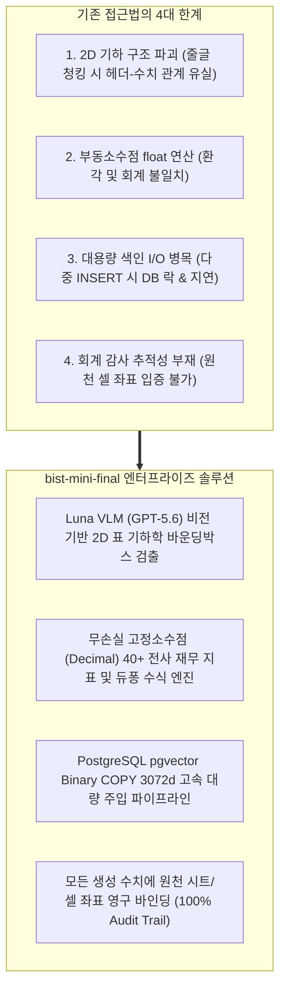

# [SEC-101] 주제 배경 및 필요성 (Background & Necessity)
> **Chapter:** 1. 프로젝트 개요 | **Section:** 1.1 | **Status:** Approved Baseline  
> **Classification:** Industry Problem Statement & Enterprise Financial AI Necessity

---

## 1. 기업 재무 데이터 분석의 한계 및 시장 문제점

글로벌 금융 기관, 자산운용사, 전략컨설팅펌 및 대기업 재무기획실은 매년 수백만 건의 복잡한 다중 시트 재무제표(`.xlsx`, `.xlsm`)를 분석하여 투자 심사, M&A 실사, 경영 전략을 수립합니다. 그러나 기존의 상용 LLM 및 일반 텍스트 RAG 시스템은 다음과 같은 **4대 치명적 기술 한계**로 인해 실제 금융 실무 도입에 실패했습니다:

---

### 1.1 기존 RAG의 4대 핵심 실패 원인 상세

1. **2D 기하 구조 파괴 (Loss of 2D Table Geometry)**:
   - 재무 엑셀은 다중 병합 헤더(`[2023년] -> [연결/별도] -> [매출액/영업이익]`), 상하 분산 단위(`단위: 백만원`), 빈 셀 갭(Blank Gap)이 복합적으로 얽혀 있습니다.
   - 이를 단순 줄글로 청킹하면 행과 열의 2차원 교차 맥락이 파괴되어 AI가 전혀 다른 연도의 숫자를 읽거나 수치를 오인식합니다.
2. **부동소수점 오차로 인한 회계 환각 (Floating-Point Hallucinations)**:
   - 파이썬 기본 `float` 연산 시 이진 부동소수점 유효숫자 절사 오차가 누적되어, 재무비율 및 듀퐁 분해 공식에서 분기 합산 불일치가 발생합니다.
3. **대용량 색인 I/O 병목 (Large-Scale Indexing Bottleneck)**:
   - 수만 개 셀 임베딩을 SQL `INSERT`로 적재 시 SQL 파싱 오버헤드로 인해 장시간 DB 락이 발생하여 실시간 서비스가 마비됩니다.
4. **회계 감사 추적성 부재 (Lack of Audit Trail)**:
   - AI가 답변한 숫자가 엑셀 파일의 정확히 어느 시트, 몇 행, 몇 열에서 도출되었는지 증명할 수 없어 내부 감사 및 컴플라이언스 통과가 불가능합니다.

---

## 2. 본 과제의 필요성 및 차별성

`bist-mini-final`은 **비전 VLM 기반 표 기하 감지**, **PostgreSQL Native Binary COPY 3072d 고속 주입**, **무손실 `Decimal` 연산 엔진**, **100% 원천 셀 감사 추적성**을 융합하여 금융 실무자가 신뢰할 수 있는 엔터프라이즈 재무 RAG & 시각화 플랫폼을 제공합니다.
