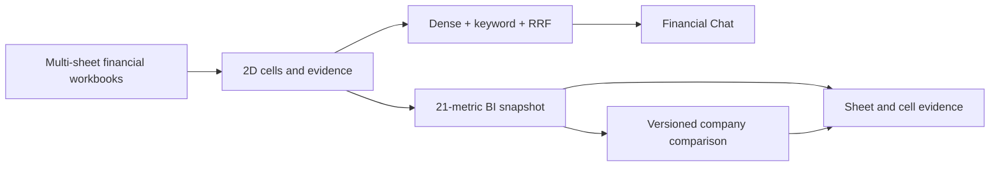

# [SEC-101] 주제 배경 및 필요성

> **Chapter:** 1. 프로젝트 개요 | **Section:** 1.1 | **Status:** Implementation-aligned

---

## 1. 해결하려는 문제

재무 분석 업무는 다중 시트 Excel, 서로 다른 계정명·회계기간·통화·배율, 원본 근거 추적이라는 세 가지 문제를 동시에 다룹니다. 일반 텍스트 RAG만 사용하면 표의 행·열 관계가 손실되고, 계산 결과가 어떤 셀에서 나왔는지 증명하기 어렵습니다. 여러 기업을 비교할 때는 기업별 누락 정도가 다르기 때문에 임의 보간이나 합성 데이터가 의사결정을 왜곡할 위험도 있습니다.

## 2. 현재 제품 해법

| 문제 | 현재 구현 |
| :--- | :--- |
| 복잡한 Excel 구조 | OpenPyXL 좌표 파싱, 외부 vision client 기반 구조 감지, `header_with_value` 직렬화 |
| 대용량 검색 색인 | 3072차원 임베딩, PostgreSQL Binary COPY, pgvector HNSW와 keyword 검색 |
| 재무 수치 신뢰성 | 21개 `MetricId`, `Decimal` 파생식, 상태 기반 누락 표현, 원본 `BiEvidence` |
| 장시간 실행 | PostgreSQL durable queue, Lease, KEDA one-shot workers, SSE 상태 관찰 |
| 자연어 분석 | 세션형 Chat API와 근거 기반 RAG run |
| 기업 비교 | BI current snapshot을 검증한 뒤 별도 `CompanyComparisonSnapshot`으로 순위·근거·가정 발행 |

## 3. Company Comparison이 필요한 이유

기업 비교는 BI 화면의 단순 복제가 아닙니다. 한 기업을 깊게 보는 BI와 여러 기업을 같은 정책으로 평가하는 비교 도메인은 갱신 주기와 오류 정책이 다릅니다. 따라서 다음 경계를 둡니다.

- BI는 기업별 원천·파생 재무 지표와 근거를 소유합니다.
- Company Comparison은 BI current snapshot을 읽기 전용 원천으로 사용합니다.
- 비교 도메인은 동일 FY·통화·배율·근거 완전성을 검증하고 성장성·수익성·안정성 점수를 계산합니다.
- 불완전한 기업은 값을 만들지 않고 `exclusions`에 기록합니다.
- 예측값은 실제 관측값과 분리하고 순위 점수에 사용하지 않습니다.

이 구조는 서로 다른 담당자가 BI와 기업 비교를 독립적으로 개발해도 API·DTO·저장 수명주기가 충돌하지 않게 합니다.

## 4. 구현 범위

현재 비전 경로는 OpenAI Responses 기반 외부 provider를 사용합니다. 로컬·온디바이스 VLM은 구현 범위에서 제외합니다. 검색은 Dense + PostgreSQL keyword + RRF를 사용하며 Cross-Encoder reranker도 범위에서 제외합니다.

현재 상태의 수치와 경로는 [`CURRENT_IMPLEMENTATION_BASELINE.md`](file:///c:/Repos/bist-mini-final/docs/CURRENT_IMPLEMENTATION_BASELINE.md)를 기준으로 합니다.
