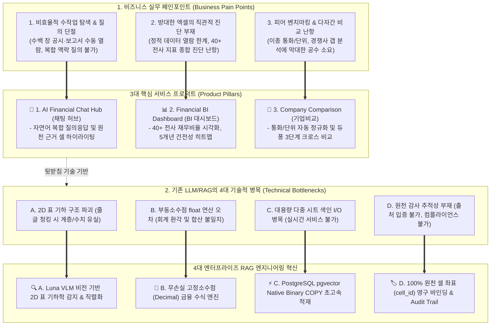
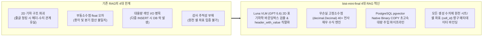

# [SEC-101] 주제 배경 및 필요성 (Background & Necessity)
> **Chapter:** 1. 프로젝트 개요 | **Section:** 1.1 | **Status:** Approved Baseline  
> **Classification:** Industry Problem Statement & Enterprise Financial AI Necessity

---

## 1. 기업 재무 데이터 분석의 시장 배경 및 문제점

글로벌 금융 기관, 자산운용사, 사모펀드(PEF), 전략컨설팅펌 및 대기업 재무기획실은 매년 수백만 건의 복잡한 다중 시트 재무제표(`.xlsx`, `.xlsm`)와 사업보고서를 분석하여 투자 심사, M&A 실사, 기업가치 평가(Valuation), 경영 전략을 수립합니다.

그러나 실무 현장에서는 **(1) 비즈니스 분석 실무의 워크플로우 비효율**과 이를 해결하기 위한 **(2) 기존 LLM/RAG의 치명적 기술 한계**라는 이중 병목에 직면해 있습니다.

---

## 2. 금융 실무 현장의 3대 비즈니스 페인포인트 및 핵심 프로덕트 도출

### 2.1 [Pain Point 1] 정보 탐색의 비효율 및 단방향 질의 단절 ➡️ **💬 AI Financial Chat Hub (채팅 허브)**
* **실무 문제**: 수백 장에 달하는 재무제표와 주석, 사업보고서 속에서 원하는 수치나 특정 회계 이벤트를 찾기 위해 단순 키워드 검색이나 수작업 스크롤에 의존하고 있으며, 복합 맥락(예: *"2023년 영업이익률 하락의 주원인인 판관비 항목 분석"*) 질의가 불가능합니다.
* **프로덕트 도출**: 자연어로 자유롭게 질문하고, 300ms 이내에 회계 수식과 표, 원천 셀 근거가 첨부된 전문 분석 보고서형 답변을 제공하는 **대화형 금융 질의응답 허브(AI Financial Chat Hub)**를 도출합니다.

### 2.2 [Pain Point 2] 방대한 엑셀의 직관적 시각화 및 전사 건전성 진단 부재 ➡️ **📊 Financial BI Dashboard (BI 대시보드)**
* **실무 문제**: 엑셀 시트에 나열된 원천 수치만으로는 경영진과 심사역이 기업의 5개년 수익성, 안정성, 성장성, 활동성 추세를 한눈에 파악하기 어렵고, 듀퐁 분해(DuPont Analysis) 등 다각도 건전성 진단을 위해 매번 수작업 차트를 생성해야 합니다.
* **프로덕트 도출**: 파일 업로드 즉시 회계기간 및 통화를 자동 인식하고 40개 이상의 핵심 재무비율을 무손실 산출하여 5개년 건전성 히트맵, 수익성/성장성 차트로 렌더링하는 **동적 인터랙티브 BI 대시보드(Financial BI Dashboard)**를 도출합니다.

### 2.3 [Pain Point 3] 피어 벤치마킹 및 다자간 기업 비교 분석의 극심한 공수 ➡️ **🏢 Company Comparison (기업비교 기능)**
* **실무 문제**: M&A 실사나 포트폴리오 편입을 위해 동종 업계 3~5개 경쟁사를 비교할 때, 각 사마다 상이한 회계기준(K-IFRS vs US-GAAP), 통화(KRW vs USD), 단위(억원 vs 백만달러), 계정과목 명칭 차이로 인해 지표 표준화 및 크로스 분석에 수일 이상의 리드타임이 소요됩니다.
* **프로덕트 도출**: 복수 기업의 재무 데이터를 한 화면에서 통화/단위를 즉시 정규화하고, 5각 건전성 레이더 차트 및 듀퐁 3단계(순이익률 × 총자산회전율 × 재무레버리지) 분해 트리로 경쟁 우위를 직관적으로 비교 분석하는 **다자간 기업 비교 플랫폼(Company Comparison & Peer Benchmarking)**을 도출합니다.

---

## 3. 기존 RAG의 4대 기술적 한계 및 엔터프라이즈 RAG 혁신

위 3대 비즈니스 프로덕트를 구현하기 위해 기존의 범용 LLM 및 상용 텍스트 RAG를 도입하려 했으나, 다음과 같은 **4대 기술적 병목**으로 인해 금융 실무 도입이 불가능했습니다:

1. **2D 기하 구조 파괴 (Loss of 2D Table Geometry)**:
   - 재무 엑셀은 다중 병합 헤더(`[2023년] -> [연결/별도] -> [매출액/영업이익]`), 상하 분산 단위(`단위: 백만원`), 빈 셀 갭(Blank Gap)이 복합적으로 얽혀 있습니다.
   - 이를 단순 줄글로 청킹하면 행과 열의 2차원 교차 맥락이 파괴되어 AI가 전혀 다른 연도의 숫자를 읽거나 수치를 오인식합니다.
   - ➡️ **해결**: Luna VLM (GPT-5.6) 기반 2D 표 기하학 바운딩박스 감지 및 `header_with_value` 정규 직렬화.
2. **부동소수점 오차로 인한 회계 환각 (Floating-Point Hallucinations)**:
   - 파이썬 기본 `float` 연산 시 이진 부동소수점 유효숫자 절사 오차가 누적되어, 재무비율 및 듀퐁 분해 공식에서 분기 합산 불일치가 발생합니다.
   - ➡️ **해결**: `decimal.Decimal` 기반 40+ 핵심 재무비율 무손실 연산 및 표현 단계 `ROUND_HALF_UP` 표준화.
3. **대용량 색인 I/O 병목 (Large-Scale Indexing Bottleneck)**:
   - 수만 개 셀 임베딩을 SQL `INSERT`로 적재 시 SQL 파싱 오버헤드로 인해 장시간 DB 락이 발생하여 실시간 서비스가 마비됩니다.
   - ➡️ **해결**: PostgreSQL 네이티브 `Binary COPY` 스트리밍 파이프라인으로 초당 대량 벡터 주입.
4. **회계 감사 추적성 부재 (Lack of Audit Trail)**:
   - AI가 답변한 숫자가 엑셀 파일의 정확히 어느 시트, 몇 행, 몇 열에서 도출되었는지 증명할 수 없어 내부 감사 및 컴플라이언스 통과가 불가능합니다.
   - ➡️ **해결**: 원천 셀 좌표(`cell_id`, 행/열 번호, 시트명)를 벡터 메타데이터 및 BI 스냅샷에 영구 바인딩하여 100% 클릭 가능 감사 모달 제공.

---

## 4. 본 과제의 필요성 및 차별성 요약

`bist-mini-final`은 **AI Financial Chat Hub**, **Financial BI Dashboard**, **Company Comparison**의 3대 핵심 사용자 서비스를 통해 금융 실무자의 분석 생산성을 극대화하며, 이를 **비전 VLM 기반 표 기하 감지**, **PostgreSQL Native Binary COPY**, **무손실 `Decimal` 연산 엔진**, **100% 원천 셀 감사 추적성**의 4대 엔터프라이즈 RAG 파이프라인으로 강력하게 뒷받침하는 신뢰도 100%의 차세대 엔터프라이즈 재무 AI 플랫폼입니다.
