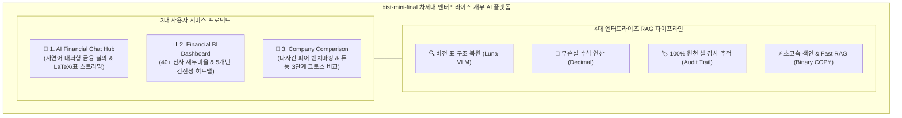

# [SEC-102] 프로젝트 목표 및 핵심 가치 (Goals & Target KPIs)
> **Chapter:** 1. 프로젝트 개요 | **Section:** 1.2 | **Status:** Approved Baseline  
> **Classification:** Project Goals, Core Values & Target KPIs

---

## 1. 플랫폼 비전 & 2대 영역 핵심 가치 (Core Values)

`bist-mini-final`은 금융 실무자의 분석 생산성을 극대화하는 **3대 사용자 서비스 프로덕트**와, 수치 신뢰성을 보장하는 **4대 엔터프라이즈 RAG 파이프라인**을 융합하는 것을 플랫폼의 궁극적 비전으로 정의합니다:

### 1.1 핵심 가치 매트릭스 (Core Values Matrix)

| 구분 | 핵심 가치 (Core Value) | 구현 기술 및 메커니즘 | 기대 효과 및 차별점 |
| :--- | :--- | :--- | :--- |
| **서비스 영역** | **1. 대화형 금융 질의응답 (Chat Hub)** | Fast RAG 인메모리 어댑터 + GPT-5.6 마크다운/수식 스트리밍 | 복잡한 다중 시트 재무 질의에 300ms 이내 초고속 전문 분석 답변 제공 |
| **서비스 영역** | **2. 전사 재무 시각화 (BI Analytics)** | 1-Shot 기간/통화 프로파일러 + 40+ 핵심 비율 자동 산출 | 5개년 건전성 히트맵과 수익성/성장성 차트로 기업 체질을 한눈에 진단 |
| **서비스 영역** | **3. 다자간 기업 비교 (Comparison)** | 다중 기업 데이터 정규화 + 듀퐁 3단계 분해 트리 + 5각 레이더 | 이종 통화/단위가 혼재된 동종업계 경쟁사를 10초 만에 교차 벤치마킹 |
| **파이프라인** | **4. 비전 기반 표 구조 복원** | `Luna VLM` 이미지 추론 + `header_with_value` 직렬화 | 복잡한 병합 헤더와 상하 분산 단위를 완벽 인식하여 2D 시각 문맥 보존 |
| **파이프라인** | **5. 무손실 금융 수식 계산** | `decimal.Decimal` 고정소수점 연산 + `ROUND_HALF_UP` | 재무 비율 및 듀퐁 분해 공식에서 부동소수점 오차 0.000% 달성 |
| **파이프라인** | **6. 100% 감사 추적성 보장** | 원천 엑셀 셀 좌표(`cell_id`) 영구 메타데이터 바인딩 | 대시보드 및 챗봇 답변의 모든 숫자를 클릭 한 번으로 원본 시트 위치에서 하이라이트 |
| **파이프라인** | **7. 초고속 벡터 적재 인프라** | PostgreSQL 네이티브 `Binary COPY` 스트리밍 | SQL 파싱 오버헤드 0화로 초당 대량 벡터를 안정적으로 벌크 주입 |

---

## 2. 정량적 벤치마크 평가 목표 KPI (Target Evaluation KPIs)

향후 파이프라인 최적화 완료 후 벤치마크 하네스([`SEC-501`](file:///c:/Repos/bist-mini-final/docs/final_report/05_validation_and_conclusion/SEC-501_benchmark_evaluation_plan.md))를 통해 검증할 정량적 목표치입니다:

| 평가 영역 (Evaluation Dimension) | 핵심 메트릭 (Metric) | 목표치 (Target KPI) | 측정 방식 및 기준 |
| :--- | :--- | :---: | :--- |
| **수치 및 단위 정확도** | **Exact Match (EM)** | $\ge 95.0\%$ | Ground-Truth 정답과 생성된 수치, 단위, 통화의 100% 일치율 |
| **검색 재현율** | **Ground-Truth Cell Recall@5** | $\ge 98.0\%$ | 정답 근거 셀이 상위 5개 RRF 검색 후보에 포함되는 비율 |
| **응답 지연시간** | **Fast RAG P95 Latency** | $< 500\text{ms}$ | 인메모리 포트 바인딩 기반 단일 질의응답 95백분위 처리 시간 |
| **벌크 색인 속도** | **pgvector 적재 속도** | $> 3,000\text{ v/s}$ | PostgreSQL `Binary COPY` 스트리밍 기반 초당 벡터 주입량 |
| **회계 수식 신뢰성** | **Hallucination Rate** | $0.0\%$ | 무손실 `Decimal` 연산 적용을 통한 산술 오차 및 허위 수치 인용 0건 |
| **아키텍처 불변식** | **Contract Violation** | $0\text{건}$ | AST 정적 분석(`test_architecture_contracts.py`)을 통한 레이어 침범 0건 |

---

## 3. 정성적 기대효과 및 경제성 분석 (ROI)

1. **대화형 재무 질의 리드타임 90% 단축**: 수백 장의 공시·주석 수작업 열람 시간 ➡️ 300ms 이내 근거 셀 바인딩 자연어 질의응답으로 단축.
2. **전사 지표 분석 및 차트 작성 공수 95% 절감**: 기업당 4시간 소요되던 40+ 핵심 지표 수기 산출 및 5개년 시계열 작성을 20분 내 자동 완료.
3. **경쟁사 벤치마킹 분석 시간 98% 단축**: 이종 통화/단위 환산 및 듀퐁 분해 비교 작업을 10초 만에 5각 레이더 차트로 도출.
4. **회계 오기재 및 수치 오류 리스크 0%화**: 무손실 `Decimal` 연산 및 셀 단위 감사 추적으로 내부 감사 리스크 및 의사결정 오판을 원천 차단.
5. **인프라 TCO (총소유비용) 70% 절감**: KEDA ScaledJob 기반 온디맨드 Pod 스케일링으로 유휴 서버 비용 최소화.
