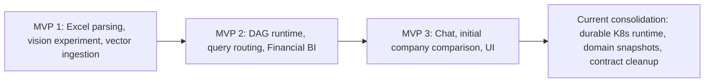

# [SEC-104] 3단계 MVP 개발 절차와 현재화 이력

> **Chapter:** 1. 프로젝트 개요 | **Section:** 1.4 | **Status:** Historical timeline + current consolidation

---

## 1. MVP 진화

| 단계 | 당시 목표·산출물 | 현재 상태 |
| :--- | :--- | :--- |
| MVP 1 | 2D 좌표 파서, vision 표 구조 감지, Binary COPY | 좌표·직렬화·COPY 유지. vision은 외부 provider만 사용하며 로컬 VLM은 제외 |
| MVP 2 | DAG, 검색 라우팅, BI 프로토타입, 합성 비교 데이터 | 19개 등록 모듈과 durable queue로 정리. BI는 21개 지표 snapshot 계약으로 고정 |
| MVP 3 | 챗봇, 초기 듀퐁/리그 비교 UI, a11y | 챗봇은 durable run으로 유지. 비교는 BI 근거 기반 `CompanyComparisonSnapshot`으로 교체 |
| 현재화 | 프로덕션 배포·문서·계약 정합성 | Helm/KEDA/Alembic, snapshot repository, 단일 comparison route, 전체 회귀 검증 완료 |

## 2. 현재 WBS 기준

| 작업 | 완료 조건 | 상태 |
| :--- | :--- | :--- |
| 런타임 영속화 | PostgreSQL queue·Lease·KEDA worker·SSE/polling | 완료 |
| 데이터·검색 | 2D 셀 직렬화, Binary COPY, Dense + keyword + RRF | 완료 |
| Financial BI | 21개 지표, 근거·상태·current snapshot | 완료 |
| AI Chat | 세션 영속화, durable RAG run, 근거 메시지 | 완료 |
| Company Comparison | 단일 UI, 전용 API, 검증·점수·예측·불변 버전 | 완료 |
| 배포 | Docker/Helm, migration hook, 로컬 K8s 실행 경로 | 완료 |
| 범위 제외 | 로컬 VLM, Cross-Encoder reranker, synthetic comparison fallback | 결정 완료 |
| 검증 | Ruff, Pyright, backend/frontend tests, production build | 완료 |

과거 일정의 “가상 기업”, “듀퐁 3단계”, “21개 모듈”은 MVP 탐색 이력이며 현재 운영 계약이 아닙니다.
