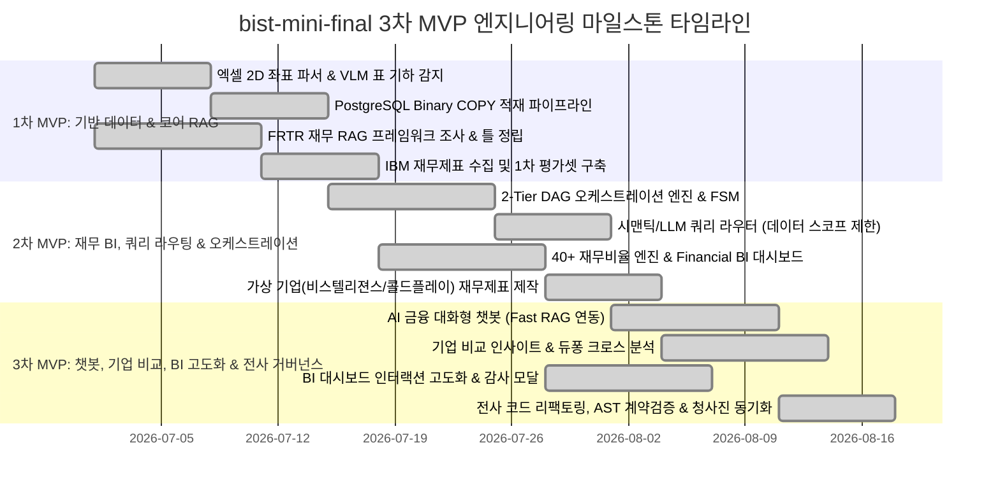

# [SEC-104] 3단계 MVP 개발 절차 및 총괄 수행 일정 (MVP Schedule & WBS)
> **Chapter:** 1. 프로젝트 개요 | **Section:** 1.4 | **Status:** Approved Baseline  
> **Classification:** Project Engineering Lifecycle, 3-Phase MVP Schedule & WBS

---

## 1. 3단계 MVP 개발 마일스톤 타임라인 (Gantt Milestones)

`bist-mini-final` 플랫폼은 3차례의 점진적 MVP(Minimum Viable Product) 애자일 이터레이션을 통해 구축되었습니다:



---

## 2. 3단계 MVP별 상세 WBS 내역

```text
[1차 MVP: 기반 데이터 수집, 파싱 & 코어 RAG 적재]
  ├── WBS 1.1 (김지환): OpenPyXL 병합 해제 및 2D 직교 좌표계 정규화 파서 개발
  ├── WBS 1.2 (김지환): Luna VLM 1-Shot 표 바운딩박스 검출 및 header_with_value 직렬화기 구현
  ├── WBS 1.3 (김지환): PostgreSQL Native Binary COPY 3072d 고속 벌크 주입기 구축
  ├── WBS 1.4 (권혁준): FRTR 재무 RAG 방법론 프레임워크 조사 및 Dense+Sparse 기초 검색 틀 정립
  └── WBS 1.5 (전명준): IBM 원천 재무제표 엑셀 분석 및 1차 Ground-Truth 평가 데이터셋 구축

[2차 MVP: 2-Tier 오케스트레이션, 쿼리 스코프 라우팅 & 재무 BI 대시보드]
  ├── WBS 2.1 (김지환): Kahn 위상정렬 기반 2-Tier DAG 실행기, FSM 런타임 및 PR 머지/품질 관리
  ├── WBS 2.2 (김정원): SemanticQueryRouter & LlmQueryRouter를 통한 대상 기업/시트 데이터 스코프 제한기 개발
  ├── WBS 2.3 (권혁준): 40+ 전사 재무비율 무손실 Decimal 계산 엔진 및 Financial BI 대시보드 차트 구축
  ├── WBS 2.4 (권혁준): 회계기간/통화 프로파일러 연동 및 5개년 건전성 히트맵 뷰모델 구현
  └── WBS 2.5 (전명준): 가상 기업(비스텔리젼스, 콜드플레이) 모델링 및 복합 다중 시트 재무제표(.xlsx) 제작

[3차 MVP: AI 챗봇, 다중 기업 비교, BI 고도화 & 전사 아키텍처 거버넌스]
  ├── WBS 3.1 (김정원): Fast RAG 인메모리 어댑터 연동 및 AI 금융 대화형 챗봇(/chatbot) 풀스택 구축
  ├── WBS 3.2 (김정원): 챗봇 대화 세션 컨텍스트 및 마크다운/LaTeX 수식 실시간 SSE 스트리밍 구현
  ├── WBS 3.3 (전명준): 다중 기업 듀퐁 3단계(순이익률 x 총자산회전율 x 재무레버리지) 크로스 비교 엔진 구현
  ├── WBS 3.4 (전명준): 동종업계 5각 재무 건전성 레이더 차트 및 벤치마크 랭킹 인사이트 뷰 구축
  ├── WBS 3.5 (권혁준): Financial BI 대시보드 인터랙션 고도화 (적응형 음수 마진 Y축 스케일링, 원천 감사 셀 EvidenceDialog 및 a11y 표준 모달 시스템 연동)
  └── WBS 3.6 (김지환): 전사 코드베이스 리팩토링, AST 아키텍처 계약 테스트 체계 및 5대 챕터 22개 청사진 완성
```
