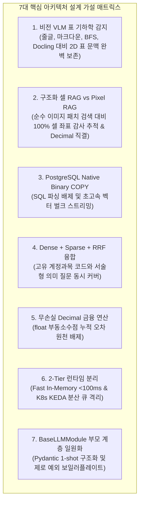

# [SEC-201] 선행 연구 조사 및 7대 아키텍처 가설 분석
> **Chapter:** 2. 프로젝트 요구 분석 | **Section:** 2.1 | **Status:** Approved Baseline  
> **Classification:** Prior Art Review, 7 Core Architectural Hypotheses & Engineering Trade-offs

---

## 1. 선행 연구 조사 (Prior Art Review)

금융 도메인 재무제표 엑셀 분석과 의사결정 자동화를 위해 선행 연구된 핵심 방법론 및 프로덕트 프레임워크입니다:

1. **대화형 금융 질의응답 및 Fast RAG (Conversational Financial QA & Hybrid Retrieval)**:
   - 금융 도메인 특화 계정과목 매핑 및 표 구조 복원 방법론 조사 (FRTR 프레임워크).
   - 단일 Dense 임베딩의 계정과목 코드 오인식과 단일 Sparse 키워드의 의미적 맥락 유실을 극복하기 위한 Dense(3072d) + Sparse(BM25) + RRF($k=60$) 상호 순위 융합 하이브리드 검색 필요성 도출.
   - 대규모 LLM 질의 시 지연시간을 300ms 이내로 단축하기 위한 인메모리 포트 바인딩 기반 Fast RAG 아키텍처 연구.
2. **자동화 재무 BI 및 듀퐁 분해 (Automated Financial BI & DuPont Decomposition)**:
   - 다중 시트 재무제표로부터 40+ 전사 재무비율(수익성, 안정성, 성장성, 활동성)을 자동 도출하고 5개년 시계열 추세를 진단하는 BI 방법론.
   - ROE를 순이익률(Profit Margin), 총자산회전율(Asset Turnover), 재무레버리지(Financial Leverage)로 분해하여 기업의 실질적 이익 창출 드라이버를 판별하는 듀퐁 3단계 분석 기법.
3. **다자간 피어 벤치마킹 및 정규화 (Multi-Company Peer Benchmarking & Normalization)**:
   - 상이한 회계기준(K-IFRS, US-GAAP), 이종 통화(KRW, USD), 상하 분산 단위(억원, 백만원, 천달러)를 단일 기준으로 자동 정규화하는 크로스 엔티티 정규화 방법론.
   - 5각 건전성 레이더 차트를 통한 동종 업계 경쟁사 간 상대가치 및 재무 건전성 랭킹 스크리닝 기법.
4. **시맨틱 쿼리 라우팅 및 2D 표 기하학 복원 (Semantic Routing & Table Geometry)**:
   - 질의 의도를 파악하여 대상 기업 컬렉션 및 특정 재무제표 시트로 데이터 스코프(Data Scope)를 사전 제한하는 최적화.
   - 비전 모델(VLM)을 활용한 병합 셀 및 다층 헤더의 2D 공간 좌표 복원 및 원천 셀 감사 추적성(Audit Trail) 보장 연구.

---

## 2. 7대 핵심 아키텍처 가설 및 트레이드오프 분석

---

### 🔬 [Hypothesis 1] 비전 VLM 표 기하학 감지 vs 4대 대조군 (줄글, 마크다운, BFS, Docling)
* **가설**: 재무 엑셀은 병합 헤더, 상하 분산 단위, 빈 셀 갭(Blank Gap)이 복잡하게 얽혀 있어, 순수 텍스트 줄글이나 좌표 탐색 알고리즘(BFS), 범용 문서 파서(Docling)보다 **시각적 비전 모델(Luna VLM)로 2D 표 기하 바운딩박스를 먼저 검출하고 `header_with_value`로 직렬화**하는 것이 행-열 교차 의미와 회계 계층을 가장 온전히 보존할 것이다.
* **4대 대조군 트레이드오프 비교**:
  * **대조군 A (Raw Text Chunking)**: 줄글 청킹 시 계층 헤더 분절 및 단위(`단위: 백만원`) 완전 유실.
  * **대조군 B (Markdown Table `|---|`)**: 복합 병합 셀 복원 불가 및 다단 헤더 왜곡, 열 수 증가 시 토큰 길이 폭증.
  * **대조군 C (BFS 그래프 탐색 휴리스틱)**: 빈 셀 갭, 점선 요약 행에서 탐색 조기 중단(Early Stop) 또는 독립 보조표 오병합(Over-merging) 발생.
  * **대조군 D (Docling + OpenPyXL 하이브리드)**: 일반 보고서 본문 표에는 적합하나 회계 엑셀 다층 병합 헤더(`[2023] -> [연결/별도] -> [매출]`)의 부모-자식 트리 추론 실패.
  * **최종 채택안 (Luna VLM + `header_with_value`)**: Pillow 래스터라이징 ➡️ GPT-5.6 Luna VLM 표 바운딩박스 검출 ➡️ OpenPyXL 정밀 좌표 매핑 ➡️ `Company | Sheet | Row Header | Col Header | Value | Unit` 단일 정규 직렬화로 2D 시각 맥락 완벽 복원.

---

### 🔬 [Hypothesis 2] Pixel RAG (이미지 패치 검색) vs 하이브리드 구조화 셀 RAG
* **가설**: 문서를 고해상도 이미지 패치/타일로 분할하여 비전-임베딩으로 직접 검색하는 **Pixel RAG(ColPali 등)** 방식은 표의 시각적 형태는 포착할 수 있으나, **인덱싱 I/O 및 지연시간이 과다하고 시각적 그리드 패턴이 내용적 의미(텍스트/계정과목)를 압도하여 희석**시키므로, 비전으로 표 기하학을 감지하되 최종 색인 및 검색은 원본 좌표가 결합된 구조화 셀(`header_with_value`)로 수행하는 하이브리드 RAG가 압도적으로 우수할 것이다.
* **대조군 트레이드오프 비교**:
  * **대조군 (Pixel RAG)**:
    * 🛑 **시각적 표 구조 패턴 과적합 및 내용적 의미 희석**: 비전 인코더가 표의 외곽 테두리, 행/열 그리드 등 '기하학적 레이아웃 유사도'에 과도하게 반응하여, 형태는 유사하나 실제 회계 계정과목 명칭과 수치 의미가 다른 타일이 상위에 랭킹되는 **내용적 의미 희석(Semantic Dilution)** 발생.
    * 🛑 **대량 인덱싱 I/O 병목 및 질의 지연시간 과다**: 고해상도 이미지 타일링에 따른 스토리지 급증 및 VLM 멀티모달 추론 지연(2,000ms+)으로 Fast RAG(<300ms) 달성 실패.
  * **채택안 (Hybrid Vision-Structured Cell RAG)**:
    * 비전으로 1-Shot 표 경계/헤더 기하학을 검출하고, 실제 색인/검색은 `header_with_value` 텍스트로 수행하여 계정과목명과 수치 맥락을 온전히 검색하며 300ms 이내 실시간 응답 보장.

---

### 🔬 [Hypothesis 3] PostgreSQL Native Binary COPY vs Multi-Row INSERT
* **가설**: 수만 개 셀 임베딩 벡터 적재 시 개별/다중 `INSERT`는 텍스트 SQL 파싱 및 직렬화 오버헤드로 병목이 발생하므로, PostgreSQL 네이티브 `Binary COPY` 프로토콜을 사용하면 대량 I/O 지연을 획기적으로 단축할 것이다.
* **결정**: PostgreSQL 바이너리 포맷 직접 스트리밍 채택으로 SQL 파싱 오버헤드 0화 및 기존 INSERT 코드 영구 삭제.

---

### 🔬 [Hypothesis 4] 하이브리드 RRF ($k=60$) 융합 vs 단일 Dense/Sparse 검색
* **가설**: 재무 질의는 고유 계정과목 코드(Sparse BM25 강점)와 복합 서술형 문맥(Dense 3072d 강점)이 혼재하므로, 상호 순위 융합(Reciprocal Rank Fusion, $k=60$)을 적용할 때 최적의 후보 셀을 도출할 것이다.
* **결정**: 점수 정규화 문제 없이 순위 기반으로 양측 강점을 상호 보완하는 Dense + Sparse + RRF($k=60$) 하이브리드 융합 채택.

---

### 🔬 [Hypothesis 5] 무손실 `Decimal` 연산 vs `float` 부동소수점
* **가설**: 40+ 전사 재무비율 연산 시 `float`를 사용하면 부동소수점 오차가 누적되므로, `decimal.Decimal` 고정소수점 연산을 적용해야 회계 무결성을 보장할 수 있다.
* **결정**: 전사 재무 계산기 `Decimal` 타입 강제 및 최종 표현 단계에서만 `ROUND_HALF_UP` 표준화.

---

### 🔬 [Hypothesis 6] 2-Tier 런타임 분리 (Fast In-Memory vs Distributed Queue)
* **가설**: 실시간 대화형 챗봇과 대규모 전사 지표 배치 추출을 동일 런타임에서 처리하면 헤드오브라인 블로킹(HoL)이 발생하므로, 2-Tier 런타임으로 분리해야 한다.
* **결정**: Tier 1 (인메모리 Fast RAG, <100ms) + Tier 2 (K8s KEDA 분산 큐 & Lease 락)로 부하 완전 격리.

---

### 🔬 [Hypothesis 7] 제로 보일러플레이트 부모-자식 계층 분리 (`BaseLLMModule`)
* **가설**: 21개 모듈마다 OpenAI API 호출, JSON 파싱, try-except 예외 래핑을 반복 작성하면 코드 중복과 런타임 휴먼 에러가 급증하므로, 부모 클래스로 집약해야 한다.
* **결정**: `BaseLLMModule` 1-Line 구조화(`complete_structured`) 및 `BaseModule.run()` 템플릿 가드 전역 예외 처리 표준화.
