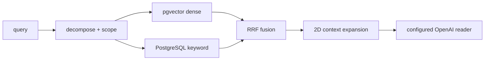

# [SEC-201] 기술 가설과 현재 결정
> **Chapter:** 2. 프로젝트 요구 분석 | **Section:** 2.1 | **Status:** Decisions Updated

---

## 1. 검토한 문제

재무 spreadsheet RAG에는 텍스트 문서와 다른 제약이 있습니다. 값의 의미가 행 header, 열 period, unit, 병합 영역, 인접 셀에 분산돼 있고, 답변·BI·비교 결과가 원본 셀까지 역추적돼야 합니다. 동시에 장시간 ingestion/BI/benchmark 실행을 API process와 분리하고 재시작에도 상태를 보존해야 합니다.

---

## 2. 가설과 현재 판정

| 가설 | 판정 | 현재 구현 |
| :--- | :--- | :--- |
| 2D 좌표와 header 문맥을 보존해야 cell 검색 품질이 유지된다 | 채택 | OpenPyXL 좌표 정규화 + `header_with_value` 직렬화 |
| 복합 표 경계는 vision 보조가 유용하다 | 제한 채택 | 외부 OpenAI vision provider; schema/bounds 검증; local VLM 제외 |
| 대량 vector 적재는 row INSERT보다 streaming COPY가 적합하다 | 채택 | 3072d artifact + `PgVectorBinaryCopyStream` |
| 검색 전에 company/file/sheet scope를 좁혀야 교차 기업 오염을 줄일 수 있다 | 채택 | LLM/semantic routing + `pgvector_data_scope` |
| Dense 단독보다 lexical signal과 융합해야 숫자·계정명 검색을 보완한다 | 채택 | Dense + PostgreSQL keyword + RRF; reranker 제외 |
| 재무 파생식은 binary float보다 Decimal이 적합하다 | 채택 | BI calculator에서 `Decimal` 사용 |
| 장기 작업 상태는 process memory보다 durable store가 적합하다 | 채택 | PostgreSQL queue/lease/heartbeat + KEDA worker |
| BI와 Company Comparison은 같은 API로 합쳐야 한다 | 기각 | 별도 route·DTO·service; BI snapshot만 source port로 재사용 |
| 장애 시 synthetic comparison을 반환하면 UX가 좋아진다 | 기각 | 명시적 404/409/5xx와 exclusions |

---

## 3. 검색 기준선

Cross-Encoder reranker는 운영 비용과 별도 모델 수명주기를 만들기 때문에 구현하지 않습니다. 현재 품질 개선은 scope 정확도, metadata, RRF, context expansion, evidence benchmark에서 수행합니다.

---

## 4. BI와 Comparison 결정

BI는 21개 지원 metric, `Decimal` 파생식, evidence, 기업별 current dashboard를 책임집니다. 초기 DuPont/다수 ratio 아이디어는 현재 계약이 아닙니다.

Company Comparison은 매출, 영업이익, 총부채, 총자산, 순부채의 검증 관측값을 사용합니다. `financial-league-v3` 점수와 `historical-cagr-hold-v1` 예측을 별도 versioned snapshot으로 발행하며 예측값은 점수에 포함하지 않습니다.

---

## 5. 평가 원칙

- 성능·정확도 개선 수치는 benchmark artifact가 있을 때만 결과로 기록합니다.
- 외부 model 기반 평가는 model ID, prompt version, dataset version, 실행 시각을 남깁니다.
- 목표 KPI와 실제 측정 결과를 구분합니다.
- source evidence가 없는 값은 정답으로 간주하지 않습니다.
