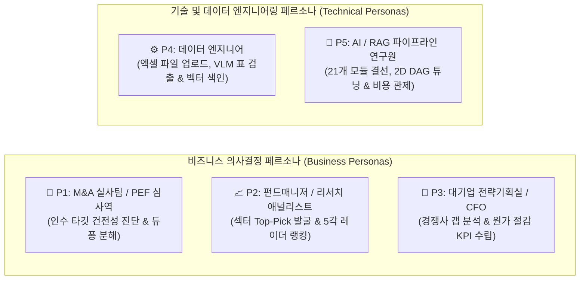

# [SEC-202] 이해관계자 및 5대 페르소나 정의 (Stakeholders & Personas)
> **Chapter:** 2. 프로젝트 요구 분석 | **Section:** 2.2 | **Status:** Approved Baseline  
> **Classification:** Stakeholder Analysis, Business & Technical Personas

---

## 1. 이해관계자 및 페르소나 맵 (Stakeholder Map)

`bist-mini-final` 플랫폼은 3대 비즈니스 의사결정자와 2대 기술 엔지니어를 주요 이해관계자로 정의합니다:

---

## 2. 5대 페르소나별 상세 실무 프로파일 및 의사결정 워크플로우

| 페르소나 (Persona) | 주 사용 워크스페이스 | 실무 현장 Pain Points | 플랫폼을 통한 해결 및 의사결정 (Action) |
| :--- | :--- | :--- | :--- |
| **P1. M&A 실사팀 / PEF 심사역** *(Private Equity / IB)* | • Financial BI ([`SEC-402`](file:///c:/Repos/bist-mini-final/docs/04_implementation_and_mvp_evolution/SEC-402_mvp2_orchestration_and_bi.md)) • Company Comparison ([`SEC-403`](file:///c:/Repos/bist-mini-final/docs/04_implementation_and_mvp_evolution/SEC-403_mvp3_chatbot_and_comparison.md)) | 인수 대상 후보 기업 3곳의 재무제표 단위가 다르고, 겉보기 지표만으로는 부채 위험을 알 수 없음. | • 통화/단위를 즉시 통일하고 **듀퐁 3단계 분해**를 돌려 **'부채 레버리지에 의존하지 않고 자체 마진과 회전율로 돈을 버는 안전한 기업'**을 1순위 인수 타깃으로 확정. |
| **P2. 주식 펀드매니저 / 애널리스트** *(Fund Manager / Research)* | • AI Financial Chatbot ([`SEC-403`](file:///c:/Repos/bist-mini-final/docs/04_implementation_and_mvp_evolution/SEC-403_mvp3_chatbot_and_comparison.md)) • Company Comparison | 100개 기업의 리포트를 일일이 열어보느라 동종업계 내 상대적 밸류에이션과 마진 순위를 잡는 데 며칠이 소요됨. | • 동일 섹터 내 5개 경쟁사를 **5각 건전성 레이더 차트**에 겹쳐놓고, **가장 찌그러짐 없이 오각형이 꽉 찬 '섹터 Top-Pick 우량주'**를 10초 만에 스크리닝하여 포트폴리오에 편입. |
| **P3. 대기업 전략기획실 / CFO** *(Corporate Strategy Office)* | • Financial BI • Company Comparison | 이사회에서 *"왜 우리 회사는 경쟁사보다 영업이익률이 3% 뒤처지는가?"*라는 질문을 받았을 때 구체적 원인 규명이 어려움. | • 경쟁사와의 **재무비율 크로스 매트릭스**를 열어 매출원가율, 판관비 비중, 재고자산회전율 차이를 짚어내고, **"내년도 원가 절감 목표 2.5%p 달성"**과 같은 구체적 경영 KPI를 도출. |
| **P4. 데이터 엔지니어** *(Data Engineer)* | • Data Sources Management ([`SEC-401`](file:///c:/Repos/bist-mini-final/docs/04_implementation_and_mvp_evolution/SEC-401_mvp1_data_and_vision_pipeline.md)) | 수십 개 시트로 구성된 대형 회계 엑셀 파싱 시 병합 셀이 깨지고, 벡터 적재 시 DB 락이 발생. | • 2D 그리드 정규화 파서와 Luna VLM 바운딩박스 오버레이로 시각적 검증을 거친 후, **PostgreSQL Native Binary COPY로 초고속 벌크 주입**. |
| **P5. AI / RAG 연구원** *(Pipeline Researcher)* | • Pipeline Playground ([`SEC-402`](file:///c:/Repos/bist-mini-final/docs/04_implementation_and_mvp_evolution/SEC-402_mvp2_orchestration_and_bi.md)) | RAG 검색 모듈 변경 시 백엔드 코드를 매번 고쳐야 하고, 노드별 지연시간과 토큰 비용 측정이 번거로움. | • **React Flow 2D 캔버스**에서 21개 모듈을 자유롭게 드래그 앤 드롭 결선하고, **실시간 SSE 스트리밍으로 노드별 지연시간/비용을 관제**. |
