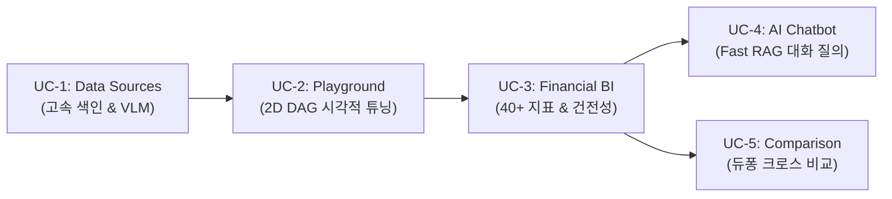

# [SEC-204] 유스케이스 모델링 및 6차원 추적성 매트릭스
> **Chapter:** 2. 프로젝트 요구 분석 | **Section:** 2.4 | **Status:** Approved Baseline  
> **Classification:** Use Case Modeling (UC-1 ~ UC-5) & 6D Requirements Traceability Matrix

---

## 1. 5대 핵심 유즈케이스 라이프사이클 다이어그램 (Use Case Diagram)

---

## 2. 5대 핵심 유즈케이스 상세 명세

### 📌 UC-1: 재무 시트 비전 구조화 및 초고속 벡터 색인 (Data Sources)
* **액터**: 데이터 엔지니어, 금융 리서치 보조원
* **목적**: 다중 시트 재무 엑셀 파일을 업로드하여 2D 표 기하학을 자동 인식하고, pgvector에 초고속 적재.
* **워크플로우**: OpenPyXL 파싱 ➡️ Luna VLM 바운딩박스 검출 ➡️ `header_with_value` 직렬화 ➡️ `text-embedding-3-large` 3072d 임베딩 ➡️ PostgreSQL `Binary COPY` 벌크 주입.

### 📌 UC-2: 파이프라인 시각적 튜닝 및 실시간 샌드박스 (Pipeline Playground)
* **액터**: AI/RAG 연구원, 파이프라인 엔지니어
* **목적**: 21개 원자적 모듈을 React Flow 2D 캔버스에서 결선하고, SSE 스트리밍으로 지연시간/비용 실시간 관제.
* **워크플로우**: 2D 노드 배치 및 핀 연결 ➡️ Kahn 위상정렬 DAG FSM 병렬 실행 ➡️ Server-Sent Events(`SSE`) 실시간 상태 스트리밍.

### 📌 UC-3: 40+ 전사 재무 BI 분석 및 건전성 히트맵 (Financial BI Analytics)
* **액터**: CFO, 투자 심사역, 기업 분석관, 경영진
* **목적**: 대상 기업 재무제표로부터 40개 이상 핵심 재무 비율을 무손실 고정소수점으로 자동 산출하고 5개년 건전성 히트맵 렌더링.
* **워크플로우**: `DocumentProfilerModule` 회계기간/통화 프로파일링 ➡️ Fast RAG 하이브리드 검색 ➡️ `FinancialCalculatorModule` 무손실 `Decimal` 연산 ➡️ 원본 셀 100% 바인딩 감사 추적 모달.

### 📌 UC-4: AI 금융 대화형 질의응답 (AI Financial Chatbot)
* **액터**: 펀드 매니저, 금융 리서치 애널리스트
* **목적**: 자연어로 복잡한 재무 질문을 입력하면, 300ms 이내에 표와 수식 근거가 첨부된 전문 답변 제공.
* **워크플로우**: Fast RAG Dense 3072d + BM25 + RRF($k=60$) 인메모리 검색 ➡️ 2D 문맥 확장 ➡️ GPT-5.6 Luna Reader 마크다운/LaTeX 답변 스트리밍.

### 📌 UC-5: 다중 기업 회계/통화 정규화 및 듀퐁 크로스 비교 (Company Comparison)
* **액터**: M&A 실사팀, 산업 섹터 수석 연구원, 전략기획실
* **목적**: 복수 기업을 선택하여 이종 통화/단위를 정규화하고 동종업계 ROE 듀퐁 3단계 분해 트리를 크로스 비교.
* **워크플로우**: 기업별 재무 스냅샷 로드 ➡️ 통화/단위 자동 정규화 ➡️ 듀퐁 3단계(순이익률 x 총자산회전율 x 재무레버리지) 분해 및 5각 건전성 레이더 차트 렌더링.

---

## 3. 전구간 6차원 엔드투엔드 추적성 매트릭스 (6D Traceability Matrix)

| 유즈케이스 (UC) | 관련 핵심 RAG 모듈 ([`SEC-302`](file:///c:/Repos/bist-mini-final/docs/final_report/03_system_architecture_and_design/SEC-302_class_diagrams_and_contracts.md)) | REST API & SSE 규격 ([`SEC-305`](file:///c:/Repos/bist-mini-final/docs/final_report/03_system_architecture_and_design/SEC-305_interface_specification.md)) | PostgreSQL 10대 테이블 ([`SEC-304`](file:///c:/Repos/bist-mini-final/docs/final_report/03_system_architecture_and_design/SEC-304_database_erd_and_vector_schema.md)) | 프론트엔드 React 컴포넌트 ([`SEC-402`](file:///c:/Repos/bist-mini-final/docs/final_report/04_implementation_and_mvp_evolution/SEC-402_mvp2_orchestration_and_bi.md)) | 품질 검증 & AST 테스트 ([`SEC-502`](file:///c:/Repos/bist-mini-final/docs/final_report/05_validation_and_conclusion/SEC-502_contract_testing_results.md)) |
| :--- | :--- | :--- | :--- | :--- | :--- |
| **UC-1: 재무 시트 고속 색인** | • `structure.cell_text_serializer` • `structure.luna_vlm_structure_detector` • `retrieval.text_embedder` • `storage.pgvector_index_writer` | • `POST /api/data-sources/upload` • `POST /api/data-sources/index` • `GET /api/data-sources/probe` | • `source_files` • `sheets` • `langchain_pg_collection` • `langchain_pg_embedding` | • `DataSourcesPage` • `SpreadsheetViewer` • `VlmOverlayInspector` | • `tests/storage/test_pgvector_copy.py` • `test_architecture_contracts.py` |
| **UC-2: 파이프라인 샌드박스** | • `query.*` (M1, M2, M3, M4, M5) • `retrieval.*` (M6, M8, M9, M10, M11) • `generation.*` (M12, M13, M14, M15, M16) | • `POST /api/workflows/run` • `GET /api/workflows/{id}/stream` (SSE) • `GET /api/pipeline/modules` | • `workflow_runs` • `node_execution_logs` | • `PlaygroundPage` • `@xyflow/react` Canvas • `NodePropertiesPanel` | • `tests/engine/test_dag_executor.py` • `test_modules_pinout.py` |
| **UC-3: 40+ 전사 재무 BI** | • `structure.document_profiler` (M20) • `retrieval.pgvector_retriever` (M8) • `retrieval.sparse_bm25_retriever` (M9) • `retrieval.rrf_fuser` (M10) • `reader.financial_calculator` (M21) | • `GET /api/bi/companies` • `GET /api/bi/companies/{id}/dashboard` • `POST /api/bi/companies/{id}/refresh` • `POST /api/bi/companies/{id}/reset` | • `bi_companies` • `bi_questions` • `bi_answers` • `bi_dashboard_snapshots` • `bi_materialization_jobs` | • `BiPage` • `BiHeader` • `FinancialHealthHeatmap` • `ProfitabilityChart` • `EvidenceDialog` | • `tests/features/bi/test_bi_calculator.py` • `test_chart_viewmodel.ts` |
| **UC-4: AI 금융 대화형 질의** | • `query.decomposer` (M2) • `retrieval.context_expander` (M11) • `generation.reader` (M12) • `generation.confidence_scorer` (M16) | • `POST /api/chatbot/sessions` • `POST /api/chatbot/sessions/{id}/messages` • `GET /api/chatbot/sessions/{id}/stream` (SSE) | • `workflow_runs` (`wf-ai-chatbot-session`) • `node_execution_logs` | • `ChatbotPage` • `ChatMessageList` • `EvidenceCellModal` | • `tests/features/chatbot/test_fast_rag.py` • `test_chatbot_latency.py` |
| **UC-5: 다중 기업 듀퐁 비교** | • `storage.company_entity_extractor` (M19) • `reader.financial_calculator` (M21) • `DocumentProfilerModule` (M20) | • `POST /api/bi/comparison/matrix` • `GET /api/bi/comparison/ranking` | • `bi_companies` • `bi_dashboard_snapshots` | • `CompanyComparisonPage` • `DupontTreeChart` • `MultiCompanyRadar` | • `tests/features/bi/test_comparison.py` • `test_currency_normalizer.py` |
