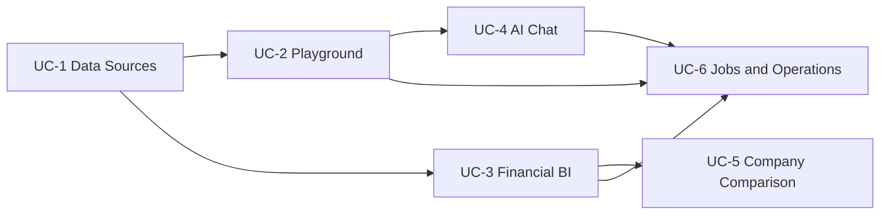

# [SEC-204] 유스케이스 모델링 및 추적성

> **Chapter:** 2. 프로젝트 요구 분석 | **Section:** 2.4 | **Status:** Implementation-aligned

---

## 1. 현재 유스케이스 흐름

## 2. 유스케이스 요약

| UC | 액터·목적 | 정상 흐름 | 실패·경계 |
| :--- | :--- | :--- | :--- |
| UC-1 Data Sources | 데이터 엔지니어가 Excel을 색인 | upload → ingestion job → KEDA worker → index publish | 파일/DB 오류는 영속 상태로 기록; 로컬 VLM은 사용하지 않음 |
| UC-2 Playground | RAG 엔지니어가 DAG를 구성·실행 | module contract → workflow 저장 → run 202 → SSE/polling | 순환·핀 불일치는 실행 전 거부 |
| UC-3 Financial BI | 분석가가 한 기업 지표·근거를 조회 | materialization/question jobs → dashboard snapshot → evidence dialog | 지표 누락은 상태로 표현하고 이웃 기간 대체 금지 |
| UC-4 AI Chat | 사용자가 세션형 재무 질의를 수행 | message → durable RAG run → result sync → cited response | 접근 범위와 근거 검증 실패 시 완료 메시지 발행 금지 |
| UC-5 Company Comparison | M&A 담당자가 여러 기업을 비교 | BI current heads → validate → score/forecast → version publish → single comparison UI | 완전 기업 2개 미만은 409; 일부 누락은 partial/exclusions |
| UC-6 Operations | 운영자가 배치 상태를 관찰 | `/jobs` → KEDA/Job/Pod/Lease correlation | 현재 읽기 전용; 로그 터미널·운영 명령은 별도 인증 정책 필요 |

## 3. 엔드투엔드 추적성

| UC | 백엔드 | API | 저장소 | 프런트 | 검증 |
| :--- | :--- | :--- | :--- | :--- | :--- |
| UC-1 | data source routes, ingestion worker, `pgvector_index_writer` | `/api/v1/data-sources/*` | `source_files`, `sheets`, pgvector tables, `workflow_runs` | `DataSourcesPage` | storage·upload·ingestion tests |
| UC-2 | `ModuleRegistry`, `WorkflowExecutor`, queue dispatcher | `/api/v1/modules`, `/api/v1/workflows`, `/api/v1/runs` | `workflow_runs`, `node_execution_logs` | `PlaygroundPage` | module pin·workflow·SSE tests |
| UC-3 | `backend/features/bi/` | `/api/v1/bi/*` | `bi_companies`, profiles, jobs, questions, answers, dashboard snapshots | `BiPage`, BI components | BI calculator·store·API·schema tests |
| UC-4 | `backend/features/chatbot/` | `/api/v1/chat/*` | chat sessions/messages/attachments/suggestions, workflow runs | `ChatbotPage` | chat route·repository tests |
| UC-5 | `CompanyComparisonService`, snapshot builder, versioned repository | `GET/POST /api/v1/company-comparisons/snapshot*` | BI heads, `domain_snapshots`, `domain_snapshot_heads` | `CompanyComparisonPage`, comparison feature | `test_company_comparison_snapshot.py`, Zod·ranking tests |
| UC-6 | Kubernetes monitor, probes | `/healthz`, `/livez`, `/readyz`, `/api/v1/jobs` | workflow/job lease state | `JobsPage` | Helm render·K8s contract tests |

세부 module 목록은 [`BP-302`](file:///c:/Repos/bist-mini-final/docs/blueprints/03_pipeline_module_blueprints/BP-302_module_pinout_catalog.md), REST 전체 목록은 [`BP-501`](file:///c:/Repos/bist-mini-final/docs/blueprints/05_interface_blueprints/BP-501_rest_api_specification.md), DB 구조는 [`BP-503`](file:///c:/Repos/bist-mini-final/docs/blueprints/05_interface_blueprints/BP-503_database_erd_and_ddl.md)를 기준으로 합니다.
