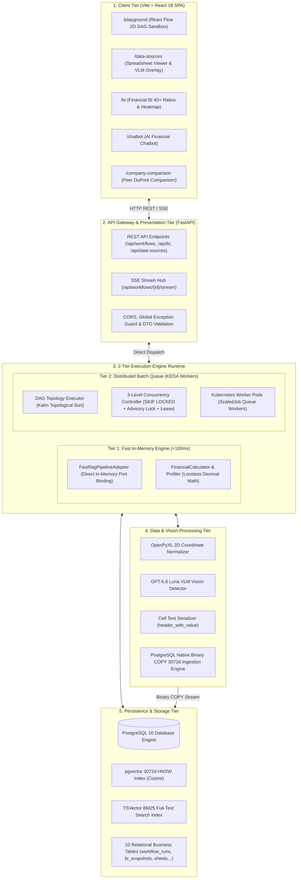

# [SEC-301] 시스템 전체 토폴로지 및 2-Tier 런타임 조감도
> **Chapter:** 3. 시스템 아키텍처 및 상세 설계 | **Section:** 3.1 | **Status:** Approved Baseline  
> **Classification:** End-to-End System Topology & 2-Tier Execution Runtime Blueprint

---

## 1. 시스템 전체 배치도 (End-to-End System Topology)

`bist-mini-final`은 프론트엔드 React SPA, FastAPI 백엔드, 2-Tier DAG 실행 엔진, PostgreSQL 16 + pgvector 물리 저장소, Kubernetes 분산 워커 클러스터로 구성된 엔터프라이즈 멀티 티어 아키텍처를 가집니다:

---

## 2. 2-Tier 실행 런타임 분리 아키텍처 (2-Tier Runtime Decoupling)

| 런타임 티어 | 구동 메커니즘 | 처리 작업 성격 | 지연시간 보장 (Latency) |
| :--- | :--- | :--- | :--- |
| **Tier 1: Fast In-Memory** | 인메모리 포트 다이렉트 바인딩 (`FastRagPipelineAdapter`) | • 실시간 챗봇 질의응답 • BI 대시보드 스냅샷 로드 & 무손실 수식 계산 | **P95 Latency $< 300\text{ms}$** |
| **Tier 2: Distributed Batch Queue** | K8s KEDA ScaledJob + 3-Level 분산 락 (`workflow_runs`) | • 다중 시트 대용량 엑셀 VLM 파싱 • 수만 건 pgvector 대량 적재 • 21개 모듈 복합 DAG 배치 파이프라인 | **수초~수분 비동기 처리** (배치 부하 격리) |
