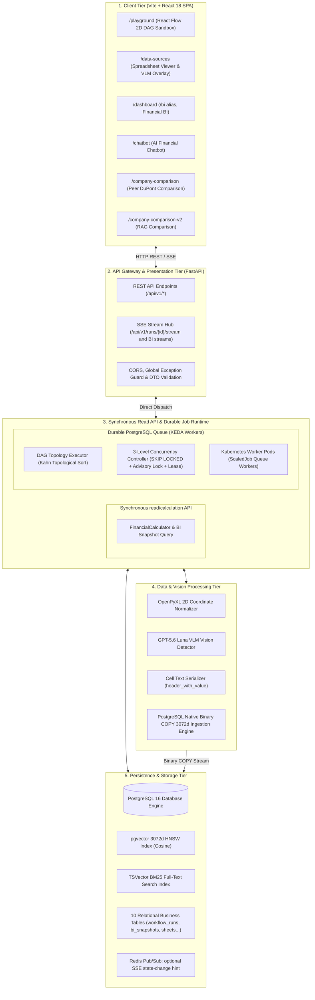

# [SEC-301] 시스템 전체 토폴로지 및 Durable Job 런타임 조감도
> **Chapter:** 3. 시스템 아키텍처 및 상세 설계 | **Section:** 3.1 | **Status:** Implementation-aligned reference
> **Classification:** End-to-End System Topology & Durable Job Runtime Blueprint

---

## 1. 시스템 전체 배치도 (End-to-End System Topology)

`bist-mini-final`은 프론트엔드 React SPA, FastAPI 백엔드, PostgreSQL durable queue, Redis SSE 변경 신호, PostgreSQL 16 + pgvector 저장소, Kubernetes 분산 워커 클러스터로 구성됩니다.

---

## 2. 현재 실행 경로 분리 아키텍처

| 실행 경로 | 구동 메커니즘 | 처리 작업 성격 | 상태 전달 |
| :--- | :--- | :--- | :--- |
| **동기 read/calculation** | FastAPI route → domain service → PostgreSQL | • BI 대시보드 스냅샷 • 기업 비교·리그 • 파일/인덱스 조회 | HTTP 응답 |
| **Durable job** | PostgreSQL queue + KEDA ScaledJob + lease | • 워크플로 DAG • 인제스천·BI materialization/question·benchmark • 채팅 RAG run | 상태 저장 후 SSE 또는 polling. Redis는 API Pod 간 SSE 갱신 신호만 전달 |
