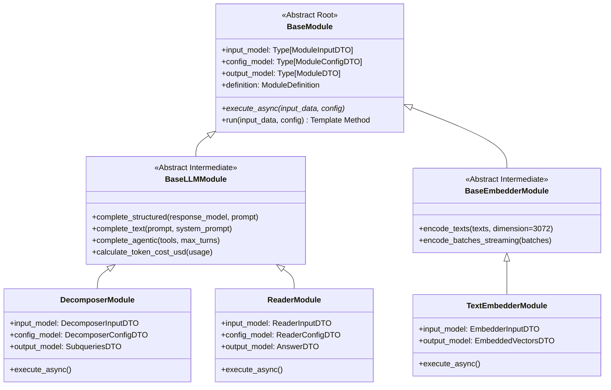

# [SEC-302] 클래스 다이어그램 & 21개 모듈 입출력 계약
> **Chapter:** 3. 시스템 아키텍처 및 상세 설계 | **Section:** 3.2 | **Status:** Approved Baseline  
> **Classification:** Class Diagrams, 3-Tier Module Inheritance & 21-Module Pinout Catalog

---

## 1. 3단계 클래스 상속 계층도 (3-Tier Inheritance Architecture)

모든 파이프라인 모듈은 최상위 `BaseModule`을 상속하며, `BaseLLMModule`과 `BaseEmbedderModule` 2대 중간 추상 계층을 통해 1-Line 구조화와 토큰/비용 집계를 수행합니다:

---

## 2. 21개 원자적 파이프라인 모듈 핀아웃(Pinout) 카탈로그

| 카테고리 | 모듈 키 / 식별자 | 부모 상속 클래스 | 주요 Input Pins (`input_model`) | 주요 Config Pins (`config_model`) | 주요 Output Pins (`output_model`) |
| :--- | :--- | :--- | :--- | :--- | :--- |
| **Query (5)** | `query.user_query` (M1) | `BaseModule` | `question_text: str` | - | `query_context: QueryContext` |
| | `query.decomposer` (M2) | `BaseLLMModule` | `query_context: QueryContext` | `model: str = "gpt-5.6-luna"` | `subqueries: List[Subquery]` |
| | `query.hypothetical_answer` (M3) | `BaseLLMModule` | `query_context: QueryContext` | `model: str = "gpt-5.6-luna"` | `hyde_document: str` |
| | `query.semantic_query_router` (M4) | `BaseModule` | `subqueries: List[Subquery]` | `routes: Dict[str, Any]` | `routed_queries: List[RoutedQuery]` |
| | `query.llm_query_router` (M5) | `BaseLLMModule` | `subqueries: List[Subquery]` | `model: str = "gpt-5.6-luna"` | `retrieval_plan: RetrievalPlan` |
| **Retrieval (6)** | `retrieval.text_embedder` (M6) | `BaseEmbedderModule`| `texts: List[str]` | `model="text-embedding-3-large"` | `embeddings: List[List[float]]` |
| | `retrieval.dense_searcher` (M7) | `BaseModule` | `query_vector: List[float]` | `top_k: int = 10` | `dense_hits: List[Hit]` |
| | `retrieval.pgvector_retriever` (M8) | `BaseModule` | `query_vector: List[float]` | `top_k: int = 10` | `candidates: List[Document]` |
| | `retrieval.sparse_bm25_retriever` (M9)| `BaseModule` | `query_text: str` | `top_k: int = 10` | `sparse_hits: List[Hit]` |
| | `retrieval.rrf_fuser` (M10) | `BaseModule` | `dense_hits, sparse_hits` | `rrf_k: int = 60` | `fused_results: List[FusedHit]` |
| | `retrieval.context_expander` (M11) | `BaseModule` | `fused_results: List[FusedHit]` | `expand_radius: int = 2` | `expanded_context: str` |
| **Generation (5)**| `generation.reader` (M12) | `BaseLLMModule` | `query_context, context` | `model: str = "gpt-5.6-luna"` | `answer_text, cited_cells` |
| | `generation.agentic_cot` (M13) | `BaseLLMModule` | `query_context, context` | `max_turns: int = 5` | `cot_trace, final_answer` |
| | `generation.financial_ratio` (M14) | `BaseLLMModule` | `financial_metrics: Dict` | `ratios: List[str]` | `calculated_ratios: Dict` |
| | `generation.auditor` (M15) | `BaseLLMModule` | `answer_text, context` | `strict_mode: bool = True` | `is_valid, audit_report` |
| | `generation.confidence_scorer` (M16)| `BaseLLMModule` | `answer_text, context` | `threshold: float = 0.8` | `confidence_score: float` |
| **Storage (5)** | `storage.pgvector_index_writer` (M17)| `BaseModule` | `items: List[CellItem]` | `table_name: str` | `inserted_count: int` |
| | `storage.company_entity_extractor` (M18)| `BaseLLMModule` | `file_name, workbook_hash` | `model: str = "gpt-5.6-luna"` | `company_name, ticker, fiscal_year` |
| | `storage.qa_example_loader` (M19) | `BaseModule` | `dataset_path: str` | - | `qa_examples: List[QaExample]` |
| | `structure.document_profiler` (M20) | `BaseLLMModule` | `workbook_hash, file_name` | `max_periods: int = 5` | `periods, currency, scale, sheets` |
| | `reader.financial_calculator` (M21) | `BaseModule` | `raw_metrics, evidence_cells`| `precision: int = 4` | `derived_ratios, bound_evidence` |
