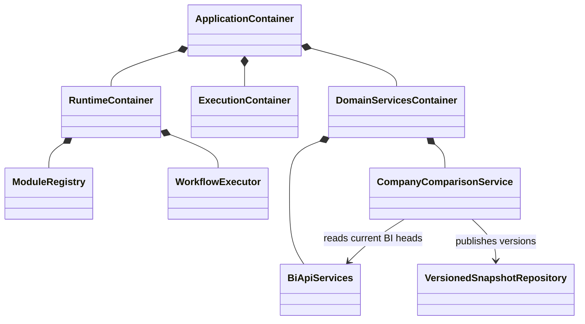
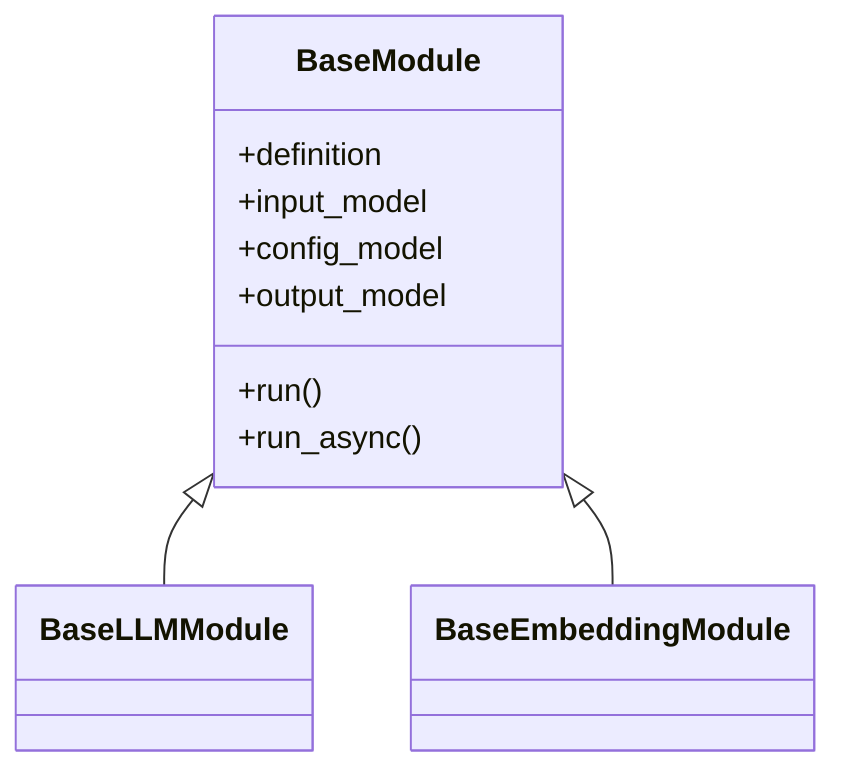

# [SEC-302] 클래스 다이어그램과 모듈·도메인 계약

> **Chapter:** 3. 시스템 아키텍처 및 상세 설계 | **Section:** 3.2 | **Status:** Implementation-aligned

---

## 1. Composition과 실행 경계

- `RuntimeContainer`는 provider·storage·19개 module registry와 workflow runtime을 소유합니다.
- `ExecutionContainer`는 durable workflow dispatcher와 실행 application service를 소유합니다.
- `DomainServicesContainer`는 BI, Company Comparison, chat suggestion, jobs monitor를 조립합니다.
- FastAPI router는 container에서 완성된 서비스를 주입받고 도메인 객체를 직접 생성하지 않습니다.

## 2. 모듈 계약

실행 가능한 module type은 `ModuleRegistry` 기준 19개입니다. Input·Config·Output schema는 `GET /api/v1/modules*`가 제공하며, 전체 목록은 [`BP-302`](file:///c:/Repos/bist-mini-final/docs/blueprints/03_pipeline_module_blueprints/BP-302_module_pinout_catalog.md)를 따릅니다.

## 3. 버전형 스냅샷 계약

`VersionedSnapshotRepository`는 도메인 payload를 이해하지 않고 다음 수명주기만 공통화합니다.

- `get_current(domain, scope_key)`
- `publish(VersionedSnapshotRecord)`
- 불변 payload 저장
- 같은 도메인·스코프의 current head 원자적 전환

BI는 기존 전용 snapshot schema를 유지하고 Company Comparison만 현재 이 공용 저장 port를 사용합니다. 향후 다른 도메인이 이 저장 port를 재사용해도 계산·검증 서비스를 공통 BaseService로 합치지 않습니다.
